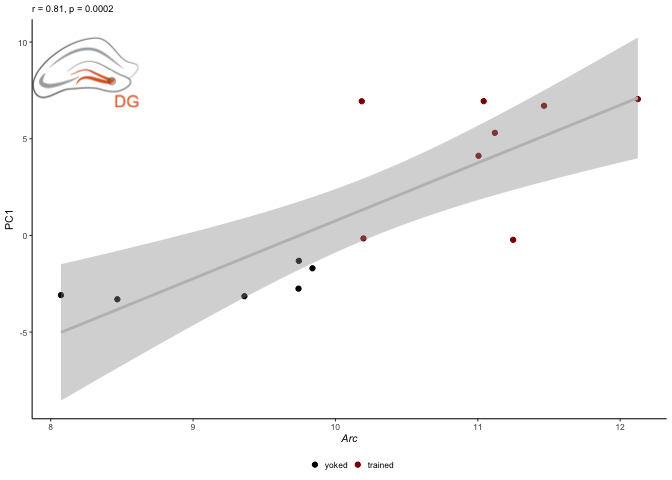
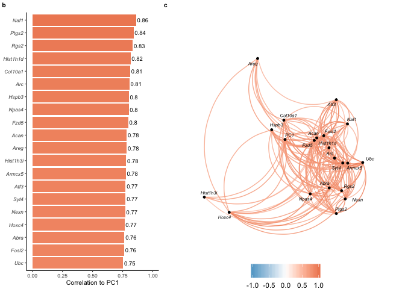
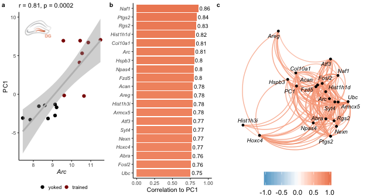

    library(tidyverse)

    ## ── Attaching packages ─────────────────────────────────────────────────────────────────────────────────────── tidyverse 1.3.0 ──

    ## ✔ ggplot2 3.2.1     ✔ purrr   0.3.3
    ## ✔ tibble  2.1.3     ✔ dplyr   0.8.3
    ## ✔ tidyr   1.0.0     ✔ stringr 1.4.0
    ## ✔ readr   1.3.1     ✔ forcats 0.4.0

    ## ── Conflicts ────────────────────────────────────────────────────────────────────────────────────────── tidyverse_conflicts() ──
    ## ✖ dplyr::filter() masks stats::filter()
    ## ✖ dplyr::lag()    masks stats::lag()

    library(corrr)
    library(cowplot)

    ## 
    ## Attaching package: 'cowplot'

    ## The following object is masked from 'package:ggplot2':
    ## 
    ##     ggsave

    source("./figureoptions.R")
    source("./functions_RNAseq.R")

Sample information and PC1
--------------------------

    # read the sample data, set levels, join iwth behvior PCA data
    colData <- read.csv("../data/00_colData.csv", row.names = 1, stringsAsFactors = T)
    colData <- colData %>% filter(subfield == "DG")
    pca.Rn <- read_csv("../data/01_pca.all.csv") %>% 
      filter(trialNum == 9) %>% 
      select(ID:PC2)

    ## Parsed with column specification:
    ## cols(
    ##   ID = col_character(),
    ##   treatment = col_character(),
    ##   trialNum = col_double(),
    ##   Day = col_double(),
    ##   PC1 = col_double(),
    ##   PC2 = col_double(),
    ##   PC3 = col_double(),
    ##   PC4 = col_double(),
    ##   PC5 = col_double(),
    ##   PC6 = col_double(),
    ##   PC7 = col_double(),
    ##   PC8 = col_double(),
    ##   PC9 = col_double(),
    ##   PC10 = col_double()
    ## )

    colData <- left_join(colData, pca.Rn)

    ## Joining, by = c("ID", "treatment")

    ## Warning: Column `ID` joining factor and character vector, coercing into
    ## character vector

    ## Warning: Column `treatment` joining factor and character vector, coercing
    ## into character vector

    head(colData)

    ##       ID subfield        treatment training trialNum Day        PC1
    ## 1 15143A       DG conflict.trained  trained        9   3 -0.2275039
    ## 2 15143B       DG   conflict.yoked    yoked        9   3 -3.1436627
    ## 3 15143D       DG   standard.yoked    yoked        9   3 -2.7532719
    ## 4 15144A       DG conflict.trained  trained        9   3  6.7041815
    ## 5 15144C       DG standard.trained  trained        9   4  7.0499369
    ## 6 15144D       DG   standard.yoked    yoked        9   3 -3.3026284
    ##           PC2
    ## 1  3.03543738
    ## 2 -0.48834291
    ## 3 -0.07584809
    ## 4 -0.07853719
    ## 5 -1.78499206
    ## 6  1.17314374

    # read all count data
    vsd <- read.csv("../data/03_DG_vsdtraining.csv", row.names = 1, check.names = F) 
    vsd$gene <- row.names(vsd)
    vsd$gene <- toupper(vsd$gene)
    vsd <- as.data.frame(vsd)
    row.names(vsd) <- vsd$gene
    vsd$gene <- NULL
    head(vsd)

    ##               143A-DG-1 143B-DG-1 143D-DG-3 144A-DG-2 144C-DG-2 144D-DG-2
    ## 0610007P14RIK  6.497231  6.520310  6.927199  6.622006  6.516323  6.739843
    ## 0610009B22RIK  5.933401  5.821822  5.483341  5.697426  5.971474  5.830043
    ## 0610009L18RIK  5.582826  5.757564  5.597896  5.205323  5.677909  5.676574
    ## 0610009O20RIK  6.833887  6.791130  6.833932  6.638295  6.893977  6.744515
    ## 0610010F05RIK  6.707621  7.173853  7.213884  7.019693  6.996682  6.692027
    ## 0610010K14RIK  6.266778  6.091529  6.152779  5.934677  6.138381  6.218123
    ##               145A-DG-2 145B-DG-1 146A-DG-2 146B-DG-2 146C-DG-4 146D-DG-3
    ## 0610007P14RIK  6.669012  6.257587  6.419110  6.134992  7.017216  7.479295
    ## 0610009B22RIK  6.084135  5.939702  5.838619  6.134992  6.195432  5.205323
    ## 0610009L18RIK  5.443572  5.205323  5.838619  5.205323  5.205323  5.205323
    ## 0610009O20RIK  6.836960  6.726062  6.844498  6.499145  6.468085  6.887955
    ## 0610010F05RIK  6.836960  6.647617  6.861230  7.165895  7.337582  6.603076
    ## 0610010K14RIK  6.344040  6.326885  6.419110  7.325996  6.112012  5.205323
    ##               147C-DG-3 147D-DG-1 148A-DG-3 148B-DG-4
    ## 0610007P14RIK  6.418946  6.592025  6.603472  6.467815
    ## 0610009B22RIK  6.054862  6.038992  5.754020  5.664124
    ## 0610009L18RIK  5.444089  5.874552  5.675946  5.530425
    ## 0610009O20RIK  6.786793  6.734482  7.188195  6.539484
    ## 0610010F05RIK  6.970304  6.855980  6.981797  6.700009
    ## 0610010K14RIK  5.915254  6.266297  5.788993  6.214841

    # prep to join with sample colData
    vsd <- as.data.frame(t(vsd))
    vsd$sample <- row.names(vsd)
    vsd$mouse <- sapply(strsplit(as.character(vsd$sample),"\\-"), "[", 1)
    vsd$ID <- paste(15, vsd$mouse, sep = "")

    vsd <- left_join(colData, vsd)

    ## Joining, by = "ID"

    summary(lm( PC1 ~ ARC, data = vsd))

    ## 
    ## Call:
    ## lm(formula = PC1 ~ ARC, data = vsd)
    ## 
    ## Residuals:
    ##     Min      1Q  Median      3Q     Max 
    ## -4.6975 -1.7185  0.2051  1.2345  5.5996 
    ## 
    ## Coefficients:
    ##             Estimate Std. Error t value Pr(>|t|)    
    ## (Intercept) -26.4042     5.4471  -4.847 0.000259 ***
    ## ARC           2.8998     0.5693   5.094 0.000164 ***
    ## ---
    ## Signif. codes:  0 '***' 0.001 '**' 0.01 '*' 0.05 '.' 0.1 ' ' 1
    ## 
    ## Residual standard error: 2.561 on 14 degrees of freedom
    ## Multiple R-squared:  0.6495, Adjusted R-squared:  0.6245 
    ## F-statistic: 25.95 on 1 and 14 DF,  p-value: 0.0001636

    summary(lm( PC2 ~ ARC, data = vsd))

    ## 
    ## Call:
    ## lm(formula = PC2 ~ ARC, data = vsd)
    ## 
    ## Residuals:
    ##     Min      1Q  Median      3Q     Max 
    ## -2.0690 -0.9000 -0.2211  0.5464  3.2927 
    ## 
    ## Coefficients:
    ##             Estimate Std. Error t value Pr(>|t|)   
    ## (Intercept)  10.1440     3.0396   3.337  0.00489 **
    ## ARC          -0.9769     0.3177  -3.075  0.00823 **
    ## ---
    ## Signif. codes:  0 '***' 0.001 '**' 0.01 '*' 0.05 '.' 0.1 ' ' 1
    ## 
    ## Residual standard error: 1.429 on 14 degrees of freedom
    ## Multiple R-squared:  0.4032, Adjusted R-squared:  0.3605 
    ## F-statistic: 9.457 on 1 and 14 DF,  p-value: 0.008228

    cor.test(vsd$PC1, vsd$ARC, method = c("pearson"))

    ## 
    ##  Pearson's product-moment correlation
    ## 
    ## data:  vsd$PC1 and vsd$ARC
    ## t = 5.0936, df = 14, p-value = 0.0001636
    ## alternative hypothesis: true correlation is not equal to 0
    ## 95 percent confidence interval:
    ##  0.5166076 0.9300680
    ## sample estimates:
    ##      cor 
    ## 0.805927

    cor.test(vsd$PC2, vsd$ARC, method = c("pearson"))

    ## 
    ##  Pearson's product-moment correlation
    ## 
    ## data:  vsd$PC2 and vsd$ARC
    ## t = -3.0752, df = 14, p-value = 0.008228
    ## alternative hypothesis: true correlation is not equal to 0
    ## 95 percent confidence interval:
    ##  -0.8599769 -0.2031956
    ## sample estimates:
    ##        cor 
    ## -0.6349459

    a <- ggplot(vsd, aes(x = ARC, y = PC1)) +
       geom_point(aes( color = treatment)) + 
       geom_smooth(method = "lm", color = "grey") +
       scale_color_manual(values = treatmentcolors) +
      theme_ms() +
       theme(legend.position = "none", axis.title.x = element_blank(), axis.text.x = element_blank())  +
      labs(subtitle = "R2 = 0.81, p = 0.0002")
    b <- ggplot(vsd, aes(x = ARC, y = PC2)) +
       geom_point(aes( color = treatment)) + 
       geom_smooth(method = "lm", color = "grey") +
       scale_color_manual(values = treatmentcolors) +
      theme_ms() +
       theme(legend.position = "none")  +
      labs(subtitle = "R2 = -0.63, p = 0.009 ")

    left <- plot_grid(a,b, nrow = 2, labels = c("a","b"), label_size = 8)
    left

Correlate ALL genes with PC1 and PC2
------------------------------------

    # I'm using the select function to get PC1, PC1, and all the genes. Use `tail(names(vsd),5)` to see that last genes is "ZZZ3"
    head(names(vsd),10)

    ##  [1] "ID"            "subfield"      "treatment"     "training"     
    ##  [5] "trialNum"      "Day"           "PC1"           "PC2"          
    ##  [9] "0610007P14RIK" "0610009B22RIK"

    tail(names(vsd),5)

    ## [1] "ZYX"    "ZZEF1"  "ZZZ3"   "sample" "mouse"

    forcorall <-  vsd %>% select(PC1:ZZZ3)
    corrrmat <- correlate(forcorall, diagonal = 1) 

    ## 
    ## Correlation method: 'pearson'
    ## Missing treated using: 'pairwise.complete.obs'

    head(corrrmat)

    ## # A tibble: 6 x 17,014
    ##   rowname     PC1     PC2 `0610007P14RIK` `0610009B22RIK` `0610009L18RIK`
    ##   <chr>     <dbl>   <dbl>           <dbl>           <dbl>           <dbl>
    ## 1 PC1      1      -0.606          -0.0939          0.324          -0.137 
    ## 2 PC2     -0.606   1               0.0182         -0.200           0.0172
    ## 3 061000… -0.0939  0.0182          1              -0.595          -0.175 
    ## 4 061000…  0.324  -0.200          -0.595           1               0.0259
    ## 5 061000… -0.137   0.0172         -0.175           0.0259          1     
    ## 6 061000…  0.0392 -0.164           0.163          -0.342           0.464 
    ## # … with 17,008 more variables: `0610009O20RIK` <dbl>,
    ## #   `0610010F05RIK` <dbl>, `0610010K14RIK` <dbl>, `0610012G03RIK` <dbl>,
    ## #   `0610030E20RIK` <dbl>, `0610037L13RIK` <dbl>, `0610040J01RIK` <dbl>,
    ## #   `1110002E22RIK` <dbl>, `1110004E09RIK` <dbl>, `1110004F10RIK` <dbl>,
    ## #   `1110008F13RIK` <dbl>, `1110008L16RIK` <dbl>, `1110008P14RIK` <dbl>,
    ## #   `1110012L19RIK` <dbl>, `1110017D15RIK` <dbl>, `1110032A03RIK` <dbl>,
    ## #   `1110032F04RIK` <dbl>, `1110034G24RIK` <dbl>, `1110037F02RIK` <dbl>,
    ## #   `1110038F14RIK` <dbl>, `1110051M20RIK` <dbl>, `1110059E24RIK` <dbl>,
    ## #   `1110059G10RIK` <dbl>, `1110065P20RIK` <dbl>, `1190002N15RIK` <dbl>,
    ## #   `1190005I06RIK` <dbl>, `1190007I07RIK` <dbl>, `1300017J02RIK` <dbl>,
    ## #   `1500009C09RIK` <dbl>, `1500009L16RIK` <dbl>, `1500011B03RIK` <dbl>,
    ## #   `1500011K16RIK` <dbl>, `1500015O10RIK` <dbl>, `1520401A03RIK` <dbl>,
    ## #   `1600002H07RIK` <dbl>, `1600002K03RIK` <dbl>, `1600012H06RIK` <dbl>,
    ## #   `1600014C10RIK` <dbl>, `1700001C19RIK` <dbl>, `1700001K19RIK` <dbl>,
    ## #   `1700001L19RIK` <dbl>, `1700001O22RIK` <dbl>, `1700001P01RIK` <dbl>,
    ## #   `1700003E16RIK` <dbl>, `1700003F12RIK` <dbl>, `1700006E09RIK` <dbl>,
    ## #   `1700007G11RIK` <dbl>, `1700007K13RIK` <dbl>, `1700008O03RIK` <dbl>,
    ## #   `1700010I14RIK` <dbl>, `1700011E24RIK` <dbl>, `1700011H14RIK` <dbl>,
    ## #   `1700011M02RIK` <dbl>, `1700013D24RIK` <dbl>, `1700013F07RIK` <dbl>,
    ## #   `1700014D04RIK` <dbl>, `1700015E13RIK` <dbl>, `1700016D06RIK` <dbl>,
    ## #   `1700016K19RIK` <dbl>, `1700017B05RIK` <dbl>, `1700019A02RIK` <dbl>,
    ## #   `1700019B03RIK` <dbl>, `1700019D03RIK` <dbl>, `1700019O17RIK` <dbl>,
    ## #   `1700020A23RIK` <dbl>, `1700020D05RIK` <dbl>, `1700020L24RIK` <dbl>,
    ## #   `1700020N01RIK` <dbl>, `1700021F05RIK` <dbl>, `1700022I11RIK` <dbl>,
    ## #   `1700023F06RIK` <dbl>, `1700024P16RIK` <dbl>, `1700025G04RIK` <dbl>,
    ## #   `1700027J19RIK` <dbl>, `1700028J19RIK` <dbl>, `1700028K03RIK` <dbl>,
    ## #   `1700028P14RIK` <dbl>, `1700029F12RIK` <dbl>, `1700029H14RIK` <dbl>,
    ## #   `1700029I15RIK` <dbl>, `1700029J07RIK` <dbl>, `1700030J22RIK` <dbl>,
    ## #   `1700030K09RIK` <dbl>, `1700034I23RIK` <dbl>, `1700034J05RIK` <dbl>,
    ## #   `1700037C18RIK` <dbl>, `1700037H04RIK` <dbl>, `1700040L02RIK` <dbl>,
    ## #   `1700047I17RIK2` <dbl>, `1700048O20RIK` <dbl>, `1700057G04RIK` <dbl>,
    ## #   `1700061G19RIK` <dbl>, `1700064H15RIK` <dbl>, `1700066B19RIK` <dbl>,
    ## #   `1700066M21RIK` <dbl>, `1700067K01RIK` <dbl>, `1700088E04RIK` <dbl>,
    ## #   `1700092M07RIK` <dbl>, `1700093K21RIK` <dbl>, `1700102P08RIK` <dbl>, …

Top 11 correlations with PC1 and their relationship with PC2
------------------------------------------------------------

    corrsTop10 <- corrrmat %>% 
      focus(PC1, PC2)  %>% 
      arrange(desc(PC1)) %>% 
      filter(PC1 > 0.7534) 
    corrsTop10

    ## # A tibble: 20 x 3
    ##    rowname    PC1    PC2
    ##    <chr>    <dbl>  <dbl>
    ##  1 NAF1     0.862 -0.698
    ##  2 PTGS2    0.840 -0.645
    ##  3 RGS2     0.834 -0.611
    ##  4 HIST1H1D 0.815 -0.544
    ##  5 COL10A1  0.813 -0.579
    ##  6 ARC      0.806 -0.635
    ##  7 HSPB3    0.803 -0.286
    ##  8 NPAS4    0.802 -0.642
    ##  9 FZD5     0.799 -0.670
    ## 10 ACAN     0.784 -0.545
    ## 11 AREG     0.784 -0.438
    ## 12 HIST1H3I 0.779 -0.489
    ## 13 ARMCX5   0.776 -0.283
    ## 14 ATF3     0.774 -0.681
    ## 15 SYT4     0.774 -0.554
    ## 16 NEXN     0.772 -0.401
    ## 17 HOXC4    0.765 -0.639
    ## 18 ABRA     0.764 -0.634
    ## 19 FOSL2    0.762 -0.672
    ## 20 UBC      0.753 -0.649

    topcorrrs <- corrsTop10$rowname

    p1 <- corrrmat %>% 
      focus(PC1, PC2, topcorrrs,  mirror = TRUE) %>% 
       focus(PC1, PC2) %>%
      mutate(rowname = reorder(rowname, PC1)) %>%
      ggplot(aes(rowname, PC1, fill = PC1)) +
        geom_col() + coord_flip() +
      scale_fill_gradient2(low = "#67a9cf",  high = "#ef8a62", midpoint = 0) +
      theme_ms() +
      theme(legend.position = "none") +
      #ylim(-1,1) +
      labs(x = NULL, y = "Correlation to PC1") +
      labs(subtitle = " ")
    p1 

    p2 <- corrrmat %>% 
      focus(PC1, PC2, topcorrrs,  mirror = TRUE) %>% 
      rearrange() %>% 
      network_plot.cor_df(colors = c("#67a9cf", "white", "#ef8a62"),
                   min_cor = .6, curved = T, legend = T,
                   repel = TRUE) + 
      theme(legend.position = "bottom") +
      labs(subtitle = " ")

    ## Registered S3 method overwritten by 'seriation':
    ##   method         from 
    ##   reorder.hclust gclus

    p2 

    right <- plot_grid(p1,p2,  nrow = 1, labels = c("c","d"), label_size = 8)
    right

all figures together
--------------------

    fig4 <- plot_grid(left, right, nrow = 1, rel_widths = c(1,2))
    fig4

    pdf(file="../figures/04_correlations/correlations.pdf", width=6.69, height=3.5)
    plot(fig4)
    dev.off()

    ## quartz_off_screen 
    ##                 2

    pdf(file="../figures/figure_4.pdf", width=6.69, height=3.5)
    plot(fig4)
    dev.off()

    ## quartz_off_screen 
    ##                 2

What genes genes correlated with PC1? How many gene correlated with PC1 and are differentially epxressed in DG?
---------------------------------------------------------------------------------------------------------------

    # 58 genes are correlated with PC1 > 0.7
    corrsPC1sig <- corrrmat %>% 
      focus(PC1)  %>% 
      arrange(desc(PC1)) %>% 
      filter(PC1 > .7) %>%
       mutate_each(funs=toupper) %>%
      mutate(gene = rowname) %>% 
      arrange(gene) %>% 
      select(gene,PC1)   
    corrsPC1sig$gene

    ##  [1] "ABRA"     "ACAN"     "ADAMTS1"  "AIM1L"    "AMIGO2"   "ARC"     
    ##  [7] "AREG"     "ARL4D"    "ARL5B"    "ARMCX5"   "ATF3"     "BDNF"    
    ## [13] "BTG2"     "CHST14"   "COL10A1"  "CPEB4"    "DUSP8"    "EGR1"    
    ## [19] "EGR4"     "ERRFI1"   "FBXO33"   "FOSL2"    "FRMD6"    "FZD5"    
    ## [25] "GM10269"  "HIST1H1D" "HIST1H3I" "HOMER1"   "HOXC4"    "HSPB3"   
    ## [31] "IGHD"     "KCNK10"   "LONRF1"   "MEST"     "NAF1"     "NEXN"    
    ## [37] "NFIL3"    "NPAS4"    "NR4A3"    "PCDH8"    "PELI1"    "PER1"    
    ## [43] "PLK2"     "PPIC"     "PTGS2"    "RASD1"    "RGS2"     "SGK1"    
    ## [49] "SLC16A1"  "SLC25A25" "SMAD7"    "SPTY2D1"  "SYT4"     "TIPARP"  
    ## [55] "TNFRSF23" "TRIB1"    "UBC"      "ZFP804B"

    # 214 DEGs in DG
    # read DG DEGs
    DG_DEGs <- read.csv("../data/03_DG_DEGs_yokedtrained.csv", row.names = 1, check.names = F) 
    DG_DEGs$gene <- toupper(DG_DEGs$gene)
    dim(DG_DEGs)

    ## [1] 214   5

    # 42 found  in both correlate and deg datasets
    PC1corrsDEGS <- inner_join(corrsPC1sig, DG_DEGs) %>% 
      arrange(gene) %>% select(gene,PC1)   

    ## Joining, by = "gene"

    length(PC1corrsDEGS$gene)

    ## [1] 42

    PC1corrsDEGS$gene

    ##  [1] "ACAN"     "ADAMTS1"  "AMIGO2"   "ARC"      "ARL4D"    "ARL5B"   
    ##  [7] "ARMCX5"   "ATF3"     "BDNF"     "BTG2"     "CPEB4"    "DUSP8"   
    ## [13] "EGR1"     "EGR4"     "ERRFI1"   "FBXO33"   "FOSL2"    "FRMD6"   
    ## [19] "FZD5"     "HOMER1"   "LONRF1"   "MEST"     "NAF1"     "NFIL3"   
    ## [25] "NPAS4"    "NR4A3"    "PCDH8"    "PELI1"    "PER1"     "PLK2"    
    ## [31] "PTGS2"    "RASD1"    "RGS2"     "SGK1"     "SLC16A1"  "SLC25A25"
    ## [37] "SMAD7"    "SPTY2D1"  "SYT4"     "TIPARP"   "TRIB1"    "UBC"

    citation("corrr")

    ## 
    ## To cite package 'corrr' in publications use:
    ## 
    ##   Edgar Ruiz, Simon Jackson and Jorge Cimentada (2019). corrr:
    ##   Correlations in R. R package version 0.4.0.
    ##   https://CRAN.R-project.org/package=corrr
    ## 
    ## A BibTeX entry for LaTeX users is
    ## 
    ##   @Manual{,
    ##     title = {corrr: Correlations in R},
    ##     author = {Edgar Ruiz and Simon Jackson and Jorge Cimentada},
    ##     year = {2019},
    ##     note = {R package version 0.4.0},
    ##     url = {https://CRAN.R-project.org/package=corrr},
    ##   }

    write.csv(corrsTop10, "../data/04_corrsTop10.csv", row.names = F)
    write.csv(corrsPC1sig, "../data/04_corrsPC1sig.csv", row.names = F)
