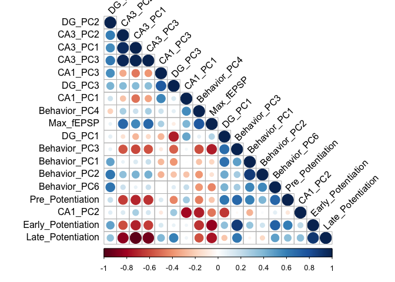
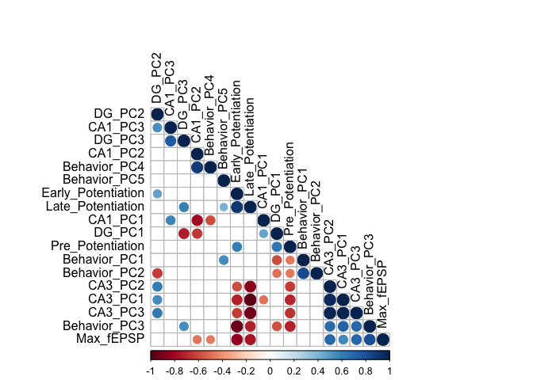
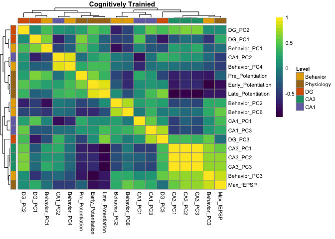
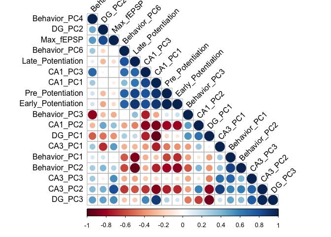
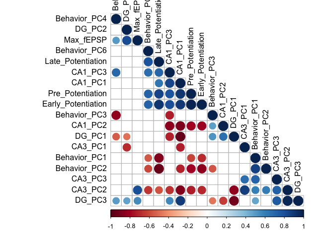
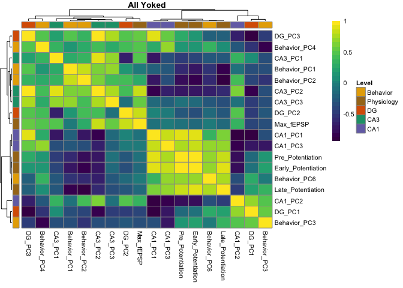
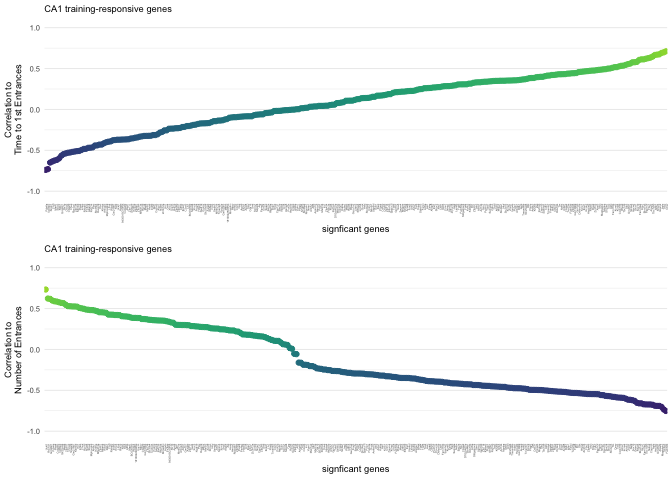
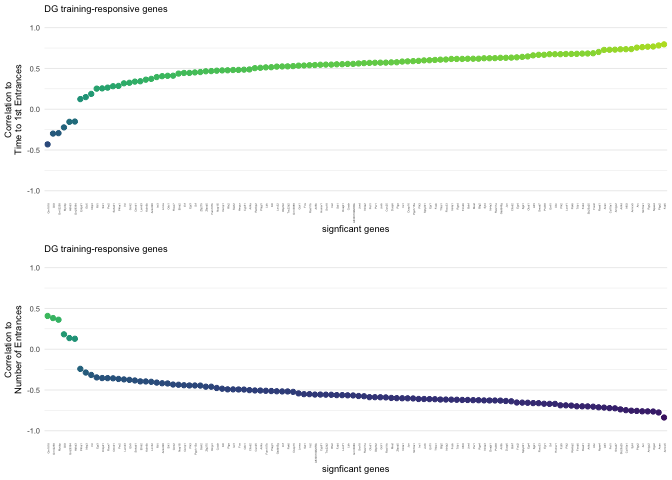
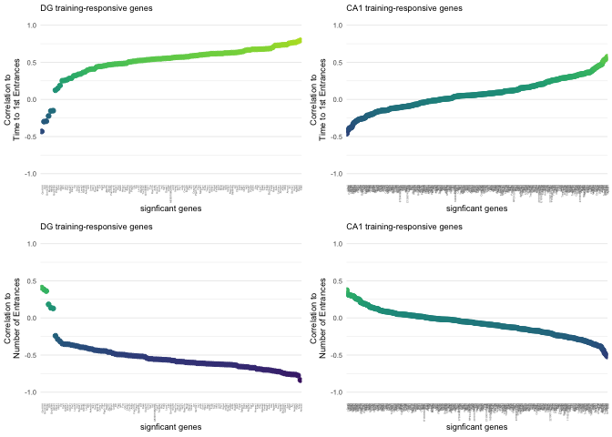

Setup
-----

    library(plyr)
    library(dplyr)
    library(reshape2)
    library(Hmisc)
    library(corrplot)
    library(viridis)
    library(cowplot)
    library(pheatmap)

    source("figureoptions.R")

    knitr::opts_chunk$set(fig.path = '../figures/04_integration/')

Import Data
-----------

    # behavior
    behavior <- read.csv("../data/01a_behavior.csv", header = T)

    # physiology
    ephys3 <- read.csv("../data/03_ephys.csv", header = T)
    ephys3 <- ephys3[,(c(1:6))]
    names(ephys3)[3] <- "Pre_Potentiation"
    names(ephys3)[4] <- "Early_Potentiation"
    names(ephys3)[5] <- "Late_Potentiation"
    names(ephys3)[6] <- "Max_fEPSP"

    # clearnup the rosetts data and filter extraneous samples
    rossetta <- read.csv("../data/00_rossettastone.csv", header = F)
    names(rossetta)[1] <- "organism"
    names(rossetta)[2] <- "ID"
    names(rossetta)[3] <- "Region"
    names(rossetta)[4] <- "RNAseqID"
    names(rossetta)[5] <- "R1filename"
    rossetta$R2filename <- rossetta$R1filename
    rossetta$R2filename <- gsub("R1", "R2", rossetta$R2filename)
    head(rossetta)

    ##   organism     ID Region   RNAseqID                          R1filename
    ## 1  15-142C 15142C    CA1 142C-CA1-S 142C_CA1_S_S19_L003_R1_001.fastq.gz
    ## 2  15-142C 15142C     DG  142C-DG-S  142C_DG_S_S21_L003_R1_001.fastq.gz
    ## 3  15-143A 15143A    CA3 143A-CA3-1 143A_CA3_1_S35_L002_R1_001.fastq.gz
    ## 4  15-143A 15143A     DG  143A-DG-1  143A_DG_1_S36_L002_R1_001.fastq.gz
    ## 5  15-143B 15143B    CA1 143B-CA1-1 143B_CA1_1_S37_L002_R1_001.fastq.gz
    ## 6  15-143B 15143B     DG  143B-DG-1  143B_DG_1_S38_L002_R1_001.fastq.gz
    ##                            R2filename
    ## 1 142C_CA1_S_S19_L003_R2_001.fastq.gz
    ## 2  142C_DG_S_S21_L003_R2_001.fastq.gz
    ## 3 143A_CA3_1_S35_L002_R2_001.fastq.gz
    ## 4  143A_DG_1_S36_L002_R2_001.fastq.gz
    ## 5 143B_CA1_1_S37_L002_R2_001.fastq.gz
    ## 6  143B_DG_1_S38_L002_R2_001.fastq.gz

    colData <- read.csv("../data/02a_colData.csv", header = T) 
    metadata <- full_join(colData, rossetta)

    ## Joining, by = c("RNAseqID", "ID")

    ## Warning: Column `RNAseqID` joining factors with different levels, coercing
    ## to character vector

    ## Warning: Column `ID` joining factors with different levels, coercing to
    ## character vector

    names(metadata)[1] <- "samplename"
    metadata$title <- as.factor(paste(metadata$ID,metadata$Region, metadata$Group, sep=" "))
    names(metadata)[6] <- "sourcename"
    metadata$char1 <- "Mus musculus"
    metadata$char2 <- "C57BL/6"
    metadata$mol <- "RNA"
    metadata$des <- " "
    metadata$processes <- as.factor(paste(metadata$samplename,"/abundance.txt"))
    metadata$process2 <- "IntegrativeWT2015ColData.csv"
    str(metadata)

    ## 'data.frame':    54 obs. of  19 variables:
    ##  $ samplename: chr  "143A-CA3-1" "143A-DG-1" "143B-CA1-1" "143B-DG-1" ...
    ##  $ Mouse     : Factor w/ 18 levels "15-143A","15-143B",..: 1 1 2 2 3 4 4 5 5 5 ...
    ##  $ Punch     : Factor w/ 3 levels "CA1","CA3","DG": 2 3 1 3 1 1 3 1 2 3 ...
    ##  $ Group     : Factor w/ 3 levels "conflict","consistent",..: 1 1 3 3 2 3 3 1 1 1 ...
    ##  $ Conflict  : Factor w/ 2 levels "Conflict","NoConflict": 1 1 1 1 2 2 2 1 1 1 ...
    ##  $ sourcename: Factor w/ 4 levels "conflict","shocked",..: 1 1 2 2 3 4 4 1 1 1 ...
    ##  $ ID        : chr  "15143A" "15143A" "15143B" "15143B" ...
    ##  $ APA2      : Factor w/ 4 levels "conflict","consistent",..: 1 1 3 3 2 4 4 1 1 1 ...
    ##  $ organism  : Factor w/ 21 levels "15-142C","15-143A",..: 2 2 3 3 4 5 5 6 6 6 ...
    ##  $ Region    : Factor w/ 3 levels "CA1","CA3","DG": 2 3 1 3 1 1 3 1 2 3 ...
    ##  $ R1filename: Factor w/ 54 levels "142C_CA1_S_S19_L003_R1_001.fastq.gz",..: 3 4 5 6 7 10 11 12 13 14 ...
    ##  $ R2filename: chr  "143A_CA3_1_S35_L002_R2_001.fastq.gz" "143A_DG_1_S36_L002_R2_001.fastq.gz" "143B_CA1_1_S37_L002_R2_001.fastq.gz" "143B_DG_1_S38_L002_R2_001.fastq.gz" ...
    ##  $ title     : Factor w/ 54 levels "15142C CA1 NA",..: 3 4 5 6 7 10 11 12 13 14 ...
    ##  $ char1     : chr  "Mus musculus" "Mus musculus" "Mus musculus" "Mus musculus" ...
    ##  $ char2     : chr  "C57BL/6" "C57BL/6" "C57BL/6" "C57BL/6" ...
    ##  $ mol       : chr  "RNA" "RNA" "RNA" "RNA" ...
    ##  $ des       : chr  " " " " " " " " ...
    ##  $ processes : Factor w/ 54 levels "142C-CA1-S /abundance.txt",..: 3 4 5 6 7 10 11 12 13 14 ...
    ##  $ process2  : chr  "IntegrativeWT2015ColData.csv" "IntegrativeWT2015ColData.csv" "IntegrativeWT2015ColData.csv" "IntegrativeWT2015ColData.csv" ...

    metadata <- dplyr::select(metadata, samplename, title, sourcename, organism, char1, char2, mol, des, processes, R1filename, R2filename, process2)

    #write.csv(metadata, "../data/00_metadata.csv")

    # clearnup the rosetts data and filter extraneous samples
    names(rossetta)[1] <- "Mouse"
    names(rossetta)[2] <- "ID"
    names(rossetta)[3] <- "Region"
    names(rossetta)[4] <- "RNAseqID"
    names(rossetta)[5] <- "R1filename"
    rossetta$R1filename <- NULL
    rossetta <- rossetta %>% dplyr::filter(Mouse != "15-100", Mouse != "15-101", Mouse != "15-147")
    rossetta <- unique(rossetta[ , c(1:2,4) ]) # for joining keop only

    ## slim behavior ephy to top 5 pcs and rename the columsn
    behaviorpca <- read.csv("../data/01a_scoresdf.csv", header = T)
    behaviorpca <- behaviorpca[(c(1:4,6,35:36))]
    names(behaviorpca)[names(behaviorpca)=="PC1"] <- "Behavior_PC1"
    names(behaviorpca)[names(behaviorpca)=="PC2"] <- "Behavior_PC2"
    names(behaviorpca)[names(behaviorpca)=="PC3"] <- "Behavior_PC3"
    names(behaviorpca)[names(behaviorpca)=="PC4"] <- "Behavior_PC4"
    names(behaviorpca)[names(behaviorpca)=="PC6"] <- "Behavior_PC6"

    behaviorpca <- behaviorpca %>% dplyr::filter(ID != "15148", ID !=  "15140A", ID !=  "15140B", ID !=  "15140C", ID !=  "15140D", ID !=  "15141C", ID !=  "15141D", ID !=  "15142C", ID !=  "15142D", ID !=  "15142A", ID !=  "15142B", ID !=  "15145C", ID !=  "15145C", ID !=  "15145D", ID !=  "15147A", ID !=  "15147B", ID !=  "15148C", ID !=  "15148D")

    pcadata <- read.csv("../data/02a_pcadata.csv", header = T)
    pcadata$Punch <- ifelse(grepl("DG", pcadata$group), "DG", 
                                            ifelse(grepl("CA3", pcadata$group), "CA3","CA1"))
    names(pcadata)[names(pcadata)=="name"] <- "RNAseqID"
    pcadata <- pcadata[c(11:17,2:10)]

    head(rossetta)

    ##     Mouse     ID   RNAseqID
    ## 1 15-142C 15142C 142C-CA1-S
    ## 2 15-142C 15142C  142C-DG-S
    ## 3 15-143A 15143A 143A-CA3-1
    ## 4 15-143A 15143A  143A-DG-1
    ## 5 15-143B 15143B 143B-CA1-1
    ## 6 15-143B 15143B  143B-DG-1

    #widen then length RNAseq data so each row is an animals
    pcadatabyregion <- dplyr::left_join(pcadata, rossetta, by = "RNAseqID")

    ## Warning: Column `RNAseqID` joining factors with different levels, coercing
    ## to character vector

    names(pcadatabyregion)

    ##  [1] "group"     "Punch"     "avoidance" "RNAseqID"  "wrap"     
    ##  [6] "PunchAPA"  "APA2"      "PC1"       "PC2"       "PC3"      
    ## [11] "PC4"       "PC5"       "PC6"       "PC7"       "PC8"      
    ## [16] "PC9"       "Mouse"     "ID"

    pcadatabyregion <- pcadatabyregion[(c(1:7,17:18,8:16))]

    pcadatabyregion <- melt(pcadatabyregion, id = c(1:9))
    pcadatabyregion$RegionPC <- as.factor(paste(pcadatabyregion$Punch, pcadatabyregion$variable, sep="_"))
    pcadatabyregion <- dcast(pcadatabyregion, Mouse ~ RegionPC)

    alldata <- left_join(pcadatabyregion, rossetta , by="Mouse")
    alldata <- left_join(alldata, behaviorpca, by="ID")

    ## Warning: Column `ID` joining factors with different levels, coercing to
    ## character vector

    alldata <- left_join(alldata, ephys3, by="Mouse")

    ## Warning: Column `Mouse` joining factors with different levels, coercing to
    ## character vector

    alldataslim <- dplyr::filter(alldata, APA2 %in% c("conflict","consistent"))

    names(alldataslim)

    ##  [1] "Mouse"              "CA1_PC1"            "CA1_PC2"           
    ##  [4] "CA1_PC3"            "CA1_PC4"            "CA1_PC5"           
    ##  [7] "CA1_PC6"            "CA1_PC7"            "CA1_PC8"           
    ## [10] "CA1_PC9"            "CA3_PC1"            "CA3_PC2"           
    ## [13] "CA3_PC3"            "CA3_PC4"            "CA3_PC5"           
    ## [16] "CA3_PC6"            "CA3_PC7"            "CA3_PC8"           
    ## [19] "CA3_PC9"            "DG_PC1"             "DG_PC2"            
    ## [22] "DG_PC3"             "DG_PC4"             "DG_PC5"            
    ## [25] "DG_PC6"             "DG_PC7"             "DG_PC8"            
    ## [28] "DG_PC9"             "ID"                 "RNAseqID"          
    ## [31] "Behavior_PC1"       "Behavior_PC2"       "Behavior_PC3"      
    ## [34] "Behavior_PC4"       "Behavior_PC6"       "APA2"              
    ## [37] "Group"              "Pre_Potentiation"   "Early_Potentiation"
    ## [40] "Late_Potentiation"  "Max_fEPSP"

    alldataslim <- alldataslim[,-c(1,5:10,14:19,23:28,29:30,36:37)]
    alldataslim <- sapply( alldataslim, as.numeric )

    cormat <- rcorr(as.matrix(alldataslim))
    res2 <- rcorr(as.matrix(alldataslim))

    corrplot(res2$r, type = "lower", order = "hclust", 
            tl.col = "black", tl.srt = 45)

    corrplot(res2$r, type="lower", order="hclust",  tl.col = "black", 
            p.mat = res2$P, sig.level = 0.05, insig = "blank")

    DEGes <- as.data.frame(cormat$r)
    DEGes$group <- c("CA1","CA1","CA1","CA3","CA3","CA3","DG","DG","DG","Behavior","Behavior","Behavior","Behavior","Behavior","Physiology","Physiology","Physiology","Physiology")
    df <- as.data.frame(DEGes$group)
    names(df)[1] <- "Level"
    row.names(df) <- row.names(DEGes)
    DEGes$group <- NULL

    paletteLength <- 30
    myBreaks <- c(seq(min(cormat$r), 0, length.out=ceiling(paletteLength/2) + 1),
                  seq(max(cormat$r)/paletteLength, max(cormat$r), length.out=floor(paletteLength/2)))

    pheatmap(DEGes, show_colnames=T, show_rownames = T,
             annotation_col = df, annotation_colors = ann_colorsLevel,
             annotation_row = df, 
             #annotation_legend = FALSE,
             annotation_names_row = FALSE, annotation_names_col = FALSE,
             treeheight_row = 10, treeheight_col = 10,
             fontsize = 8, 
             width=2.5, height=2,
             border_color = "grey60" ,
             color = viridis(30),
             #cellwidth = 10, 
             clustering_method="average",
             breaks=myBreaks,
             clustering_distance_cols="correlation",
             clustering_distance_rows="correlation" ,
             main="Cognitively Trainied"
             )

    pheatmap(cormat$r, show_colnames=F, show_rownames = T,
             annotation_col = df, annotation_colors = ann_colorsLevel,
             annotation_row = df, 
             #annotation_legend = FALSE,
             annotation_names_row = FALSE, annotation_names_col = FALSE,
             treeheight_row = 10, treeheight_col = 10,
             fontsize = 8, 
             width=4, height=2.25,
             border_color = "grey60" ,
             color = viridis(30),
             clustering_method="average",
             breaks=myBreaks,
             clustering_distance_cols="correlation",
             clustering_distance_rows="correlation",
             filename = "../figures/04_integration/corrTrained.pdf"
             )

    head(alldata)

    ##     Mouse   CA1_PC1  CA1_PC2   CA1_PC3   CA1_PC4    CA1_PC5    CA1_PC6
    ## 1 15-143A        NA       NA        NA        NA         NA         NA
    ## 2 15-143A        NA       NA        NA        NA         NA         NA
    ## 3 15-143B -15.81153 15.25303 -3.606462 0.9520639  3.8894245  0.4329035
    ## 4 15-143B -15.81153 15.25303 -3.606462 0.9520639  3.8894245  0.4329035
    ## 5 15-143C -16.30623 17.24287 -7.792934 2.1072940 -0.1733359 -1.1584867
    ## 6 15-143C -16.30623 17.24287 -7.792934 2.1072940 -0.1733359 -1.1584867
    ##        CA1_PC7   CA1_PC8      CA1_PC9   CA3_PC1   CA3_PC2   CA3_PC3
    ## 1           NA        NA           NA -18.11347 -19.38979 -5.184887
    ## 2           NA        NA           NA -18.11347 -19.38979 -5.184887
    ## 3 -0.795806464 -3.027021 -0.006689372        NA        NA        NA
    ## 4 -0.795806464 -3.027021 -0.006689372        NA        NA        NA
    ## 5  0.008446822 -2.806268 -1.884597363        NA        NA        NA
    ## 6  0.008446822 -2.806268 -1.884597363        NA        NA        NA
    ##     CA3_PC4   CA3_PC5   CA3_PC6    CA3_PC7   CA3_PC8    CA3_PC9   DG_PC1
    ## 1 -7.600432 -6.916928 0.2442081 -0.1748939 0.2335554 -0.9225033 30.62595
    ## 2 -7.600432 -6.916928 0.2442081 -0.1748939 0.2335554 -0.9225033 30.62595
    ## 3        NA        NA        NA         NA        NA         NA 26.91100
    ## 4        NA        NA        NA         NA        NA         NA 26.91100
    ## 5        NA        NA        NA         NA        NA         NA       NA
    ## 6        NA        NA        NA         NA        NA         NA       NA
    ##       DG_PC2    DG_PC3    DG_PC4      DG_PC5    DG_PC6    DG_PC7
    ## 1 -0.9656786 -5.455227  4.087336 -0.08806555 2.7988142 -2.090717
    ## 2 -0.9656786 -5.455227  4.087336 -0.08806555 2.7988142 -2.090717
    ## 3 -1.8943162 -2.192852 -0.767995  4.05246079 0.2182273 -2.291432
    ## 4 -1.8943162 -2.192852 -0.767995  4.05246079 0.2182273 -2.291432
    ## 5         NA        NA        NA          NA        NA        NA
    ## 6         NA        NA        NA          NA        NA        NA
    ##       DG_PC8    DG_PC9     ID   RNAseqID Behavior_PC1 Behavior_PC2
    ## 1 -0.6829819 0.7056409 15143A 143A-CA3-1     8.979881    -3.205040
    ## 2 -0.6829819 0.7056409 15143A  143A-DG-1     8.979881    -3.205040
    ## 3  1.6244657 3.8663534 15143B 143B-CA1-1    -7.986703    -4.867634
    ## 4  1.6244657 3.8663534 15143B  143B-DG-1    -7.986703    -4.867634
    ## 5         NA        NA 15143C 143C-CA1-1    12.252855     3.106723
    ## 6         NA        NA 15143C 143C-CA1-S    12.252855     3.106723
    ##   Behavior_PC3 Behavior_PC4 Behavior_PC6           APA2    Group
    ## 1   2.67546000    0.8503198    -6.280920       conflict     <NA>
    ## 2   2.67546000    0.8503198    -6.280920       conflict     <NA>
    ## 3  -0.03632236    2.3240220     8.613456 yoked-conflict  control
    ## 4  -0.03632236    2.3240220     8.613456 yoked-conflict  control
    ## 5   6.88945052   -2.8341330     2.997247     consistent conflict
    ## 6   6.88945052   -2.8341330     2.997247     consistent conflict
    ##   Pre_Potentiation Early_Potentiation Late_Potentiation  Max_fEPSP
    ## 1               NA                 NA                NA         NA
    ## 2               NA                 NA                NA         NA
    ## 3           101.56              95.34             76.90 -0.0061714
    ## 4           101.56              95.34             76.90 -0.0061714
    ## 5           130.98             199.54            195.64 -0.0077112
    ## 6           130.98             199.54            195.64 -0.0077112

    alldata$APA2 <- factor(alldata$APA2, levels = c("yoked-consistent", "consistent",  "yoked-conflict", "conflict"))

    alldata$avoidance <-  ifelse(grepl("yoked", alldata$APA), "no", "yes")

    alldata$wrap <- "All Cognitively Trained" 

    behavDG <- alldata %>%
      filter(avoidance == "yes") %>%
      ggplot(aes(Behavior_PC1,as.numeric(DG_PC2))) + 
      geom_point(size = 2, alpha = 0.75, aes(color=APA2)) +
      scale_color_manual(values = colorvalAPA6) +
        theme_cowplot(font_size = 8, line_size = 0.25)  +
        theme(legend.position="none") +
        stat_smooth(method = "lm", color="red") + 
        ylab(paste0("DG PC1")) +
        xlab(paste0("Behavior PC1"))  +
      facet_wrap(~wrap)
    behavDG

    pdf(file="../figures/04_integration/behavDG.pdf", width=1.75, height=2)
    plot(behavDG)
    dev.off()

    ## pdf 
    ##   3

    alldata <- left_join(pcadatabyregion, rossetta , by="Mouse")
    alldata <- left_join(alldata, behaviorpca, by="ID")
    alldata <- left_join(alldata, ephys3, by="Mouse")

    alldataslim <- dplyr::filter(alldata, APA2 %in% c("yoked-conflict","yoked-consistent"))

    alldataslim <- alldataslim[,-c(1,5:10,14:19,23:28,29:30,36:37)]
    alldataslim <- sapply( alldataslim, as.numeric )

    cormat <- rcorr(as.matrix(alldataslim))
    res2 <- rcorr(as.matrix(alldataslim))

    corrplot(res2$r, type = "lower", order = "hclust", 
            tl.col = "black", tl.srt = 45)

    corrplot(res2$r, type="lower", order="hclust",  tl.col = "black", 
            p.mat = res2$P, sig.level = 0.05, insig = "blank")

    DEGes <- as.data.frame(cormat$r)
    DEGes$group <- c("CA1","CA1","CA1","CA3","CA3","CA3","DG","DG","DG","Behavior","Behavior","Behavior","Behavior","Behavior","Physiology","Physiology","Physiology","Physiology")
    df <- as.data.frame(DEGes$group)
    names(df)[1] <- "Level"
    row.names(df) <- row.names(DEGes)
    DEGes$group <- NULL

    paletteLength <- 30
    myBreaks <- c(seq(min(cormat$r), 0, length.out=ceiling(paletteLength/2) + 1),
                  seq(max(cormat$r)/paletteLength, max(cormat$r), length.out=floor(paletteLength/2)))
    pheatmap(DEGes, show_colnames=T, show_rownames = T,
             annotation_col = df, annotation_colors = ann_colorsLevel,
             annotation_row = df, 
             #annotation_legend = FALSE,
             annotation_names_row = FALSE, annotation_names_col = FALSE,
             treeheight_row = 10, treeheight_col = 10,
             fontsize = 8, 
             width=2.5, height=2,
             border_color = "grey60" ,
             color = viridis(30),
             #cellwidth = 10, 
             clustering_method="average",
             breaks=myBreaks,
             clustering_distance_cols="correlation",
             clustering_distance_rows="correlation" ,
             main="All Yoked"
             )

    pheatmap(cormat$r, show_colnames=F, show_rownames = T,
             annotation_col = df, annotation_colors = ann_colorsLevel,
             annotation_row = df, 
             #annotation_legend = FALSE,
             annotation_names_row = FALSE, annotation_names_col = FALSE,
             treeheight_row = 10, treeheight_col = 10,
             fontsize = 8, 
             width=4, height=2.25,
             border_color = "grey60" ,
             color = viridis(30),
             clustering_method="average",
             breaks=myBreaks,
             clustering_distance_cols="correlation",
             clustering_distance_rows="correlation",
             filename = "../figures/04_integration/corrYoked.pdf",
             main="All Yoked"
             )

Significant genes

    # read files with pvalues
    CA1stresspvals <- read.csv("../data/02c_CA1_consyokcons.csv", stringsAsFactors = F, row.names = NULL) 
    CA1trainpvals <- read.csv("../data/02c_CA1_yokeconfyokcons.csv", stringsAsFactors = F, row.names = NULL)
    DGtrainpvals <- read.csv("../data/02c_DG_consyokcons.csv", stringsAsFactors = F)

    # remove non-significant genes and genes affected by learning and stresss
    CA1learnstress <- read.csv("../data/02_CA1learningstressgenes.csv", stringsAsFactors = F)
    CA1learnstress <- as.vector(CA1learnstress$gene)

    CA1trainpvals <- CA1trainpvals %>% filter(!gene %in% CA1learnstress,
                                              direction != "NS")
    CA1stresspvals <- CA1stresspvals %>% filter(!gene %in% CA1learnstress,
                                              direction != "NS")
    DGtrainpvals <- DGtrainpvals %>% filter(!gene %in% CA1learnstress,
                                              direction != "NS")

    # read variance stabilized count data
    DGvsd <- read.csv("../data/02c_DGvsd.csv", stringsAsFactors = F, check.names = F) 
    CA1vsd <- read.csv("../data/02c_CA1vsd.csv", stringsAsFactors = F, check.names = F)

    # function to calculate and plot correlations between gene expression and behaivor
    correlationdf <- function(pvalues, vsds){
      
      # add gene to df for joining
      colnames(vsds)[1] <- "gene"
      
      mydf <- left_join(pvalues, vsds)
      row.names(mydf) <- mydf$gene
      mydf <- mydf[-c(1:6)]
      mydf <- as.data.frame(t(mydf))
      
      # create an ID column to join lists of DEGs with their experssion values and the behavior of the animal 
      mydf$sample <-  row.names(mydf)
      mydf$mouse <- sapply(strsplit(as.character(mydf$sample),'-'), "[", 1)
      mydf$ID <- paste("15", mydf$mouse, sep = "")
      mydf$sample <-  NULL
      mydf$mouse <- NULL
      row.names(mydf) <- mydf$ID
      
      # randomely select 15 genes and add ID column back for joining
      mydfrandom <- mydf
      #mydfrandom <- mydfrandom[sample(1:ncol(mydfrandom), 15,replace=FALSE)]
      
      mydfrandom$ID <- row.names(mydfrandom)
      
      # subset the beahvior data to the last time point and only values shows in figure 2
      favbehav <- behavior %>% 
        filter(TrainSession == "Retention") %>%
        select(ID, NumEntrances, Time1stEntr)
        
      favbehavgenes <- left_join(mydfrandom, favbehav)
      favbehavgenes$ID <- NULL
      
      mycordf = cor(favbehavgenes)
      #corrplot(mycordf, method = "circle", title = mytitle, tl.col = "black", tl.cex = 0.8)
      mycordf <- as.data.frame(mycordf)
      mycordf$gene <- row.names(mycordf)
      return(mycordf)
    }  

    corCA1stress <- correlationdf(CA1stresspvals, CA1vsd)

    ## Joining, by = "gene"

    ## Joining, by = "ID"

    ## Warning: Column `ID` joining character vector and factor, coercing into
    ## character vector

    corCA1train <- correlationdf(CA1trainpvals, CA1vsd)

    ## Joining, by = "gene"
    ## Joining, by = "ID"

    ## Warning: Column `ID` joining character vector and factor, coercing into
    ## character vector

    corDGtrain <- correlationdf(DGtrainpvals, DGvsd) 

    ## Joining, by = "gene"
    ## Joining, by = "ID"

    ## Warning: Column `ID` joining character vector and factor, coercing into
    ## character vector

    corpointplot <- function(mycordf, mytitle){

      # remove self corelations
      mycordf <- mycordf %>%
        filter(!gene %in% c("NumEntrances", "Time1stEntr"))
      
      p1 <- mycordf %>%
        select(-Time1stEntr) %>% # remove corelations with other behavior
        ggplot(aes(x = reorder(gene, -NumEntrances), y = NumEntrances, color = NumEntrances)) +
        geom_point(stat = "identity") +
        theme_minimal(base_size = 7) +
        theme(axis.text.x = element_text(angle = 90, hjust = 1, size = 2),
              panel.grid.major.x = element_blank(),
              panel.grid.minor.x = element_blank(),
              legend.position = "none")   +
        labs(subtitle = mytitle, x = "signficant genes", y = "Correlation to\nNumber of Entrances")  +
        ylim(-1, 1) +
        scale_color_viridis(limits=c(-1,1))
      
      p2 <- mycordf %>%
        select(-NumEntrances) %>% # remove corelations with other behavior
        ggplot(aes(x =  reorder(gene, Time1stEntr), y = Time1stEntr, color = Time1stEntr)) +
        geom_point(stat = "identity") +
        theme_minimal(base_size = 7) +
        theme(axis.text.x = element_text(angle = 90, hjust = 1, size = 2),
              panel.grid.major.x = element_blank(),
              panel.grid.minor.x = element_blank(),
              legend.position = "none",
              legend.title = element_blank())   +
        labs(subtitle = mytitle, x = "signficant genes", y = "Correlation to\nTime to 1st Entrances")  +
        ylim(-1, 1) +
        scale_color_viridis(limits=c(-1,1)) 
        
      
      p12 <- plot_grid(p2,p1, nrow = 2)
        
      print(p12)
    }

    a <- corpointplot(corCA1train, "CA1 training-responsive genes") 

    b <- corpointplot(corDGtrain, "DG training-responsive genes")

    ab <- plot_grid(b,a, nrow = 1)
    ab 

    pdf(file="../figures/04_integration/correlationpointplots.pdf", width=5, height=4)
    plot(ab)    
    dev.off() 

    ## quartz_off_screen 
    ##                 2

    corDGtrain %>%
      filter(Time1stEntr > 0.75 | NumEntrances < -.75 |  Time1stEntr < -.75 | NumEntrances > 0.75,
             !gene %in% c("Time1stEntr", "NumEntrances")) %>%
      select(gene, Time1stEntr, NumEntrances)

    ##       gene Time1stEntr NumEntrances
    ## 1     Acan   0.7270032   -0.7757527
    ## 2   Amigo2   0.7301423   -0.7621433
    ## 3      Arc   0.7550063   -0.7613195
    ## 4   Armcx5   0.7372492   -0.8373150
    ## 5     Fzd5   0.7954120   -0.6875919
    ## 6    Npas4   0.7686581   -0.7123179
    ## 7    Ptgs2   0.7818914   -0.7566271
    ## 8     Rgs2   0.7664609   -0.7638017
    ## 9  Slc16a1   0.7613746   -0.6036242
    ## 10    Syt4   0.6248840   -0.7540978

    corCA1train %>%
      filter(Time1stEntr > 0.5 | NumEntrances < -.5 |  Time1stEntr < -.5 | NumEntrances > 0.5,
             !gene %in% c("Time1stEntr", "NumEntrances")) %>%
      select(gene, Time1stEntr, NumEntrances)

    ##       gene Time1stEntr NumEntrances
    ## 1   Apcdd1   0.5747051   -0.4286220
    ## 2     Dus2   0.5446638   -0.4347349
    ## 3  Gm10146   0.5391813   -0.5062042
    ## 4   Gm6741   0.5519054   -0.3576612
    ## 5 Irak1bp1   0.5327331   -0.3336685
    ## 6     Orc6   0.5020997   -0.5185818
    ## 7  Tmem143   0.5219493   -0.3079609
