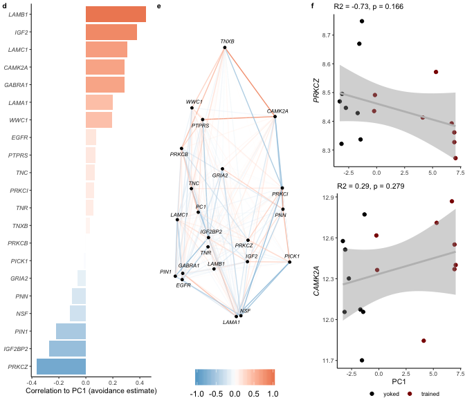
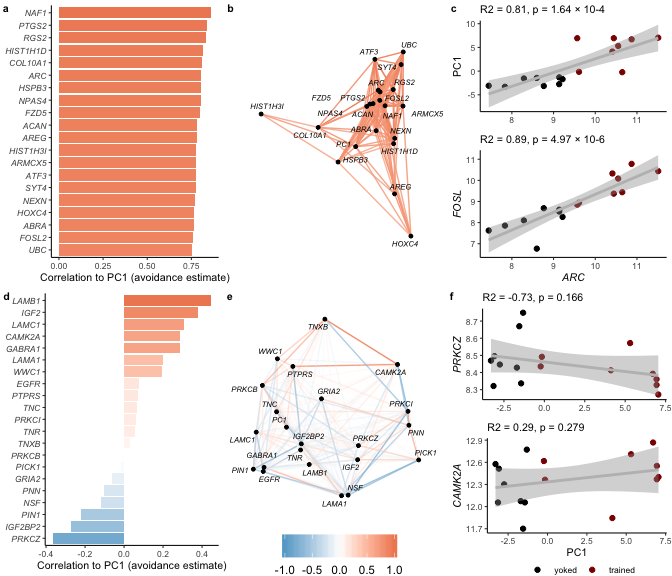

    suppressMessages(library(tidyverse))
    suppressMessages(library(cowplot))
    suppressMessages(library(corrr)) # for easy correlations
    suppressMessages(library(Hmisc)) # for correlations with pvalue

    source("./figureoptions.R")
    source("./functions_RNAseq.R")

Sample information and PC1
--------------------------

    # meta data
    colData <- read_csv("../data/00_colData.csv")

    ## Parsed with column specification:
    ## cols(
    ##   RNAseqID = col_character(),
    ##   ID = col_character(),
    ##   subfield = col_character(),
    ##   treatment = col_character(),
    ##   training = col_character()
    ## )

    geneids <- read_csv("../data/00_geneids.csv") %>% distinct(gene) %>% mutate(gene = toupper(gene))

    ## Parsed with column specification:
    ## cols(
    ##   id = col_character(),
    ##   ENSMUST = col_character(),
    ##   ENSMUSG = col_character(),
    ##   OTTMUSG = col_character(),
    ##   OTTMUST = col_character(),
    ##   transcript = col_character(),
    ##   gene = col_character(),
    ##   length = col_double(),
    ##   structure1 = col_character(),
    ##   structure2 = col_character(),
    ##   structure3 = col_character(),
    ##   transcript_lenght = col_character()
    ## )

    # pca data
    pca.Rn <- read_csv("../data/01_pca.all.csv") %>% 
      filter(trialNum == 9) %>%  
      select(ID:PC2) %>%
      left_join(colData) %>% drop_na() %>% select(ID, treatment, training, trialNum, Day, RNAseqID, subfield, PC1, PC2)

    ## Parsed with column specification:
    ## cols(
    ##   ID = col_character(),
    ##   treatment = col_character(),
    ##   trialNum = col_double(),
    ##   Day = col_double(),
    ##   PC1 = col_double(),
    ##   PC2 = col_double(),
    ##   PC3 = col_double(),
    ##   PC4 = col_double(),
    ##   PC5 = col_double(),
    ##   PC6 = col_double(),
    ##   PC7 = col_double(),
    ##   PC8 = col_double(),
    ##   PC9 = col_double(),
    ##   PC10 = col_double()
    ## )

    ## Joining, by = c("ID", "treatment")

    head(pca.Rn)

    ## # A tibble: 6 x 9
    ##   ID     treatment training trialNum   Day RNAseqID subfield    PC1     PC2
    ##   <chr>  <chr>     <chr>       <dbl> <dbl> <chr>    <chr>     <dbl>   <dbl>
    ## 1 15143A conflict… trained         9     3 143A-CA… CA3      -0.228  3.04  
    ## 2 15143A conflict… trained         9     3 143A-DG… DG       -0.228  3.04  
    ## 3 15143B conflict… yoked           9     3 143B-CA… CA1      -3.14  -0.488 
    ## 4 15143B conflict… yoked           9     3 143B-DG… DG       -3.14  -0.488 
    ## 5 15143C standard… trained         9     3 143C-CA… CA1       5.89   0.332 
    ## 6 15143D standard… yoked           9     3 143D-CA… CA1      -2.75  -0.0758

    prepvsdforjoin <- function(pathtovsd, mysubfield){
      #read all count data
      vsd <- read_csv(pathtovsd) 
      vsd$gene <- vsd$X1
      vsd$gene <- toupper(vsd$gene)
      vsd <- vsd %>% arrange(gene) %>%  select(gene,everything())
      vsd <- as.data.frame(vsd)
      vsd$X1 <- NULL
      row.names(vsd) <- vsd$gene
      vsd$gene <- NULL
      vsd <- as.data.frame(t(vsd))

      vsd$RNAseqID <- row.names(vsd)
      vsd <- vsd %>%  select(RNAseqID, everything())
      vsd <- left_join(pca.Rn, vsd)  %>% drop_na()

      vsd$subfield <- factor(vsd$subfield, levels = levelssubfield)
      vsd$treatment <- factor(vsd$treatment, levels = levelstreatment)
      vsd$training <- factor(vsd$training, levels = levelstraining)
      return(vsd)
    }

    vsdDG <- prepvsdforjoin("../data/03_DG_vsdtraining.csv")

    ## Warning: Missing column names filled in: 'X1' [1]

    ## Parsed with column specification:
    ## cols(
    ##   X1 = col_character(),
    ##   `143A-DG-1` = col_double(),
    ##   `143B-DG-1` = col_double(),
    ##   `143D-DG-3` = col_double(),
    ##   `144A-DG-2` = col_double(),
    ##   `144C-DG-2` = col_double(),
    ##   `144D-DG-2` = col_double(),
    ##   `145A-DG-2` = col_double(),
    ##   `145B-DG-1` = col_double(),
    ##   `146A-DG-2` = col_double(),
    ##   `146B-DG-2` = col_double(),
    ##   `146C-DG-4` = col_double(),
    ##   `146D-DG-3` = col_double(),
    ##   `147C-DG-3` = col_double(),
    ##   `147D-DG-1` = col_double(),
    ##   `148A-DG-3` = col_double(),
    ##   `148B-DG-4` = col_double()
    ## )

    ## Joining, by = "RNAseqID"

different sets of candidatea genes
----------------------------------

    classicmemgenes <- c("PRKCZ", "WWC1", "PRKCI", "PRKCB",
                    "NSF", "GRIA2", "PIN1", "IGF2", "CAMK2A",
                    "PICK1")

    stabilizationgenes  <- c("IGF2BP2",  "LAMA1", "LAMB1", "LAMC1", "TNC", "TNXB",
                              "TNR", "GABRA1", "PTPRS", "PNN", "EGFR")

    ACTINngenes <- c("LIMK1","CFL1", "ROCK2")

    astrocyticgenes <- c("ALDH1A1", "ALDH1L1", "ALDH1L2", 
                         "SLC1A2", "GFAP", "GJB6", "FGFR3", "AQP4", "ALDOC")

    allcandidates <- c(classicmemgenes, ACTINngenes, stabilizationgenes, astrocyticgenes)

correlations with ARC
---------------------

    printcortests <- function(mysubfield, df){
      print(mysubfield)
      print(cor.test(df$PC1, df$ARC, method = c("pearson")))
      print(cor.test(df$FOSL2, df$ARC, method = c("pearson")))
      print(cor.test(df$PC1, df$PRKCZ, method = c("pearson")))
      print(cor.test(df$PC1, df$CAMK2A, method = c("pearson")))
    }

    printcortests("DG", vsdDG)

    ## [1] "DG"
    ## 
    ##  Pearson's product-moment correlation
    ## 
    ## data:  df$PC1 and df$ARC
    ## t = 5.0936, df = 14, p-value = 0.0001636
    ## alternative hypothesis: true correlation is not equal to 0
    ## 95 percent confidence interval:
    ##  0.5166076 0.9300680
    ## sample estimates:
    ##      cor 
    ## 0.805927 
    ## 
    ## 
    ##  Pearson's product-moment correlation
    ## 
    ## data:  df$FOSL2 and df$ARC
    ## t = 7.1459, df = 14, p-value = 4.966e-06
    ## alternative hypothesis: true correlation is not equal to 0
    ## 95 percent confidence interval:
    ##  0.6957281 0.9600200
    ## sample estimates:
    ##       cor 
    ## 0.8859057 
    ## 
    ## 
    ##  Pearson's product-moment correlation
    ## 
    ## data:  df$PC1 and df$PRKCZ
    ## t = -1.4622, df = 14, p-value = 0.1658
    ## alternative hypothesis: true correlation is not equal to 0
    ## 95 percent confidence interval:
    ##  -0.7282877  0.1607156
    ## sample estimates:
    ##        cor 
    ## -0.3639878 
    ## 
    ## 
    ##  Pearson's product-moment correlation
    ## 
    ## data:  df$PC1 and df$CAMK2A
    ## t = 1.1261, df = 14, p-value = 0.2791
    ## alternative hypothesis: true correlation is not equal to 0
    ## 95 percent confidence interval:
    ##  -0.2421023  0.6859077
    ## sample estimates:
    ##      cor 
    ## 0.288189

    plotcorrelation <- function(df, myx, myy){
      p <- ggplot(df, aes(x = myx, y = myy)) +
       geom_point(aes(color = training)) + 
       geom_smooth(method = "lm", color = "grey") +
       scale_color_manual(values = volcano1) +
      theme_ms() +
       theme(legend.position = "none") +
        labs(y = NULL, x = NULL)
      return(p)
    }

    p1 <- plotcorrelation(vsdDG, vsdDG$ARC, vsdDG$PC1) + labs(y = "PC1", subtitle = "R2 = 0.81, p = 1.64 × 10-4")
    p2 <- plotcorrelation(vsdDG, vsdDG$ARC, vsdDG$FOSL2)  + labs(y = "FOSL", x = "ARC", subtitle = "R2 = 0.89, p = 4.97 × 10-6") + 
      theme(axis.title = element_text(face = "italic"))

    cd <- plot_grid(p1,p2, nrow = 2, rel_heights = c(0.45,0.55), labels = c("c", NULL), label_size = 8)
    cd

    p3 <- plotcorrelation(vsdDG, vsdDG$PC1, vsdDG$PRKCZ) + labs( y = "PRKCZ",   subtitle = "R2 = -0.73, p = 0.166") + 
      theme(axis.title.y = element_text(face = "italic"))
    p4 <- plotcorrelation(vsdDG, vsdDG$PC1, vsdDG$CAMK2A)  + labs(x = "PC1", y = "CAMK2A", subtitle = "R2 = 0.29, p = 0.279") + 
      theme(axis.title.y = element_text(face = "italic"), 
            legend.position = "bottom", legend.title = element_blank(),
            legend.margin=margin(0,0,0,0),
            legend.box.margin=margin(-8,-8,-8,-8)) 

    gh <- plot_grid(p3,p4, nrow = 2, rel_heights = c(0.45,0.55), labels = c("f", NULL), label_size = 8)
    gh

Correlate ALL genes with PC1 and PC2
------------------------------------

    # Use `tail(names(vsd),10)` to see that last genes is "ZZZ3"
    tail(names(vsdDG),10)

    ##  [1] "ZUFSP"  "ZW10"   "ZWILCH" "ZWINT"  "ZXDB"   "ZXDC"   "ZYG11B"
    ##  [8] "ZYX"    "ZZEF1"  "ZZZ3"

    makecorrrmatrix <- function(df){
      forcorall <-  df %>% select(PC1:ZZZ3)
      corrrmat <- correlate(forcorall) 
      return(corrrmat)
    }

    corrrDG <- makecorrrmatrix(vsdDG) 

    ## 
    ## Correlation method: 'pearson'
    ## Missing treated using: 'pairwise.complete.obs'

    corrrCA3 <- makecorrrmatrix(vsdCA3) 

    ## 
    ## Correlation method: 'pearson'
    ## Missing treated using: 'pairwise.complete.obs'

    corrrCA1 <- makecorrrmatrix(vsdCA1) 

    ## 
    ## Correlation method: 'pearson'
    ## Missing treated using: 'pairwise.complete.obs'

Top correlations with PC1 and their relationship with PC2
---------------------------------------------------------

    corrsTop <- corrrDG %>% 
      focus(PC1)  %>% 
      arrange(desc(PC1)) %>% 
      top_n(20)

    ## Selecting by PC1

    topcorrrs <- corrsTop$rowname

    a <- corrrDG %>% 
        focus(PC1,  topcorrrs,  mirror = TRUE) %>% 
        focus(PC1) %>% 
        mutate(rowname = reorder(rowname, PC1)) %>%
        ggplot(aes(rowname, PC1, fill = PC1)) +
         geom_col() + coord_flip() +
        scale_fill_gradient2(low = "#67a9cf",  high = "#ef8a62", midpoint = 0) +
        theme_ms() +
        theme(legend.position = "none", axis.text.y = element_text(face = "italic")) +
        #ylim(-1,1) +
        labs(x = NULL, y = "Correlation to PC1 (avoidance estimate)") 
      
    b <- corrrDG %>% 
        focus(PC1, topcorrrs,  mirror = TRUE) %>% 
        replace(., is.na(.), 1) %>% 
        network_plot.cor_df(colors = c("#67a9cf", "white", "#ef8a62"),
                   min_cor = .7, curved = F, legend = T,
                   repel = TRUE) + 
        theme(legend.position = "none") 
      
    ab <- plot_grid(a,b,  nrow = 1, labels = c("a", "b"), label_size = 8)
     
    abcd <- plot_grid(ab, cd, rel_widths = c(0.66, 0.33))
    abcd

    plotcorrrs2 <- function(df, whichsubfield){
      
      favgenes <- c(classicmemgenes, stabilizationgenes)
      
      df <- df %>% 
        focus(PC1, favgenes,  mirror = TRUE)  %>% 
        arrange(desc(PC1))

      p1 <- df %>% 
        focus(PC1) %>%
        mutate(rowname = reorder(rowname, PC1)) %>%
        ggplot(aes(rowname, PC1, fill = PC1)) +
         geom_col() + coord_flip() +
        scale_fill_gradient2(low = "#67a9cf",  high = "#ef8a62", midpoint = 0) +
        theme_ms() +
        theme(legend.position = "none", axis.text.y = element_text(face = "italic")) +
        #ylim(-1,1) +
        labs(x = NULL, y = "Correlation to PC1 (avoidance estimate)")
      

      p3 <- df %>% 
        replace(., is.na(.), 1) %>% 
        network_plot.cor_df(colors = c("#67a9cf", "white", "#ef8a62"),
                   min_cor = 0.0, curved = F, legend = T,
                   repel = TRUE) + 
        theme(legend.position = "bottom") 
      
      p13 <- plot_grid(p1,p3,  nrow = 1, labels = c("d", "e"), label_size = 8)
      
      filename <- paste("../data/06_", whichsubfield, "_candidatecorrelations.csv", sep = "")
      
      write.csv(df, filename)

      return(p13)
      
    }

    ef <- plotcorrrs2(corrrDG, "DG")

    efgh <- plot_grid(ef, gh, rel_widths = c(0.66, 0.33))
    efgh

    plot_grid(abcd,efgh, nrow = 2)

correlations with p-values
--------------------------

    getcandidategenecorrelations <- function(df, candidategenes, whichsubfield){
      
      x <- df %>%
        select(ID, PC1, PC2, candidategenes)
      x <- as.data.frame(x)
      row.names(x) <- x$ID
      x$ID <- NULL
      res <- rcorr(as.matrix(x))
      
      cormat <- res$r
      pmat <- res$P
      
      ut <- upper.tri(cormat)
      
      newdf <- data.frame(
        row = rownames(cormat)[row(cormat)[ut]],
        column = rownames(cormat)[col(cormat)[ut]],
        cor  =(cormat)[ut],
        p = pmat[ut]
        )
      
      newdf <- newdf %>% arrange(p) %>%
        mutate(padj = p.adjust(p, method = "fdr", n = length(p)))
      
      filename <- paste("../data/06_", whichsubfield, "_corrswithpvalue.csv", sep = "")
      write.csv(newdf, filename)
      
      print(head(newdf, 10))
      return(newdf)
      
    }

    DGcorrswithpvalue <- getcandidategenecorrelations(vsdDG, allcandidates, "DG")

    ##        row  column        cor            p         padj
    ## 1    PICK1   LAMC1  0.9009589 1.922347e-06 0.0004728711
    ## 2     TNXB ALDH1L1 -0.8939859 3.036534e-06 0.0004728711
    ## 3    PRKCI    TNXB  0.8884341 4.274995e-06 0.0004728711
    ## 4   SLC1A2    AQP4  0.8877482 4.454013e-06 0.0004728711
    ## 5  ALDH1A1    GJB6  0.8874325 4.538507e-06 0.0004728711
    ## 6    PRKCI ALDH1L1 -0.8865977 4.768448e-06 0.0004728711
    ## 7    PRKCI   ROCK2  0.8819981 6.219411e-06 0.0005286499
    ## 8  ALDH1A1   ALDOC  0.8757261 8.783571e-06 0.0006532781
    ## 9     GFAP    GJB6  0.8680360 1.309062e-05 0.0008654355
    ## 10  CAMK2A  SLC1A2  0.8489599 3.194234e-05 0.0019005690
