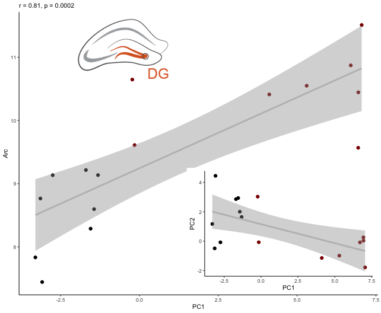

    suppressMessages(library(tidyverse))
    suppressMessages(library(cowplot))
    suppressMessages(library(corrr)) # for easy correlations
    suppressMessages(library(Hmisc)) # for correlations with pvalue

    source("./figureoptions.R")
    source("./functions_RNAseq.R")

Sample information and PC1
--------------------------

    # meta data
    colData <- read_csv("../data/00_colData.csv")

    ## Parsed with column specification:
    ## cols(
    ##   RNAseqID = col_character(),
    ##   ID = col_character(),
    ##   subfield = col_character(),
    ##   treatment = col_character(),
    ##   training = col_character()
    ## )

    geneids <- read_csv("../data/00_geneids.csv") %>% distinct(gene) %>% mutate(gene = toupper(gene))

    ## Parsed with column specification:
    ## cols(
    ##   id = col_character(),
    ##   ENSMUST = col_character(),
    ##   ENSMUSG = col_character(),
    ##   OTTMUSG = col_character(),
    ##   OTTMUST = col_character(),
    ##   transcript = col_character(),
    ##   gene = col_character(),
    ##   length = col_double(),
    ##   structure1 = col_character(),
    ##   structure2 = col_character(),
    ##   structure3 = col_character(),
    ##   transcript_lenght = col_character()
    ## )

    # pca data
    pca.Rn <- read_csv("../data/01_pca.all.csv") %>% 
      filter(trialNum == 9) %>%  
      select(ID:PC2) %>%
      left_join(colData) %>% drop_na() %>% select(ID, treatment, training, trialNum, Day, RNAseqID, subfield, PC1, PC2)

    ## Parsed with column specification:
    ## cols(
    ##   ID = col_character(),
    ##   treatment = col_character(),
    ##   trialNum = col_double(),
    ##   Day = col_double(),
    ##   PC1 = col_double(),
    ##   PC2 = col_double(),
    ##   PC3 = col_double(),
    ##   PC4 = col_double(),
    ##   PC5 = col_double(),
    ##   PC6 = col_double(),
    ##   PC7 = col_double(),
    ##   PC8 = col_double(),
    ##   PC9 = col_double(),
    ##   PC10 = col_double()
    ## )

    ## Joining, by = c("ID", "treatment")

    head(pca.Rn)

    ## # A tibble: 6 x 9
    ##   ID     treatment training trialNum   Day RNAseqID subfield    PC1     PC2
    ##   <chr>  <chr>     <chr>       <dbl> <dbl> <chr>    <chr>     <dbl>   <dbl>
    ## 1 15143A conflict… trained         9     3 143A-CA… CA3      -0.228  3.04  
    ## 2 15143A conflict… trained         9     3 143A-DG… DG       -0.228  3.04  
    ## 3 15143B conflict… yoked           9     3 143B-CA… CA1      -3.14  -0.488 
    ## 4 15143B conflict… yoked           9     3 143B-DG… DG       -3.14  -0.488 
    ## 5 15143C standard… trained         9     3 143C-CA… CA1       5.89   0.332 
    ## 6 15143D standard… yoked           9     3 143D-CA… CA1      -2.75  -0.0758

    prepvsdforjoin <- function(pathtovsd, mysubfield){
      #read all count data
      vsd <- read_csv(pathtovsd) 
      vsd$gene <- vsd$X1
      vsd$gene <- str_to_title(vsd$gene)
      vsd <- vsd %>% arrange(gene) %>%  select(gene,everything())
      vsd <- as.data.frame(vsd)
      vsd$X1 <- NULL
      row.names(vsd) <- vsd$gene
      vsd$gene <- NULL
      vsd <- as.data.frame(t(vsd))

      vsd$RNAseqID <- row.names(vsd)
      vsd <- vsd %>%  select(RNAseqID, everything())
      vsd <- left_join(pca.Rn, vsd)  %>% drop_na()

      vsd$subfield <- factor(vsd$subfield, levels = levelssubfield)
      vsd$treatment <- factor(vsd$treatment, levels = levelstreatment)
      vsd$training <- factor(vsd$training, levels = levelstraining)
      return(vsd)
    }

    vsdDG <- prepvsdforjoin("../data/03_DG_vsdtraining.csv")

    ## Warning: Missing column names filled in: 'X1' [1]

    ## Parsed with column specification:
    ## cols(
    ##   X1 = col_character(),
    ##   `143A-DG-1` = col_double(),
    ##   `143B-DG-1` = col_double(),
    ##   `143D-DG-3` = col_double(),
    ##   `144A-DG-2` = col_double(),
    ##   `144C-DG-2` = col_double(),
    ##   `144D-DG-2` = col_double(),
    ##   `145A-DG-2` = col_double(),
    ##   `145B-DG-1` = col_double(),
    ##   `146A-DG-2` = col_double(),
    ##   `146B-DG-2` = col_double(),
    ##   `146C-DG-4` = col_double(),
    ##   `146D-DG-3` = col_double(),
    ##   `147C-DG-3` = col_double(),
    ##   `147D-DG-1` = col_double(),
    ##   `148A-DG-3` = col_double(),
    ##   `148B-DG-4` = col_double()
    ## )

    ## Joining, by = "RNAseqID"

    vsdCA1 <- prepvsdforjoin("../data/03_CA1_vsdtraining.csv")

    ## Warning: Missing column names filled in: 'X1' [1]

    ## Parsed with column specification:
    ## cols(
    ##   X1 = col_character(),
    ##   `143B-CA1-1` = col_double(),
    ##   `143C-CA1-1` = col_double(),
    ##   `143D-CA1-3` = col_double(),
    ##   `144A-CA1-2` = col_double(),
    ##   `144B-CA1-1` = col_double(),
    ##   `144C-CA1-2` = col_double(),
    ##   `145A-CA1-2` = col_double(),
    ##   `145B-CA1-1` = col_double(),
    ##   `146A-CA1-2` = col_double(),
    ##   `146B-CA1-2` = col_double(),
    ##   `146C-CA1-4` = col_double(),
    ##   `146D-CA1-3` = col_double(),
    ##   `147C-CA1-3` = col_double(),
    ##   `148A-CA1-3` = col_double(),
    ##   `148B-CA1-4` = col_double()
    ## )
    ## Joining, by = "RNAseqID"

    vsdCA3 <- prepvsdforjoin("../data/03_CA3_vsdtraining.csv")

    ## Warning: Missing column names filled in: 'X1' [1]

    ## Parsed with column specification:
    ## cols(
    ##   X1 = col_character(),
    ##   `143A-CA3-1` = col_double(),
    ##   `144A-CA3-2` = col_double(),
    ##   `144B-CA3-1` = col_double(),
    ##   `144C-CA3-2` = col_double(),
    ##   `144D-CA3-2` = col_double(),
    ##   `145A-CA3-2` = col_double(),
    ##   `146A-CA3-2` = col_double(),
    ##   `146B-CA3-2` = col_double(),
    ##   `146D-CA3-3` = col_double(),
    ##   `147C-CA3-3` = col_double(),
    ##   `147D-CA3-1` = col_double(),
    ##   `148A-CA3-3` = col_double(),
    ##   `148B-CA3-4` = col_double()
    ## )
    ## Joining, by = "RNAseqID"

    head(vsdDG)[1:10]

    ## # A tibble: 6 x 10
    ##   ID    treatment training trialNum   Day RNAseqID subfield    PC1     PC2
    ##   <chr> <fct>     <fct>       <dbl> <dbl> <chr>    <fct>     <dbl>   <dbl>
    ## 1 1514… conflict… trained         9     3 143A-DG… DG       -0.228  3.04  
    ## 2 1514… conflict… yoked           9     3 143B-DG… DG       -3.14  -0.488 
    ## 3 1514… standard… yoked           9     3 143D-DG… DG       -2.75  -0.0758
    ## 4 1514… conflict… trained         9     3 144A-DG… DG        6.70  -0.0785
    ## 5 1514… standard… trained         9     4 144C-DG… DG        7.05  -1.78  
    ## 6 1514… standard… yoked           9     3 144D-DG… DG       -3.30   1.17  
    ## # … with 1 more variable: `0610007p14rik` <dbl>

correlation between PC1 and PC2 or Arc
--------------------------------------

    iconDG <- png::readPNG("../figures/00_schematics/DG.png")
    iconDG <-  grid::rasterGrob(iconDG, interpolate=TRUE)

    iconCA3 <- png::readPNG("../figures/00_schematics/CA3.png")
    iconCA3 <-  grid::rasterGrob(iconCA3, interpolate=TRUE)

    iconCA1 <- png::readPNG("../figures/00_schematics/CA1.png")
    iconCA1 <-  grid::rasterGrob(iconCA1, interpolate=TRUE)

    icontrainedyoked <- png::readPNG("../figures/00_schematics/figure_yokedtrained.png")
    icontrainedyoked <-  grid::rasterGrob(icontrainedyoked, interpolate=TRUE)

correlations with PC1
---------------------

    # correlations to go with plots a, b, and c
    cor.test(vsdDG$PC1, vsdDG$PC2, method = c("pearson"))

    ## 
    ##  Pearson's product-moment correlation
    ## 
    ## data:  vsdDG$PC1 and vsdDG$PC2
    ## t = -2.8489, df = 14, p-value = 0.01288
    ## alternative hypothesis: true correlation is not equal to 0
    ## 95 percent confidence interval:
    ##  -0.8471103 -0.1573206
    ## sample estimates:
    ##        cor 
    ## -0.6057841

    cor.test(vsdCA3$PC1, vsdCA3$Arc, method = c("pearson"))

    ## 
    ##  Pearson's product-moment correlation
    ## 
    ## data:  vsdCA3$PC1 and vsdCA3$Arc
    ## t = -1.0265, df = 11, p-value = 0.3267
    ## alternative hypothesis: true correlation is not equal to 0
    ## 95 percent confidence interval:
    ##  -0.7280482  0.3050049
    ## sample estimates:
    ##        cor 
    ## -0.2956684

    cor.test(vsdCA1$PC1, vsdCA1$Arc, method = c("pearson"))

    ## 
    ##  Pearson's product-moment correlation
    ## 
    ## data:  vsdCA1$PC1 and vsdCA1$Arc
    ## t = 0.73268, df = 13, p-value = 0.4768
    ## alternative hypothesis: true correlation is not equal to 0
    ## 95 percent confidence interval:
    ##  -0.3486959  0.6455477
    ## sample estimates:
    ##       cor 
    ## 0.1991377

    plotcorrelation <- function(df, myx, myy){
      p <- ggplot(df, aes(x = myx, y = myy)) +
       geom_point(aes(color = training)) + 
       geom_smooth(method = "lm", color = "grey") +
       scale_color_manual(values = volcano1) +
      theme_ms() +
       theme(legend.position = "none") +
        labs(y = NULL, x = NULL)
      return(p)
    }

    p1 <- plotcorrelation(vsdDG, vsdDG$PC1, vsdDG$PC2) + 
      labs(x = "PC1", y = "PC2", subtitle = "r = -0.61, p = 0.013")  + 
        annotation_custom(icontrainedyoked, ymin = 3, ymax = 4, xmin = 2.5, xmax = 7)

    p2 <- plotcorrelation(vsdCA3, vsdCA3$PC1, vsdCA3$Arc) + 
      labs(x = "PC1", y = "Arc", subtitle = "r = -0.30, p = 0.327")  + 
      theme(axis.title.y = element_text(face = "italic"),
            legend.position = "bottom",
            legend.title = element_blank(),
            legend.key.size =  unit(0.25, "cm")) +
      annotation_custom(iconCA3, ymin = 9.3, ymax = 9.7, xmin = 2.5, xmax = 7)

    p3 <- plotcorrelation(vsdCA1, vsdCA1$PC1, vsdCA1$Arc)  + 
      labs(x = "PC1", y = "Arc", subtitle = "r = 0.20, p = 0.48") + 
      theme(axis.title.y = element_text(face = "italic")) +
        annotation_custom(iconCA1, ymin = 10.5, ymax = 11.3, xmin = 2.5, xmax = 7) 

    cor.test(vsdDG$PC1, vsdDG$Igf2, method = c("pearson"))

    ## 
    ##  Pearson's product-moment correlation
    ## 
    ## data:  vsdDG$PC1 and vsdDG$Igf2
    ## t = 1.5246, df = 14, p-value = 0.1496
    ## alternative hypothesis: true correlation is not equal to 0
    ## 95 percent confidence interval:
    ##  -0.1455966  0.7354766
    ## sample estimates:
    ##       cor 
    ## 0.3773427

    cor.test(vsdCA3$PC1, vsdCA3$Igf2, method = c("pearson"))

    ## 
    ##  Pearson's product-moment correlation
    ## 
    ## data:  vsdCA3$PC1 and vsdCA3$Igf2
    ## t = 1.846, df = 11, p-value = 0.09195
    ## alternative hypothesis: true correlation is not equal to 0
    ## 95 percent confidence interval:
    ##  -0.08831082  0.81810116
    ## sample estimates:
    ##       cor 
    ## 0.4863387

    cor.test(vsdCA1$PC1, vsdCA1$Igf2, method = c("pearson"))

    ## 
    ##  Pearson's product-moment correlation
    ## 
    ## data:  vsdCA1$PC1 and vsdCA1$Igf2
    ## t = 2.5589, df = 13, p-value = 0.02379
    ## alternative hypothesis: true correlation is not equal to 0
    ## 95 percent confidence interval:
    ##  0.09453006 0.84153161
    ## sample estimates:
    ##       cor 
    ## 0.5787666

    p4 <- plotcorrelation(vsdDG, vsdDG$PC1, vsdDG$Igf2) + 
      labs(x = "PC1", y = "Igf2", subtitle = "r = 0.38, p = 0.150")  + 
      theme(axis.title.y = element_text(face = "italic"),
            legend.title = element_blank(),
            legend.key.size =  unit(0.25, "cm")) +
      annotation_custom(iconDG, ymin = 5, ymax = 5.6, xmin = 2.5, xmax = 7)

    p5 <- plotcorrelation(vsdCA3, vsdCA3$PC1, vsdCA3$Igf2) + 
      labs(x = "PC1", y = "Igf2", subtitle = "r = 0.48, p = 0.092")  + 
      theme(axis.title.y = element_text(face = "italic"),
            legend.title = element_blank(),
            legend.key.size =  unit(0.25, "cm")) +
      annotation_custom(iconCA3, ymin = 5, ymax = 7, xmin = 2.5, xmax = 7)

    p6 <- plotcorrelation(vsdCA1, vsdCA1$PC1, vsdCA1$Igf2)  + 
      labs(x = "PC1", y = "Igf2", subtitle = "r = 0.58, p = 0.024") + 
      theme(axis.title.y = element_text(face = "italic")) +
        annotation_custom(iconCA1, ymin = 6, ymax = 6.3, xmin = 2.5, xmax = 7) 

    plot_grid(p4,p5,p6, nrow = 1)

    mylegend = get_legend(p2)

    p1p2p3 <- plot_grid(p1,p2 + theme(legend.position = "none"), p3, 
                        p4,p5,p6,
                        labels = "auto", label_size = 8, nrow = 2)

    supplfig3 <- plot_grid(p1p2p3, mylegend, nrow = 2, rel_heights = c(1,0.1))
    supplfig3

    pdf(file="../figures/06_favegenes/supplfig3.pdf", width=6.69, height=5.5)
    plot(supplfig3)
    dev.off()

    ## quartz_off_screen 
    ##                 2

    pdf(file="../figures/supplfig3.pdf", width=6.69, height=5.5)
    plot(supplfig3)
    dev.off()

    ## quartz_off_screen 
    ##                 2

Correlate ALL genes with PC1 and PC2
------------------------------------

Candidate gene
--------------

    classicmemgenes <- c("Camk2a" ,  "Gria2",  "Igf2" , "Nsf" , "Pick1",
                            "Prkcb" ,  "Prkci",  "Prkcz", "Wwc1" )

    stabilizationgenes  <- c("Igf2bp2", "Lama1"  , "Lamb1"  , "Lamc1" ,  "Tnc" ,
                             "Tnxb"  ,  "Tnr" ,    "Gabra1" , "Ptprs"  , "Pnn"  , "Egfr")

    ACTINngenes <- c("Limk1","Cfl1", "Rock2")

    astrocyticgenes <- c("Aldh1a1", "Aldh1l1" ,"Aldh1l2", "Slc1a2" , "Gfap" ,
                         "Gjb6" ,   "Fgfr3" ,  "Aqp4" ,   "Aldoc")

    allcandidates <- c(classicmemgenes, ACTINngenes, stabilizationgenes, astrocyticgenes)

    # Use `tail(names(vsd),10)` to see that last genes is "Zzz3"
    makecorrrmatrix <- function(df){
      forcorall <-  df %>% select(PC1, PC2, allcandidates)
      corrrmat <- correlate(forcorall) 
      return(corrrmat)
    }

    corrrDG <- makecorrrmatrix(vsdDG)  

    ## 
    ## Correlation method: 'pearson'
    ## Missing treated using: 'pairwise.complete.obs'

    corrrCA3 <- makecorrrmatrix(vsdCA3)  

    ## 
    ## Correlation method: 'pearson'
    ## Missing treated using: 'pairwise.complete.obs'

    corrrCA1 <- makecorrrmatrix(vsdCA1)  

    ## 
    ## Correlation method: 'pearson'
    ## Missing treated using: 'pairwise.complete.obs'

    plotcorrrs2 <- function(favgenes, corrs, whichsubfield, myPC1label, myPC2label, mylabels){
      
      df <- corrs %>% 
        focus(PC1, PC2, favgenes,  mirror = TRUE)  %>% 
        arrange(desc(PC1))
      
      p1 <- df %>% 
        focus(PC1) %>%
        dplyr::filter(rowname != "PC2") %>%
        ggplot(aes(x = reorder(rowname, desc(rowname)), PC1, fill = PC1, label = round(PC1,2))) +
         geom_col() + coord_flip() +
        scale_fill_gradient2(low = "#67a9cf",  high = "#ef8a62", midpoint = 0) +
        theme_ms() +
        theme(legend.position = "none", axis.text.y = element_text(face = "italic")) +
        ylim(-0.75, 0.75) +
        labs(x = whichsubfield, y = myPC1label) +
         geom_hline(yintercept = -0.6, linetype = "dashed", color = "grey", size = 0.5) +
         geom_hline(yintercept = 0.6, linetype = "dashed", color = "grey", size = 0.5)
      
       p2 <- df %>% 
        focus(PC2) %>%
        dplyr::filter(rowname != "PC1") %>%
        ggplot(aes(x = reorder(rowname, desc(rowname)), PC2, fill = PC2, label = round(PC2,2))) +
         geom_col() + coord_flip() +
        scale_fill_gradient2(low = "#67a9cf",  high = "#ef8a62", midpoint = 0) +
        theme_ms() +
        theme(legend.position = "none", 
              axis.text.y = element_blank()) +
        ylim(-0.75,0.75) +
        labs(x = " ", y = myPC2label) +
         geom_hline(yintercept = -0.6, linetype = "dashed", color = "grey", size = 0.5) +
         geom_hline(yintercept = 0.6, linetype = "dashed", color = "grey", size = 0.5)

      dflong <- df %>%
        pivot_longer(-rowname, names_to = "colname") %>%
        dplyr::filter(rowname != "PC1", rowname != "PC2")%>%
        dplyr::filter(colname != "PC1", colname != "PC2")

      p3 <-  ggplot(dflong, aes(x = rowname, y = reorder(colname, desc(colname)), 
                                fill= value, label = round(value,2))) + 
        geom_tile() +
        scale_fill_gradient2(low = "#67a9cf",mid = "white", 
                             high = "#ef8a62", na.value = "white",
                             limits = c(-1,1)) +
        theme_classic(base_size = 8) +
        labs(x = NULL, y = NULL) +
        theme(axis.text = element_text(face = "italic"),
              legend.position = "none") +
        geom_text(size=2.5, aes(label= ifelse(value > 0.6, round(value,2),
                                              ifelse(value < -0.6, round(value,2), " "))))
      
      
      p123 <- plot_grid(p1, p2, p3,  
                       nrow = 1, labels = mylabels, label_size = 8, rel_widths = c(0.9,0.8,1.5))
      
      #filename <- paste("../data/06_", whichsubfield, "_candidatecorrelations.csv", sep = "")
      
      #write.csv(df, filename)

      return(p123)
      
    }

    p4 <- plotcorrrs2(classicmemgenes, corrrDG, "DG", NULL, NULL, c("a", "b", "c"))

    ## Warning: Removed 9 rows containing missing values (geom_text).

    p5 <- plotcorrrs2(classicmemgenes, corrrCA3, "CA3", NULL, NULL, c("d", "e", "f"))

    ## Warning: Removed 9 rows containing missing values (geom_text).

    p6 <- plotcorrrs2(classicmemgenes, corrrCA1, "CA1", "Correlation to PC1 \n (avoidance estimate)",
                      "Correlation to PC2 \n (activity estimate)",
                      c("g", "h", "i"))

    ## Warning: Removed 9 rows containing missing values (geom_text).

    p456 <- plot_grid(p4,p5,p6, nrow = 3)

    circuit <- png::readPNG("../figures/00_schematics/figure_hippocircuit.png")
    circuit <- ggdraw() +  draw_image(circuit, scale = 1)

    p456circuit <- plot_grid(circuit, p456, nrow = 1, rel_widths = c(0.1,1))
    p456circuit

    pdf(file="../figures/06_favegenes/classicmemgenes.pdf", width=6.69, height=6)
    plot(p456circuit)    
    dev.off()

    ## quartz_off_screen 
    ##                 2

    pdf(file="../figures/figure_4.pdf", width=6.69, height=6)
    plot(p456circuit)    
    dev.off()

    ## quartz_off_screen 
    ##                 2

    p7 <- plotcorrrs2(astrocyticgenes, corrrDG, "DG", NULL, NULL, c("a", "b", "c"))

    ## Warning: Removed 9 rows containing missing values (geom_text).

    p8 <- plotcorrrs2(astrocyticgenes, corrrCA3, "CA3", NULL, NULL, c("d", "e", "f"))

    ## Warning: Removed 2 rows containing missing values (position_stack).

    ## Warning: Removed 9 rows containing missing values (geom_text).

    p9 <- plotcorrrs2(astrocyticgenes, corrrCA1, "CA1", "Correlation to PC1 \n (avoidance estimate)",
                      "Correlation to PC2 \n (activity estimate)",
                      c("g", "h", "i"))

    ## Warning: Removed 9 rows containing missing values (geom_text).

    p789 <- plot_grid(p7,p8,p9, nrow = 3)

    p789circuit <- plot_grid(circuit, p789, nrow = 1, rel_widths = c(0.1,1))
    p789circuit

    pdf(file="../figures/06_favegenes/astrocyticgenes.pdf", width=6.69, height=6)
    plot(p789circuit)    
    dev.off()

    ## quartz_off_screen 
    ##                 2

    pdf(file="../figures/supplfig4.pdf", width=6.69, height=6)
    plot(p789circuit)    
    dev.off()

    ## quartz_off_screen 
    ##                 2

correlations with p-values
--------------------------

    getcandidategenecorrelations <- function(df, candidategenes, whichsubfield){
      
      x <- df %>%
        select(ID, PC1, PC2, candidategenes)
      x <- as.data.frame(x)
      row.names(x) <- x$ID
      x$ID <- NULL
      res <- rcorr(as.matrix(x))
      
      cormat <- res$r
      pmat <- res$P
      
      ut <- upper.tri(cormat)
      
      newdf <- data.frame(
        row = rownames(cormat)[row(cormat)[ut]],
        column = rownames(cormat)[col(cormat)[ut]],
        cor  =(cormat)[ut],
        p = pmat[ut]
        )
      
      newdf <- newdf %>% arrange(p) %>%
        mutate(padj = p.adjust(p, method = "fdr", n = length(p)))
      
      filename <- paste("../data/06_", whichsubfield, "_corrswithpvalue.csv", sep = "")
      write.csv(newdf, filename)
      
      print(head(newdf, 10))
      return(newdf)
      
    }

    DGcorrswithpvalue <- getcandidategenecorrelations(vsdDG, allcandidates, "DG")

    ##        row  column        cor            p         padj
    ## 1    Pick1   Lamc1  0.9009589 1.922347e-06 0.0004458499
    ## 2     Tnxb Aldh1l1 -0.8939859 3.036534e-06 0.0004458499
    ## 3    Prkci    Tnxb  0.8884341 4.274995e-06 0.0004458499
    ## 4   Slc1a2    Aqp4  0.8877482 4.454013e-06 0.0004458499
    ## 5  Aldh1a1    Gjb6  0.8874325 4.538507e-06 0.0004458499
    ## 6    Prkci Aldh1l1 -0.8865977 4.768448e-06 0.0004458499
    ## 7    Prkci   Rock2  0.8819981 6.219411e-06 0.0004984414
    ## 8  Aldh1a1   Aldoc  0.8757261 8.783571e-06 0.0006159479
    ## 9     Gfap    Gjb6  0.8680360 1.309062e-05 0.0008159821
    ## 10  Camk2a  Slc1a2  0.8489599 3.194234e-05 0.0017919651

    CA3corrswithpvalue <- getcandidategenecorrelations(vsdCA3, allcandidates, "CA3")

    ##        row  column        cor            p         padj
    ## 1     Gjb6   Aldoc  0.9356891 2.622829e-06 0.0006724521
    ## 2  Aldh1a1 Aldh1l1  0.9324362 3.418801e-06 0.0006724521
    ## 3     Gfap   Fgfr3  0.9317971 3.596001e-06 0.0006724521
    ## 4     Gfap   Aldoc  0.9180910 9.584218e-06 0.0013441866
    ## 5    Fgfr3    Aqp4  0.8983028 3.030198e-05 0.0028908321
    ## 6    Ptprs    Gjb6 -0.8979158 3.091799e-05 0.0028908321
    ## 7   Slc1a2   Fgfr3  0.8768696 8.312999e-05 0.0064093533
    ## 8      Nsf    Gfap -0.8740583 9.359244e-05 0.0064093533
    ## 9      Nsf Aldh1l1 -0.8713203 1.047687e-04 0.0064093533
    ## 10  Slc1a2    Gfap  0.8691755 1.142487e-04 0.0064093533

    CA1corrswithpvalue <- getcandidategenecorrelations(vsdCA1, allcandidates, "CA1")

    ##        row column        cor            p       padj
    ## 1      Nsf   Wwc1 -0.8555629 4.756473e-05 0.01595307
    ## 2    Prkcb    Tnr  0.8501021 5.970954e-05 0.01595307
    ## 3    Limk1  Lamb1  0.8332957 1.141492e-04 0.01595307
    ## 4    Prkcb  Rock2  0.8312027 1.231329e-04 0.01595307
    ## 5    Lamc1   Egfr  0.8248231 1.541753e-04 0.01595307
    ## 6    Limk1   Aqp4  0.8175267 1.972814e-04 0.01595307
    ## 7   Slc1a2  Fgfr3  0.8172553 1.990579e-04 0.01595307
    ## 8    Pick1    Pnn -0.7964702 3.800031e-04 0.02664772
    ## 9  Aldh1a1  Aldoc  0.7811893 5.846593e-04 0.03644376
    ## 10   Gria2  Limk1 -0.7712003 7.613469e-04 0.04271156
