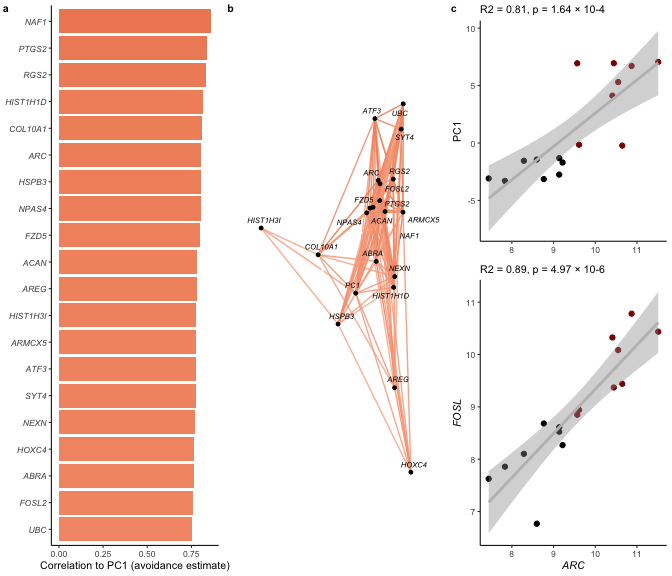

    suppressMessages(library(tidyverse))
    suppressMessages(library(cowplot))
    suppressMessages(library(corrr)) # for easy correlations
    suppressMessages(library(Hmisc)) # for correlations with pvalue

    source("./figureoptions.R")
    source("./functions_RNAseq.R")

Sample information and PC1
--------------------------

    # meta data
    colData <- read_csv("../data/00_colData.csv")

    ## Parsed with column specification:
    ## cols(
    ##   RNAseqID = col_character(),
    ##   ID = col_character(),
    ##   subfield = col_character(),
    ##   treatment = col_character(),
    ##   training = col_character()
    ## )

    geneids <- read_csv("../data/00_geneids.csv") %>% distinct(gene) %>% mutate(gene = toupper(gene))

    ## Parsed with column specification:
    ## cols(
    ##   id = col_character(),
    ##   ENSMUST = col_character(),
    ##   ENSMUSG = col_character(),
    ##   OTTMUSG = col_character(),
    ##   OTTMUST = col_character(),
    ##   transcript = col_character(),
    ##   gene = col_character(),
    ##   length = col_double(),
    ##   structure1 = col_character(),
    ##   structure2 = col_character(),
    ##   structure3 = col_character(),
    ##   transcript_lenght = col_character()
    ## )

    # pca data
    pca.Rn <- read_csv("../data/01_pca.all.csv") %>% 
      filter(trialNum == 9) %>%  
      select(ID:PC2) %>%
      left_join(colData) %>% drop_na() %>% select(ID, treatment, training, trialNum, Day, RNAseqID, subfield, PC1, PC2)

    ## Parsed with column specification:
    ## cols(
    ##   ID = col_character(),
    ##   treatment = col_character(),
    ##   trialNum = col_double(),
    ##   Day = col_double(),
    ##   PC1 = col_double(),
    ##   PC2 = col_double(),
    ##   PC3 = col_double(),
    ##   PC4 = col_double(),
    ##   PC5 = col_double(),
    ##   PC6 = col_double(),
    ##   PC7 = col_double(),
    ##   PC8 = col_double(),
    ##   PC9 = col_double(),
    ##   PC10 = col_double()
    ## )

    ## Joining, by = c("ID", "treatment")

    head(pca.Rn)

    ## # A tibble: 6 x 9
    ##   ID     treatment training trialNum   Day RNAseqID subfield    PC1     PC2
    ##   <chr>  <chr>     <chr>       <dbl> <dbl> <chr>    <chr>     <dbl>   <dbl>
    ## 1 15143A conflict… trained         9     3 143A-CA… CA3      -0.228  3.04  
    ## 2 15143A conflict… trained         9     3 143A-DG… DG       -0.228  3.04  
    ## 3 15143B conflict… yoked           9     3 143B-CA… CA1      -3.14  -0.488 
    ## 4 15143B conflict… yoked           9     3 143B-DG… DG       -3.14  -0.488 
    ## 5 15143C standard… trained         9     3 143C-CA… CA1       5.89   0.332 
    ## 6 15143D standard… yoked           9     3 143D-CA… CA1      -2.75  -0.0758

    prepvsdforjoin <- function(pathtovsd, mysubfield){
      #read all count data
      vsd <- read_csv(pathtovsd) 
      vsd$gene <- vsd$X1
      vsd$gene <- str_to_title(vsd$gene)
      vsd <- vsd %>% arrange(gene) %>%  select(gene,everything())
      vsd <- as.data.frame(vsd)
      vsd$X1 <- NULL
      row.names(vsd) <- vsd$gene
      vsd$gene <- NULL
      vsd <- as.data.frame(t(vsd))

      vsd$RNAseqID <- row.names(vsd)
      vsd <- vsd %>%  select(RNAseqID, everything())
      vsd <- left_join(pca.Rn, vsd)  %>% drop_na()

      vsd$subfield <- factor(vsd$subfield, levels = levelssubfield)
      vsd$treatment <- factor(vsd$treatment, levels = levelstreatment)
      vsd$training <- factor(vsd$training, levels = levelstraining)
      return(vsd)
    }

    vsdDG <- prepvsdforjoin("../data/03_DG_vsdtraining.csv")

    ## Warning: Missing column names filled in: 'X1' [1]

    ## Parsed with column specification:
    ## cols(
    ##   X1 = col_character(),
    ##   `143A-DG-1` = col_double(),
    ##   `143B-DG-1` = col_double(),
    ##   `143D-DG-3` = col_double(),
    ##   `144A-DG-2` = col_double(),
    ##   `144C-DG-2` = col_double(),
    ##   `144D-DG-2` = col_double(),
    ##   `145A-DG-2` = col_double(),
    ##   `145B-DG-1` = col_double(),
    ##   `146A-DG-2` = col_double(),
    ##   `146B-DG-2` = col_double(),
    ##   `146C-DG-4` = col_double(),
    ##   `146D-DG-3` = col_double(),
    ##   `147C-DG-3` = col_double(),
    ##   `147D-DG-1` = col_double(),
    ##   `148A-DG-3` = col_double(),
    ##   `148B-DG-4` = col_double()
    ## )

    ## Joining, by = "RNAseqID"

    vsdCA1 <- prepvsdforjoin("../data/03_CA1_vsdtraining.csv")

    ## Warning: Missing column names filled in: 'X1' [1]

    ## Parsed with column specification:
    ## cols(
    ##   X1 = col_character(),
    ##   `143B-CA1-1` = col_double(),
    ##   `143C-CA1-1` = col_double(),
    ##   `143D-CA1-3` = col_double(),
    ##   `144A-CA1-2` = col_double(),
    ##   `144B-CA1-1` = col_double(),
    ##   `144C-CA1-2` = col_double(),
    ##   `145A-CA1-2` = col_double(),
    ##   `145B-CA1-1` = col_double(),
    ##   `146A-CA1-2` = col_double(),
    ##   `146B-CA1-2` = col_double(),
    ##   `146C-CA1-4` = col_double(),
    ##   `146D-CA1-3` = col_double(),
    ##   `147C-CA1-3` = col_double(),
    ##   `148A-CA1-3` = col_double(),
    ##   `148B-CA1-4` = col_double()
    ## )
    ## Joining, by = "RNAseqID"

    vsdCA3 <- prepvsdforjoin("../data/03_CA3_vsdtraining.csv")

    ## Warning: Missing column names filled in: 'X1' [1]

    ## Parsed with column specification:
    ## cols(
    ##   X1 = col_character(),
    ##   `143A-CA3-1` = col_double(),
    ##   `144A-CA3-2` = col_double(),
    ##   `144B-CA3-1` = col_double(),
    ##   `144C-CA3-2` = col_double(),
    ##   `144D-CA3-2` = col_double(),
    ##   `145A-CA3-2` = col_double(),
    ##   `146A-CA3-2` = col_double(),
    ##   `146B-CA3-2` = col_double(),
    ##   `146D-CA3-3` = col_double(),
    ##   `147C-CA3-3` = col_double(),
    ##   `147D-CA3-1` = col_double(),
    ##   `148A-CA3-3` = col_double(),
    ##   `148B-CA3-4` = col_double()
    ## )
    ## Joining, by = "RNAseqID"

correlation of PC1 and PC2
--------------------------

    head(vsdDG)[1:10]

    ## # A tibble: 6 x 10
    ##   ID    treatment training trialNum   Day RNAseqID subfield    PC1     PC2
    ##   <chr> <fct>     <fct>       <dbl> <dbl> <chr>    <fct>     <dbl>   <dbl>
    ## 1 1514… conflict… trained         9     3 143A-DG… DG       -0.228  3.04  
    ## 2 1514… conflict… yoked           9     3 143B-DG… DG       -3.14  -0.488 
    ## 3 1514… standard… yoked           9     3 143D-DG… DG       -2.75  -0.0758
    ## 4 1514… conflict… trained         9     3 144A-DG… DG        6.70  -0.0785
    ## 5 1514… standard… trained         9     4 144C-DG… DG        7.05  -1.78  
    ## 6 1514… standard… yoked           9     3 144D-DG… DG       -3.30   1.17  
    ## # … with 1 more variable: `0610007p14rik` <dbl>

different sets of candidatea genes
----------------------------------

    classicmemgenes <- c("Prkcz",  "Wwc1" ,  "Prkci",  "Prkcb" , "Nsf" ,   "Gria2" , 
                         "Pin1" ,  "Igf2" ,  "Camk2a" , "Pick1")

    stabilizationgenes  <- c("Igf2bp2", "Lama1"  , "Lamb1"  , "Lamc1" ,  "Tnc" ,
                             "Tnxb"  ,  "Tnr" ,    "Gabra1" , "Ptprs"  , "Pnn"  , "Egfr")

    ACTINngenes <- c("Limk1","Cfl1", "Rock2")

    astrocyticgenes <- c("Aldh1a1", "Aldh1l1" ,"Aldh1l2", "Slc1a2" , "Gfap" ,
                         "Gjb6" ,   "Fgfr3" ,  "Aqp4" ,   "Aldoc")

    allcandidates <- c(classicmemgenes, ACTINngenes, stabilizationgenes, astrocyticgenes)

    iconDG <- png::readPNG("../figures/00_schematics/DG.png")
    iconDG <-  grid::rasterGrob(iconDG, interpolate=TRUE)

    iconCA3 <- png::readPNG("../figures/00_schematics/CA3.png")
    iconCA3 <-  grid::rasterGrob(iconCA3, interpolate=TRUE)

    iconCA1 <- png::readPNG("../figures/00_schematics/CA1.png")
    iconCA1 <-  grid::rasterGrob(iconCA1, interpolate=TRUE)

    icontrainedyoked <- png::readPNG("../figures/00_schematics/figure_yokedtrained.png")
    icontrainedyoked <-  grid::rasterGrob(icontrainedyoked, interpolate=TRUE)

correlations with PC1
---------------------

    printcortests <- function(mysubfield, df){
      print(mysubfield)
      print(cor.test(df$PC1, df$Arc, method = c("pearson")))
      print(cor.test(df$PC1, df$Prkcz, method = c("pearson")))
      print(cor.test(df$PC1, df$Camk2a, method = c("pearson")))
    }

    printcortests("CA3", vsdCA3)

    ## [1] "CA3"
    ## 
    ##  Pearson's product-moment correlation
    ## 
    ## data:  df$PC1 and df$Arc
    ## t = -1.0265, df = 11, p-value = 0.3267
    ## alternative hypothesis: true correlation is not equal to 0
    ## 95 percent confidence interval:
    ##  -0.7280482  0.3050049
    ## sample estimates:
    ##        cor 
    ## -0.2956684 
    ## 
    ## 
    ##  Pearson's product-moment correlation
    ## 
    ## data:  df$PC1 and df$Prkcz
    ## t = -1.3927, df = 11, p-value = 0.1912
    ## alternative hypothesis: true correlation is not equal to 0
    ## 95 percent confidence interval:
    ##  -0.7732032  0.2082543
    ## sample estimates:
    ##        cor 
    ## -0.3871551 
    ## 
    ## 
    ##  Pearson's product-moment correlation
    ## 
    ## data:  df$PC1 and df$Camk2a
    ## t = -1.7187, df = 11, p-value = 0.1136
    ## alternative hypothesis: true correlation is not equal to 0
    ## 95 percent confidence interval:
    ##  -0.8066050  0.1217481
    ## sample estimates:
    ##        cor 
    ## -0.4601014

    printcortests("CA1", vsdCA1)

    ## [1] "CA1"
    ## 
    ##  Pearson's product-moment correlation
    ## 
    ## data:  df$PC1 and df$Arc
    ## t = 0.73268, df = 13, p-value = 0.4768
    ## alternative hypothesis: true correlation is not equal to 0
    ## 95 percent confidence interval:
    ##  -0.3486959  0.6455477
    ## sample estimates:
    ##       cor 
    ## 0.1991377 
    ## 
    ## 
    ##  Pearson's product-moment correlation
    ## 
    ## data:  df$PC1 and df$Prkcz
    ## t = -0.40724, df = 13, p-value = 0.6905
    ## alternative hypothesis: true correlation is not equal to 0
    ## 95 percent confidence interval:
    ##  -0.5905452  0.4244299
    ## sample estimates:
    ##        cor 
    ## -0.1122351 
    ## 
    ## 
    ##  Pearson's product-moment correlation
    ## 
    ## data:  df$PC1 and df$Camk2a
    ## t = -1.2828, df = 13, p-value = 0.222
    ## alternative hypothesis: true correlation is not equal to 0
    ## 95 percent confidence interval:
    ##  -0.7232694  0.2137700
    ## sample estimates:
    ##        cor 
    ## -0.3351993

    plotcorrelation <- function(df, myx, myy){
      p <- ggplot(df, aes(x = myx, y = myy)) +
       geom_point(aes(color = training)) + 
       geom_smooth(method = "lm", color = "grey") +
       scale_color_manual(values = volcano1) +
      theme_ms() +
       theme(legend.position = "none") +
        labs(y = NULL, x = NULL)
      return(p)
    }

    p1 <- plotcorrelation(vsdDG, vsdDG$PC1, vsdDG$PC2) + 
      labs(x = "PC1", y = "PC2", subtitle = "r = -0.30, p = 0.327")  + 
        annotation_custom(icontrainedyoked, ymin = 3, ymax = 4, xmin = 2.5, xmax = 7.5)

    p2 <- plotcorrelation(vsdCA3, vsdCA3$PC1, vsdCA3$Arc) + 
      labs(x = "PC1", y = "Arc", subtitle = "r = -0.30, p = 0.327")  + 
      theme(axis.title.y = element_text(face = "italic"),
            legend.position = "bottom",
            legend.title = element_blank(),
            legend.key.size =  unit(0.25, "cm")) +
      annotation_custom(iconCA3, ymin = 9.3, ymax = 9.7, xmin = 4.25, xmax = 7)

    p3 <- plotcorrelation(vsdCA1, vsdCA1$PC1, vsdCA1$Arc)  + 
      labs(x = "PC1", y = "Arc", subtitle = "r = 0.20, p = 0.48") + 
      theme(axis.title.y = element_text(face = "italic")) +
        annotation_custom(iconCA1, ymin = 10.5, ymax = 11.3, xmin = -2.6, xmax = 0) 
      
    mylegend = get_legend(p2)
    p1p2p3 <- plot_grid(p1,p2 + theme(legend.position = "none"), p3, labels = "auto", label_size = 8, nrow = 1)

    supplfig3 <- plot_grid(p1p2p3, mylegend, nrow = 2, rel_heights = c(1,0.1))
    supplfig3

    pdf(file="../figures/04_correlations/supplfig3.pdf", width=6.69, height=3.5)
    plot(supplfig3)
    dev.off()

    ## quartz_off_screen 
    ##                 2

    pdf(file="../figures/supplfig3.pdf", width=6.69, height=3.5)
    plot(supplfig3)
    dev.off()

    ## quartz_off_screen 
    ##                 2

Correlate ALL genes with PC1 and PC2
------------------------------------

    # Use `tail(names(vsd),10)` to see that last genes is "Zzz3"
    tail(names(vsdDG),10)

    ##  [1] "Zufsp"  "Zw10"   "Zwilch" "Zwint"  "Zxdb"   "Zxdc"   "Zyg11b"
    ##  [8] "Zyx"    "Zzef1"  "Zzz3"

    makecorrrmatrix <- function(df){
      forcorall <-  df %>% select(PC1:Zzz3)
      corrrmat <- correlate(forcorall) 
      return(corrrmat)
    }

    corrrDG <- makecorrrmatrix(vsdDG) 

    ## 
    ## Correlation method: 'pearson'
    ## Missing treated using: 'pairwise.complete.obs'

    corrrCA3 <- makecorrrmatrix(vsdCA3) 

    ## 
    ## Correlation method: 'pearson'
    ## Missing treated using: 'pairwise.complete.obs'

    corrrCA1 <- makecorrrmatrix(vsdCA1) 

    ## 
    ## Correlation method: 'pearson'
    ## Missing treated using: 'pairwise.complete.obs'

Top correlations with PC1 and their relationship with PC2
---------------------------------------------------------

    corrsTop <- corrrDG %>% 
      focus(PC1)  %>% 
      arrange(desc(PC1)) %>% 
      top_n(20)

    ## Selecting by PC1

    topcorrrs <- corrsTop$rowname

    a <- corrrDG %>% 
        focus(PC1,  topcorrrs,  mirror = TRUE) %>% 
        focus(PC1) %>% 
        mutate(rowname = reorder(rowname, PC1)) %>%
        ggplot(aes(rowname, PC1, fill = PC1)) +
         geom_col() + coord_flip() +
        scale_fill_gradient2(low = "#67a9cf",  high = "#ef8a62", midpoint = 0) +
        theme_ms() +
        theme(legend.position = "none", axis.text.y = element_text(face = "italic")) +
        #ylim(-1,1) +
        labs(x = NULL, y = "Correlation to PC1 (avoidance estimate)") 
      
    b <- corrrDG %>% 
        focus(PC1, topcorrrs,  mirror = TRUE) %>% 
        replace(., is.na(.), 1) %>% 
        network_plot.cor_df(colors = c("#67a9cf", "white", "#ef8a62"),
                   min_cor = .7, curved = F, legend = T,
                   repel = TRUE) + 
        theme(legend.position = "none") 
      
    ab <- plot_grid(a,b,  nrow = 1, labels = c("a", "b"), label_size = 8)
     
    abcd <- plot_grid(ab, cd, rel_widths = c(0.66, 0.33))
    abcd

    plotcorrrs2 <- function(df, whichsubfield){
      
      favgenes <- c(classicmemgenes, stabilizationgenes)
      
      df <- df %>% 
        focus(PC1, favgenes,  mirror = TRUE)  %>% 
        arrange(desc(PC1))

      p1 <- df %>% 
        focus(PC1) %>%
        mutate(rowname = reorder(rowname, PC1)) %>%
        ggplot(aes(rowname, PC1, fill = PC1)) +
         geom_col() + coord_flip() +
        scale_fill_gradient2(low = "#67a9cf",  high = "#ef8a62", midpoint = 0) +
        theme_ms() +
        theme(legend.position = "none", axis.text.y = element_text(face = "italic")) +
        #ylim(-1,1) +
        labs(x = NULL, y = "Correlation to PC1 (avoidance estimate)")
      

      p3 <- df %>% 
        replace(., is.na(.), 1) %>% 
        network_plot.cor_df(colors = c("#67a9cf", "white", "#ef8a62"),
                   min_cor = 0.0, curved = F, legend = T,
                   repel = TRUE) + 
        theme(legend.position = "bottom") 
      
      p13 <- plot_grid(p1,p3,  nrow = 1, labels = c("d", "e"), label_size = 8)
      
      filename <- paste("../data/06_", whichsubfield, "_candidatecorrelations.csv", sep = "")
      
      write.csv(df, filename)

      return(p13)
      
    }

    ef <- plotcorrrs2(corrrDG, "DG")

    efgh <- plot_grid(ef, gh, rel_widths = c(0.66, 0.33))
    efgh

    plot_grid(abcd,efgh, nrow = 2)

correlations with p-values
--------------------------

    getcandidategenecorrelations <- function(df, candidategenes, whichsubfield){
      
      x <- df %>%
        select(ID, PC1, PC2, candidategenes)
      x <- as.data.frame(x)
      row.names(x) <- x$ID
      x$ID <- NULL
      res <- rcorr(as.matrix(x))
      
      cormat <- res$r
      pmat <- res$P
      
      ut <- upper.tri(cormat)
      
      newdf <- data.frame(
        row = rownames(cormat)[row(cormat)[ut]],
        column = rownames(cormat)[col(cormat)[ut]],
        cor  =(cormat)[ut],
        p = pmat[ut]
        )
      
      newdf <- newdf %>% arrange(p) %>%
        mutate(padj = p.adjust(p, method = "fdr", n = length(p)))
      
      filename <- paste("../data/06_", whichsubfield, "_corrswithpvalue.csv", sep = "")
      write.csv(newdf, filename)
      
      print(head(newdf, 10))
      return(newdf)
      
    }

    DGcorrswithpvalue <- getcandidategenecorrelations(vsdDG, allcandidates, "DG")

    ##        row  column        cor            p         padj
    ## 1    PICK1   LAMC1  0.9009589 1.922347e-06 0.0004728711
    ## 2     TNXB ALDH1L1 -0.8939859 3.036534e-06 0.0004728711
    ## 3    PRKCI    TNXB  0.8884341 4.274995e-06 0.0004728711
    ## 4   SLC1A2    AQP4  0.8877482 4.454013e-06 0.0004728711
    ## 5  ALDH1A1    GJB6  0.8874325 4.538507e-06 0.0004728711
    ## 6    PRKCI ALDH1L1 -0.8865977 4.768448e-06 0.0004728711
    ## 7    PRKCI   ROCK2  0.8819981 6.219411e-06 0.0005286499
    ## 8  ALDH1A1   ALDOC  0.8757261 8.783571e-06 0.0006532781
    ## 9     GFAP    GJB6  0.8680360 1.309062e-05 0.0008654355
    ## 10  CAMK2A  SLC1A2  0.8489599 3.194234e-05 0.0019005690
