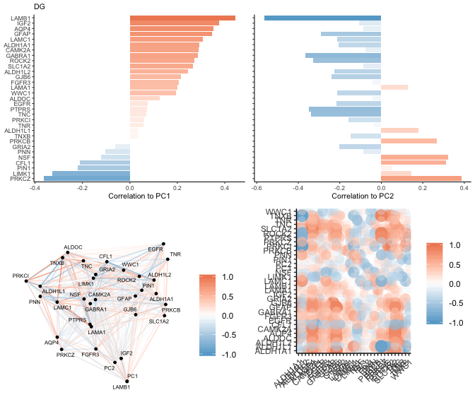
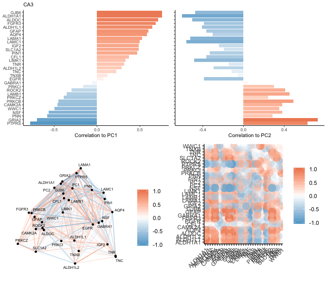
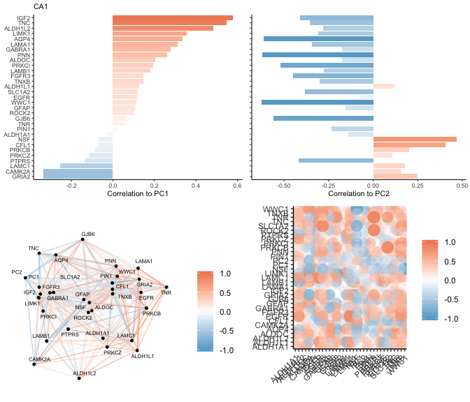
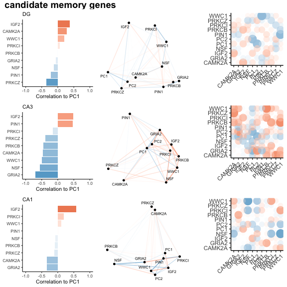
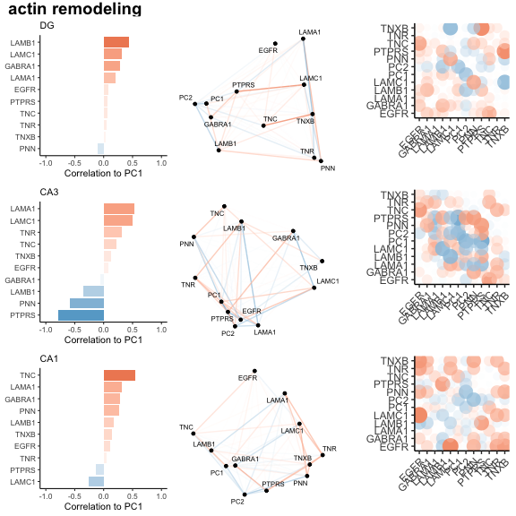
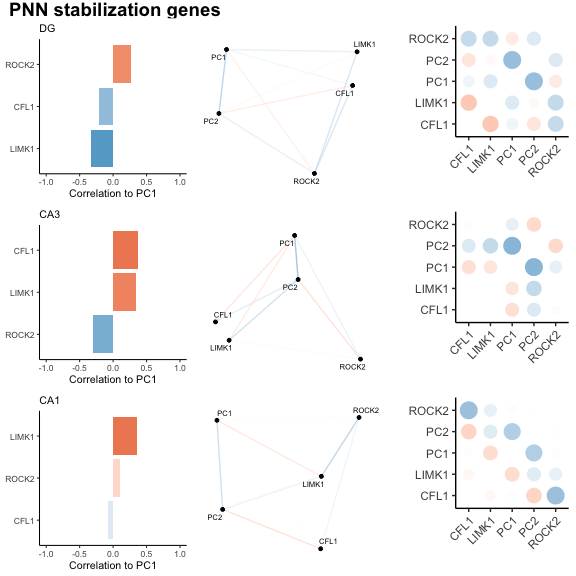
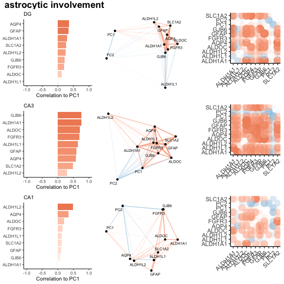

    library(tidyverse)
    library(corrr)
    library(cowplot)

    source("./figureoptions.R")
    source("./functions_RNAseq.R")

Sample information and PC1
--------------------------

    # meta data
    colData <- read_csv("../data/00_colData.csv")

    ## Parsed with column specification:
    ## cols(
    ##   RNAseqID = col_character(),
    ##   ID = col_character(),
    ##   subfield = col_character(),
    ##   treatment = col_character(),
    ##   training = col_character()
    ## )

    geneids <- read_csv("../data/00_geneids.csv") %>% distinct(gene) %>% mutate(gene = toupper(gene))

    ## Parsed with column specification:
    ## cols(
    ##   id = col_character(),
    ##   ENSMUST = col_character(),
    ##   ENSMUSG = col_character(),
    ##   OTTMUSG = col_character(),
    ##   OTTMUST = col_character(),
    ##   transcript = col_character(),
    ##   gene = col_character(),
    ##   length = col_double(),
    ##   structure1 = col_character(),
    ##   structure2 = col_character(),
    ##   structure3 = col_character(),
    ##   transcript_lenght = col_character()
    ## )

    # pca data
    pca.Rn <- read_csv("../data/01_pca.all.csv") %>% 
      filter(trialNum == 9) %>%  
      select(ID:PC2) %>%
      left_join(colData) %>% drop_na() %>% select(ID, treatment, training, trialNum, Day, RNAseqID, subfield, PC1, PC2)

    ## Parsed with column specification:
    ## cols(
    ##   ID = col_character(),
    ##   treatment = col_character(),
    ##   trialNum = col_double(),
    ##   Day = col_double(),
    ##   PC1 = col_double(),
    ##   PC2 = col_double(),
    ##   PC3 = col_double(),
    ##   PC4 = col_double(),
    ##   PC5 = col_double(),
    ##   PC6 = col_double(),
    ##   PC7 = col_double(),
    ##   PC8 = col_double(),
    ##   PC9 = col_double(),
    ##   PC10 = col_double()
    ## )

    ## Joining, by = c("ID", "treatment")

    head(pca.Rn)

    ## # A tibble: 6 x 9
    ##   ID     treatment training trialNum   Day RNAseqID subfield    PC1     PC2
    ##   <chr>  <chr>     <chr>       <dbl> <dbl> <chr>    <chr>     <dbl>   <dbl>
    ## 1 15143A conflict… trained         9     3 143A-CA… CA3      -0.228  3.04  
    ## 2 15143A conflict… trained         9     3 143A-DG… DG       -0.228  3.04  
    ## 3 15143B conflict… yoked           9     3 143B-CA… CA1      -3.14  -0.488 
    ## 4 15143B conflict… yoked           9     3 143B-DG… DG       -3.14  -0.488 
    ## 5 15143C standard… trained         9     3 143C-CA… CA1       5.89   0.332 
    ## 6 15143D standard… yoked           9     3 143D-CA… CA1      -2.75  -0.0758

    prepvsdforjoin <- function(pathtovsd, mysubfield){
      #read all count data
      vsd <- read_csv(pathtovsd) 
      vsd$gene <- vsd$X1
      vsd$gene <- toupper(vsd$gene)
      vsd <- vsd %>% arrange(gene) %>%  select(gene,everything())
      vsd <- as.data.frame(vsd)
      vsd$X1 <- NULL
      row.names(vsd) <- vsd$gene
      vsd$gene <- NULL
      vsd <- as.data.frame(t(vsd))

      vsd$RNAseqID <- row.names(vsd)
      vsd <- vsd %>%  select(RNAseqID, everything())
      vsd <- left_join(pca.Rn, vsd)  %>% drop_na()

      vsd$subfield <- factor(vsd$subfield, levels = levelssubfield)
      vsd$treatment <- factor(vsd$treatment, levels = levelstreatment)
      return(vsd)
    }

    vsdDG <- prepvsdforjoin("../data/03_DG_vsdtraining.csv")

    ## Warning: Missing column names filled in: 'X1' [1]

    ## Parsed with column specification:
    ## cols(
    ##   X1 = col_character(),
    ##   `143A-DG-1` = col_double(),
    ##   `143B-DG-1` = col_double(),
    ##   `143D-DG-3` = col_double(),
    ##   `144A-DG-2` = col_double(),
    ##   `144C-DG-2` = col_double(),
    ##   `144D-DG-2` = col_double(),
    ##   `145A-DG-2` = col_double(),
    ##   `145B-DG-1` = col_double(),
    ##   `146A-DG-2` = col_double(),
    ##   `146B-DG-2` = col_double(),
    ##   `146C-DG-4` = col_double(),
    ##   `146D-DG-3` = col_double(),
    ##   `147C-DG-3` = col_double(),
    ##   `147D-DG-1` = col_double(),
    ##   `148A-DG-3` = col_double(),
    ##   `148B-DG-4` = col_double()
    ## )

    ## Joining, by = "RNAseqID"

    vsdCA3 <- prepvsdforjoin("../data/03_CA3_vsdtraining.csv")

    ## Warning: Missing column names filled in: 'X1' [1]

    ## Parsed with column specification:
    ## cols(
    ##   X1 = col_character(),
    ##   `143A-CA3-1` = col_double(),
    ##   `144A-CA3-2` = col_double(),
    ##   `144B-CA3-1` = col_double(),
    ##   `144C-CA3-2` = col_double(),
    ##   `144D-CA3-2` = col_double(),
    ##   `145A-CA3-2` = col_double(),
    ##   `146A-CA3-2` = col_double(),
    ##   `146B-CA3-2` = col_double(),
    ##   `146D-CA3-3` = col_double(),
    ##   `147C-CA3-3` = col_double(),
    ##   `147D-CA3-1` = col_double(),
    ##   `148A-CA3-3` = col_double(),
    ##   `148B-CA3-4` = col_double()
    ## )
    ## Joining, by = "RNAseqID"

    vsdCA1 <- prepvsdforjoin("../data/03_CA1_vsdtraining.csv")

    ## Warning: Missing column names filled in: 'X1' [1]

    ## Parsed with column specification:
    ## cols(
    ##   X1 = col_character(),
    ##   `143B-CA1-1` = col_double(),
    ##   `143C-CA1-1` = col_double(),
    ##   `143D-CA1-3` = col_double(),
    ##   `144A-CA1-2` = col_double(),
    ##   `144B-CA1-1` = col_double(),
    ##   `144C-CA1-2` = col_double(),
    ##   `145A-CA1-2` = col_double(),
    ##   `145B-CA1-1` = col_double(),
    ##   `146A-CA1-2` = col_double(),
    ##   `146B-CA1-2` = col_double(),
    ##   `146C-CA1-4` = col_double(),
    ##   `146D-CA1-3` = col_double(),
    ##   `147C-CA1-3` = col_double(),
    ##   `148A-CA1-3` = col_double(),
    ##   `148B-CA1-4` = col_double()
    ## )
    ## Joining, by = "RNAseqID"

    printcortests <- function(mysubfield, df){
      print(mysubfield)
      print(cor.test(df$PC1, df$ARC, method = c("pearson")))
      print(cor.test(df$PC2, df$ARC, method = c("pearson")))
    }

    printcortests("DG", vsdDG)

    ## [1] "DG"
    ## 
    ##  Pearson's product-moment correlation
    ## 
    ## data:  df$PC1 and df$ARC
    ## t = 5.0936, df = 14, p-value = 0.0001636
    ## alternative hypothesis: true correlation is not equal to 0
    ## 95 percent confidence interval:
    ##  0.5166076 0.9300680
    ## sample estimates:
    ##      cor 
    ## 0.805927 
    ## 
    ## 
    ##  Pearson's product-moment correlation
    ## 
    ## data:  df$PC2 and df$ARC
    ## t = -3.0752, df = 14, p-value = 0.008228
    ## alternative hypothesis: true correlation is not equal to 0
    ## 95 percent confidence interval:
    ##  -0.8599769 -0.2031956
    ## sample estimates:
    ##        cor 
    ## -0.6349459

    printcortests("CA3", vsdCA3)

    ## [1] "CA3"
    ## 
    ##  Pearson's product-moment correlation
    ## 
    ## data:  df$PC1 and df$ARC
    ## t = -1.0265, df = 11, p-value = 0.3267
    ## alternative hypothesis: true correlation is not equal to 0
    ## 95 percent confidence interval:
    ##  -0.7280482  0.3050049
    ## sample estimates:
    ##        cor 
    ## -0.2956684 
    ## 
    ## 
    ##  Pearson's product-moment correlation
    ## 
    ## data:  df$PC2 and df$ARC
    ## t = -0.34391, df = 11, p-value = 0.7374
    ## alternative hypothesis: true correlation is not equal to 0
    ## 95 percent confidence interval:
    ##  -0.6189505  0.4748301
    ## sample estimates:
    ##        cor 
    ## -0.1031389

    printcortests("CA1", vsdCA1)

    ## [1] "CA1"
    ## 
    ##  Pearson's product-moment correlation
    ## 
    ## data:  df$PC1 and df$ARC
    ## t = 0.73268, df = 13, p-value = 0.4768
    ## alternative hypothesis: true correlation is not equal to 0
    ## 95 percent confidence interval:
    ##  -0.3486959  0.6455477
    ## sample estimates:
    ##       cor 
    ## 0.1991377 
    ## 
    ## 
    ##  Pearson's product-moment correlation
    ## 
    ## data:  df$PC2 and df$ARC
    ## t = -1.7954, df = 13, p-value = 0.09586
    ## alternative hypothesis: true correlation is not equal to 0
    ## 95 percent confidence interval:
    ##  -0.7799244  0.0861938
    ## sample estimates:
    ##        cor 
    ## -0.4457507

    plotcorrelation <- function(df, favegene, myPC){
      p <- ggplot(df, aes(x = favegene, y = myPC)) +
       geom_point(aes( color = treatment)) + 
       geom_smooth(method = "lm", color = "grey") +
       scale_color_manual(values = treatmentcolors) +
      theme_ms() +
       theme(legend.position = "none") +
        facet_wrap(~subfield) +
        labs(y = NULL, x = NULL)
      return(p)
    }

    p1 <- plotcorrelation(vsdDG, vsdDG$ARC, vsdDG$PC1) + labs(y = "PC1")
    p2 <- plotcorrelation(vsdDG, vsdDG$ARC, vsdDG$PC2) + labs(y = "PC2")  + labs(x =  " ")
    p3 <- plotcorrelation(vsdCA3, vsdCA3$ARC, vsdCA3$PC1) 
    p4 <- plotcorrelation(vsdCA3, vsdCA3$ARC, vsdCA3$PC2)  + labs(x = "ARC expression")
    p5 <- plotcorrelation(vsdCA1, vsdCA1$ARC, vsdCA1$PC1)
    p6 <- plotcorrelation(vsdCA1, vsdCA1$ARC, vsdCA1$PC2)  + labs(x =  " ")

    plot_grid(p1,p3,p5,p2,p4,p6, nrow = 2, labels = c("a","b", "c", " ", " ", " "), 
                      label_size = 8, rel_heights = c(0.45,0.575))

    plotcorrelation2 <- function(df, favegene, myPC){
      p <- ggplot(df, aes(x = favegene, y = myPC)) +
       geom_point(aes( color = treatment)) + 
       geom_smooth(method = "lm", color = "grey") +
       scale_color_manual(values = treatmentcolors) +
      theme_ms() +
       theme(legend.position = "none",
             strip.text = element_blank()) +
        facet_wrap(~subfield) +
        labs(y = NULL, x = NULL)
      return(p)
    }

    printcortests1 <- function(mysubfield, df){
      print(mysubfield)
      print(cor.test(df$PRKCZ, df$PRKCI, method = c("pearson")))
      print(cor.test(df$PRKCZ, df$PRKCB, method = c("pearson")))
    }

    printcortests1("DG", vsdDG)

    ## [1] "DG"
    ## 
    ##  Pearson's product-moment correlation
    ## 
    ## data:  df$PRKCZ and df$PRKCI
    ## t = -1.649, df = 14, p-value = 0.1214
    ## alternative hypothesis: true correlation is not equal to 0
    ## 95 percent confidence interval:
    ##  -0.7492100  0.1155226
    ## sample estimates:
    ##        cor 
    ## -0.4032764 
    ## 
    ## 
    ##  Pearson's product-moment correlation
    ## 
    ## data:  df$PRKCZ and df$PRKCB
    ## t = -0.31913, df = 14, p-value = 0.7543
    ## alternative hypothesis: true correlation is not equal to 0
    ## 95 percent confidence interval:
    ##  -0.5572153  0.4287850
    ## sample estimates:
    ##         cor 
    ## -0.08498373

    printcortests1("CA3", vsdCA3)

    ## [1] "CA3"
    ## 
    ##  Pearson's product-moment correlation
    ## 
    ## data:  df$PRKCZ and df$PRKCI
    ## t = 0.67052, df = 11, p-value = 0.5164
    ## alternative hypothesis: true correlation is not equal to 0
    ## 95 percent confidence interval:
    ##  -0.3960683  0.6754034
    ## sample estimates:
    ##       cor 
    ## 0.1981613 
    ## 
    ## 
    ##  Pearson's product-moment correlation
    ## 
    ## data:  df$PRKCZ and df$PRKCB
    ## t = 1.4981, df = 11, p-value = 0.1623
    ## alternative hypothesis: true correlation is not equal to 0
    ## 95 percent confidence interval:
    ##  -0.1802239  0.7846575
    ## sample estimates:
    ##       cor 
    ## 0.4116373

    printcortests1("CA1", vsdCA1)

    ## [1] "CA1"
    ## 
    ##  Pearson's product-moment correlation
    ## 
    ## data:  df$PRKCZ and df$PRKCI
    ## t = -0.64224, df = 13, p-value = 0.5319
    ## alternative hypothesis: true correlation is not equal to 0
    ## 95 percent confidence interval:
    ##  -0.6309485  0.3701487
    ## sample estimates:
    ##        cor 
    ## -0.1753659 
    ## 
    ## 
    ##  Pearson's product-moment correlation
    ## 
    ## data:  df$PRKCZ and df$PRKCB
    ## t = -0.6687, df = 13, p-value = 0.5154
    ## alternative hypothesis: true correlation is not equal to 0
    ## 95 percent confidence interval:
    ##  -0.6352749  0.3639007
    ## sample estimates:
    ##        cor 
    ## -0.1823556

    printcortests2 <- function(mysubfield, df){
      print(mysubfield)
      #print(cor.test(df$WWC1, df$PRKCI, method = c("pearson")))
      #print(cor.test(df$WWC1, df$PRKCB, method = c("pearson")))
      print(cor.test(df$WWC1, df$PRKCZ, method = c("pearson")))
    }

    printcortests2("DG", vsdDG)

    ## [1] "DG"
    ## 
    ##  Pearson's product-moment correlation
    ## 
    ## data:  df$WWC1 and df$PRKCZ
    ## t = 0.90783, df = 14, p-value = 0.3793
    ## alternative hypothesis: true correlation is not equal to 0
    ## 95 percent confidence interval:
    ##  -0.2943199  0.6549413
    ## sample estimates:
    ##       cor 
    ## 0.2357856

    printcortests2("CA3", vsdCA3)

    ## [1] "CA3"
    ## 
    ##  Pearson's product-moment correlation
    ## 
    ## data:  df$WWC1 and df$PRKCZ
    ## t = 1.4464, df = 11, p-value = 0.1759
    ## alternative hypothesis: true correlation is not equal to 0
    ## 95 percent confidence interval:
    ##  -0.1939546  0.7791277
    ## sample estimates:
    ##       cor 
    ## 0.3997505

    printcortests2("CA1", vsdCA1)

    ## [1] "CA1"
    ## 
    ##  Pearson's product-moment correlation
    ## 
    ## data:  df$WWC1 and df$PRKCZ
    ## t = 0.81675, df = 13, p-value = 0.4288
    ## alternative hypothesis: true correlation is not equal to 0
    ## 95 percent confidence interval:
    ##  -0.3285129  0.6586500
    ## sample estimates:
    ##      cor 
    ## 0.220929

    p1 <- plotcorrelation2(vsdDG, vsdDG$PRKCZ, vsdDG$PRKCI) + labs(x = " ", y =  "PRKCI",
                                                                 subtitle = "p = 0.12", title = "DG")
    p2 <- plotcorrelation2(vsdDG,  vsdDG$PRKCZ, vsdDG$PRKCB) + labs(x = " ", y =  "PRKCB",
                                                                 subtitle = "p = 0.75")

    p3 <- plotcorrelation2(vsdCA3,  vsdCA3$PRKCZ, vsdCA3$PRKCI) + labs(x = "PRKCZ", y =  " ",
                                                                 subtitle = "p = 0.51", title = "CA3")
    p4 <- plotcorrelation2(vsdCA3,  vsdCA3$PRKCZ, vsdCA3$PRKCB) + labs(x = "PRKCZ", y =  " ",
                                                                 subtitle = "p = 0.16")

    p5 <- plotcorrelation2(vsdCA1,  vsdCA1$PRKCZ, vsdCA1$PRKCI) + labs(x = " ", y =  " ",
                                                                 subtitle = "p = 0.53", title = "CA1")
    p6 <- plotcorrelation2(vsdCA1,  vsdCA1$PRKCZ, vsdCA1$PRKCB) + labs(x = " ", y =  " ",
                                                                 subtitle = "p = 0.52")

    p11 <- plotcorrelation2(vsdDG, vsdDG$WWC1, vsdDG$PRKCI) + labs(x = " ", y =  "PRKCI",
                                                                 subtitle = "p = 0.403")
    p12 <- plotcorrelation2(vsdDG,  vsdDG$WWC1, vsdDG$PRKCB) + labs(x = " ", y =  "PRKCB",
                                                                 subtitle = "p = 0.085")

    p13 <- plotcorrelation2(vsdCA3,  vsdCA3$WWC1, vsdCA3$PRKCI) + labs(x = "WWC1", y =  " ",
                                                                 subtitle = "p = 0.058")
    p14 <- plotcorrelation2(vsdCA3,  vsdCA3$WWC1, vsdCA3$PRKCB) + labs(x = "WWC1", y =  " ",
                                                                 subtitle = "p = 0.001" )
    p15 <- plotcorrelation2(vsdCA1,  vsdCA1$WWC1, vsdCA1$PRKCI) + labs(x = " ", y =  " ",
                                                                 subtitle = "p = 0.004")
    p16 <- plotcorrelation2(vsdCA1,  vsdCA1$WWC1, vsdCA1$PRKCB) + labs(x = " ", y =  " ",
                                                                 subtitle = "p = 0.385")

    p24 <- plotcorrelation2(vsdDG,  vsdDG$WWC1, vsdDG$PRKCZ) + labs(x = " ", y =  "PRKCZ",
                                                                 subtitle = "p = 0.380" )
    p25 <- plotcorrelation2(vsdCA3,  vsdCA3$WWC1, vsdCA3$PRKCZ) + labs(x = "WWC1", y =  " ",
                                                                 subtitle = "p = 0.176")
    p26 <- plotcorrelation2(vsdCA1,  vsdCA1$WWC1, vsdCA1$PRKCZ) + labs(x = " ", y =  " ",
                                                                 subtitle = "p = 0.4288")

    plot_grid(p1,p3,p5,p2,p4,p6,
              p11,p13,p15,p12,p14,p16,
              p24,p25,p26,
              nrow = 5, rel_heights = c(1.1,1,1,1,1))

Correlate ALL genes with PC1 and PC2
------------------------------------

    # Use `tail(names(vsd),10)` to see that last genes is "ZZZ3"
    tail(names(vsdDG),10)

    ##  [1] "ZUFSP"  "ZW10"   "ZWILCH" "ZWINT"  "ZXDB"   "ZXDC"   "ZYG11B"
    ##  [8] "ZYX"    "ZZEF1"  "ZZZ3"

    makecorrrmatrix <- function(df){
      forcorall <-  df %>% select(PC1:ZZZ3)
      corrrmat <- correlate(forcorall) 
      return(corrrmat)
    }

    corrrDG <- makecorrrmatrix(vsdDG) 

    ## 
    ## Correlation method: 'pearson'
    ## Missing treated using: 'pairwise.complete.obs'

    corrrCA3 <- makecorrrmatrix(vsdCA3) 

    ## 
    ## Correlation method: 'pearson'
    ## Missing treated using: 'pairwise.complete.obs'

    corrrCA1 <- makecorrrmatrix(vsdCA1) 

    ## 
    ## Correlation method: 'pearson'
    ## Missing treated using: 'pairwise.complete.obs'

Top correlations with PC1 and their relationship with PC2
---------------------------------------------------------

    plotcorrrs <- function(df, mysubtitle){
      
     corrsTop <- df %>% 
      focus(PC1)  %>% 
      arrange(desc(PC1)) %>% 
      top_n(20)
      
      topcorrrs <- corrsTop$rowname

      p1 <- df %>% 
        focus(PC1, PC2, topcorrrs,  mirror = TRUE) %>% 
        focus(PC1, PC2) %>%
        mutate(rowname = reorder(rowname, PC1)) %>%
        ggplot(aes(rowname, PC1, fill = PC1)) +
         geom_col() + coord_flip() +
        scale_fill_gradient2(low = "#67a9cf",  high = "#ef8a62", midpoint = 0) +
        theme_ms() +
        theme(legend.position = "none") +
        #ylim(-1,1) +
        labs(x = NULL, y = "Correlation to PC1") +
        labs(subtitle = mysubtitle)
      
      p2 <- df %>% 
        focus(PC1, PC2, topcorrrs,  mirror = TRUE) %>% 
        focus(PC1, PC2) %>%
        mutate(rowname = reorder(rowname, PC1)) %>%
        ggplot(aes(rowname, PC2, fill = PC2)) +
         geom_col() + coord_flip() +
        scale_fill_gradient2(low = "#67a9cf",  high = "#ef8a62", midpoint = 0) +
        theme_ms() +
        theme(legend.position = "none") +
        #ylim(-1,1) +
        labs(x = NULL, y = "Correlation to PC2") +
        labs(subtitle = " ")

      p3 <- df %>% 
        focus(PC1, PC2, topcorrrs,  mirror = TRUE) %>% 
        replace(., is.na(.), 1) %>% 
        network_plot.cor_df(colors = c("#67a9cf", "white", "#ef8a62"),
                   min_cor = .7, curved = F, legend = T,
                   repel = TRUE) + 
        theme(legend.position = "right") +
        labs(subtitle = " ")
      
      p4 <- df %>% 
        focus(PC1, PC2, topcorrrs,  mirror = TRUE) %>% 
        replace(., is.na(.), 0) %>% 
        rearrange() %>% 
        rplot()
      
      p12 <- plot_grid(p1,p2,  nrow = 1)
      p34 <- plot_grid(p3,p4,  nrow = 1)
      p1234 <- plot_grid(p12,p34,  nrow = 2)
      
      
      return(p1234)
    }

    plotcorrrs(corrrDG, "DG")

    ## Selecting by PC1

    ## Registered S3 method overwritten by 'seriation':
    ##   method         from 
    ##   reorder.hclust gclus

    ## Don't know how to automatically pick scale for object of type noquote. Defaulting to continuous.

    plotcorrrs(corrrCA3, "CA3")

    ## Selecting by PC1
    ## Don't know how to automatically pick scale for object of type noquote. Defaulting to continuous.

    plotcorrrs(corrrCA1, "CA1")

    ## Selecting by PC1
    ## Don't know how to automatically pick scale for object of type noquote. Defaulting to continuous.

    classicmemgenes <- c("PRKCZ", "WWC1", "PRKCI", "PRKCB",
                    "NSF", "GRIA2", "PIN1", "IGF2", "CAMK2A")

    ACTINngenes <- c( "LAMA1", "LAMB1", "LAMC1", "TNC", "TNXB", "TNR",
                    "GABRA1", "PTPRS", "PNN", "EGFR")

    stabilizationgenes <- c("LIMK1","CFL1", "ROCK2")

    astrocyticgenes <- c("ALDH1A1", "ALDH1L1", "ALDH1L2", 
                         "SLC1A2", "GFAP", "GJB6", "FGFR3", "AQP4", "ALDOC")

    allcandidates <- c(classicmemgenes, ACTINngenes, stabilizationgenes, astrocyticgenes)

    plotcorrrs2 <- function(df, whichsubfield){
      
      favgenes <- allcandidates
      
      df <- df %>% 
        focus(PC1, PC2, favgenes,  mirror = TRUE)  %>% 
        arrange(desc(PC1))

      p1 <- df %>% 
        focus(PC1, PC2) %>%
        mutate(rowname = reorder(rowname, PC1)) %>%
        ggplot(aes(rowname, PC1, fill = PC1)) +
         geom_col() + coord_flip() +
        scale_fill_gradient2(low = "#67a9cf",  high = "#ef8a62", midpoint = 0) +
        theme_ms() +
        theme(legend.position = "none") +
        #ylim(-1,1) +
        labs(x = NULL, y = "Correlation to PC1") +
        labs(subtitle = whichsubfield)
      
      p2 <- df %>% 
        focus(PC1, PC2) %>%
        mutate(rowname = reorder(rowname, PC1)) %>%
        ggplot(aes(rowname, PC2, fill = PC2)) +
        geom_col() + coord_flip() +
        scale_fill_gradient2(low = "#67a9cf",  high = "#ef8a62", midpoint = 0) +
        theme_ms() +
        theme(legend.position = "none",
              axis.text.y = element_blank()) +
        #ylim(-1,1) +
        labs(x = NULL, y = "Correlation to PC2") +
        labs(subtitle = " ") 

      p3 <- df %>% 
        replace(., is.na(.), 1) %>% 
        network_plot.cor_df(colors = c("#67a9cf", "white", "#ef8a62"),
                   min_cor = 0.0, curved = F, legend = T,
                   repel = TRUE) + 
        theme(legend.position = "right") +
        labs(subtitle = " ")
      
      p4 <- df %>% 
        focus(PC1, PC2, favgenes,  mirror = TRUE) %>% 
        replace(., is.na(.), 0) %>% 
        rearrange() %>% 
        rplot(colours = c("#67a9cf", "white", "#ef8a62")) + 
        theme(axis.text.x = element_text(angle = 45, hjust = 1)) 
        
      p34 <- plot_grid(p3,p4,  nrow = 1)
      p12 <- plot_grid(p1,p2,  nrow = 1, rel_widths = c(1.1,1))
      p1234 <- plot_grid(p12,p34,  nrow = 2)
      
      filename <- paste("../data/06_", whichsubfield, "_candidatecorrelations.csv", sep = "")
      
      write.csv(df, filename)

      return(p1234)
      
    }

    plotcorrrs2(corrrDG, "DG")

    ## Registered S3 method overwritten by 'seriation':
    ##   method         from 
    ##   reorder.hclust gclus

    ## Don't know how to automatically pick scale for object of type noquote. Defaulting to continuous.

    plotcorrrs2(corrrCA3, "CA3")

    ## Don't know how to automatically pick scale for object of type noquote. Defaulting to continuous.

    plotcorrrs2(corrrCA1, "CA1")

    ## Don't know how to automatically pick scale for object of type noquote. Defaulting to continuous.

3 hypotheses
------------

    plotcorrrs3 <- function(favgenes, mytitle){
      
      plotfavgenes <- function(favgenes, df, whichsubfield){
      
        df <- df %>% focus(PC1, PC2, favgenes,  mirror = TRUE) 
        
        p1 <- df %>% 
          focus(PC1, PC2) %>%
          mutate(rowname = reorder(rowname, PC1)) %>%
          ggplot(aes(rowname, PC1, fill = PC1)) +
          geom_col() + coord_flip() +
          scale_fill_gradient2(low = "#67a9cf",  high = "#ef8a62", midpoint = 0) +
          theme_ms() +
          ylim(-1,1) +
          theme(legend.position = "none") +
          labs(x = NULL, y = "Correlation to PC1") +
          labs(subtitle = whichsubfield)
      
        p2 <- df %>% 
          replace(., is.na(.), 0) %>% 
          network_plot.cor_df(colors = c("#67a9cf", "white", "#ef8a62"),
                   min_cor = 0.0, curved = F, legend = T,
                   repel = TRUE) + 
          theme(legend.position = "none") 
        
        p3 <- df %>% 
        focus(PC1, PC2, favgenes,  mirror = TRUE) %>% 
        #rearrange() %>% 
        replace(., is.na(.), 0) %>%   
        rplot(colours = c("#67a9cf", "white", "#ef8a62")) + 
        theme(axis.text.x = element_text(angle = 45, hjust = 1))  + 
          theme(legend.position = "none") 

        p12 <- plot_grid(p1, p2, p3, nrow = 1, rel_widths = c(1,1,1))

        return(p12)
      }
      
      a <- plotfavgenes(favgenes, corrrDG, "DG")
      b <- plotfavgenes(favgenes, corrrCA3, "CA3")
      c <- plotfavgenes(favgenes, corrrCA1, "CA1")
      
      title <- ggdraw() + 
        draw_label(mytitle, fontface = 'bold', x = 0, hjust = 0) +
        theme(plot.margin = margin(0, 0, 0, 7))
      
      plot_grid(title, a,b,c, nrow = 4, rel_heights = c(0.1, 1, 1, 1))
      
    }

    plotcorrrs3(classicmemgenes, "candidate memory genes")

    ## Don't know how to automatically pick scale for object of type noquote. Defaulting to continuous.
    ## Don't know how to automatically pick scale for object of type noquote. Defaulting to continuous.
    ## Don't know how to automatically pick scale for object of type noquote. Defaulting to continuous.

    plotcorrrs3(ACTINngenes, "actin remodeling")

    ## Don't know how to automatically pick scale for object of type noquote. Defaulting to continuous.
    ## Don't know how to automatically pick scale for object of type noquote. Defaulting to continuous.
    ## Don't know how to automatically pick scale for object of type noquote. Defaulting to continuous.

    plotcorrrs3(stabilizationgenes, "PNN stabilization genes")

    ## Don't know how to automatically pick scale for object of type noquote. Defaulting to continuous.
    ## Don't know how to automatically pick scale for object of type noquote. Defaulting to continuous.
    ## Don't know how to automatically pick scale for object of type noquote. Defaulting to continuous.

    plotcorrrs3(astrocyticgenes, "astrocytic involvement")

    ## Don't know how to automatically pick scale for object of type noquote. Defaulting to continuous.
    ## Don't know how to automatically pick scale for object of type noquote. Defaulting to continuous.
    ## Don't know how to automatically pick scale for object of type noquote. Defaulting to continuous.

