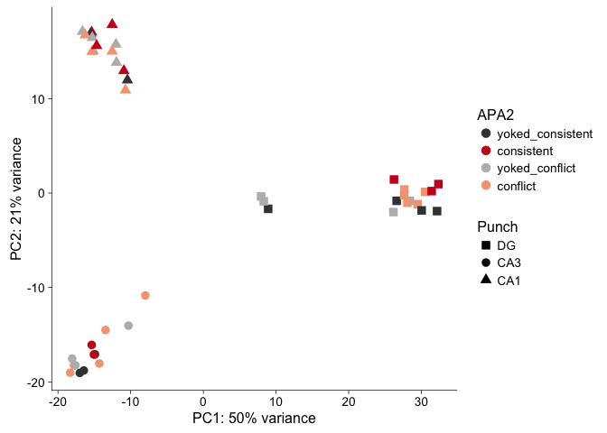
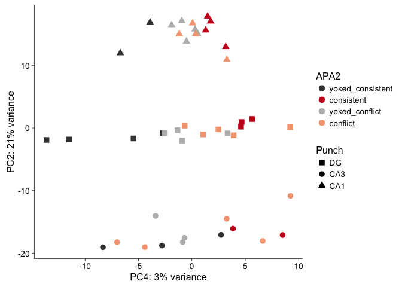
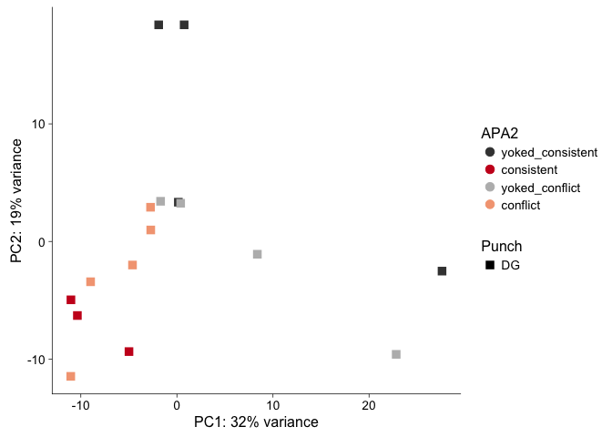

Load libraries, functions, and color pallettes
----------------------------------------------

    library(ggplot2) ## for awesome plots!
    library(cowplot) ## for some easy to use ggplot themes
    library(dplyr) ## for filtering and selecting rows
    library(DESeq2) ## for gene expression analysis
    library(genefilter)  ## for PCA fuction

    ## load functions 
    source("figureoptions.R")
    source("functions_RNAseq.R")

    ## set output file for figures 
    knitr::opts_chunk$set(fig.path = '../figures/99_fordeep/')

Exerperimental Design
---------------------

APA2: the column name for the four behavioral treatments  
Punch: the column name for the three tissue types from the hippocampus

    colData <- read.csv("../data/02a_colData.csv", header = T)
    countData <- read.csv("../data/02a_countData.csv", header = T, check.names = F, row.names = 1)
    colData %>% select(APA2,Punch)  %>%  summary()

    ##                APA2    Punch   
    ##  conflict        :14   CA1:15  
    ##  consistent      : 9   CA3:13  
    ##  yoked_conflict  :12   DG :16  
    ##  yoked_consistent: 9

Running DESeq2 will all the data
--------------------------------

    dds <- DESeqDataSetFromMatrix(countData = countData,
                                  colData = colData,
                                  design = ~ Punch + APA2 + Punch*APA2)
    dds <- dds[ rowSums(counts(dds)) > 1, ]  # Pre-filtering genes with 0 counts
    dds # view number of genes after normalization and the number of samples

    ## class: DESeqDataSet 
    ## dim: 17674 44 
    ## metadata(1): version
    ## assays(1): counts
    ## rownames(17674): 0610007P14Rik 0610009B22Rik ... Zzef1 Zzz3
    ## rowData names(0):
    ## colnames(44): 143A-CA3-1 143A-DG-1 ... 148B-CA3-4 148B-DG-4
    ## colData names(8): RNAseqID Mouse ... APA APA2

    dds <- DESeq(dds) # Differential expression analysis
    rld <- rlog(dds, blind=FALSE) ## log transformed data

Principle component analysis on all the data.
---------------------------------------------

PC1 and PC2 are significant for tissue (aka "Punch") and explains 50%
and 21%, respectively, of the variation.

PC4 is significant for behavioral treatment (aka "APA2") and explains 3%
of the variation.

The scatter plot of PC1 and PC2 nicely clusters the three tissues, but
PC4 doesn't really give four clusters by treatment.

    # create the dataframe using my function pcadataframe 
    pcadata <- pcadataframe(rld, intgroup=c("Punch","APA2"), returnData=TRUE)

    # extract the variance associated with each PC
    percentVar <- round(100 * attr(pcadata, "percentVar"))
    percentVar

    ## [1] 50 21  5  3  2  1  1  1  1

    # anova for each PCA
    summary(aov(PC1 ~ Punch, data=pcadata)) 

    ##             Df Sum Sq Mean Sq F value Pr(>F)    
    ## Punch        2  15879    7939   256.2 <2e-16 ***
    ## Residuals   41   1270      31                   
    ## ---
    ## Signif. codes:  0 '***' 0.001 '**' 0.01 '*' 0.05 '.' 0.1 ' ' 1

    summary(aov(PC2 ~ Punch, data=pcadata)) 

    ##             Df Sum Sq Mean Sq F value Pr(>F)    
    ## Punch        2   7153    3576    1030 <2e-16 ***
    ## Residuals   41    142       3                   
    ## ---
    ## Signif. codes:  0 '***' 0.001 '**' 0.01 '*' 0.05 '.' 0.1 ' ' 1

    summary(aov(PC4 ~ APA2, data=pcadata)) 

    ##             Df Sum Sq Mean Sq F value   Pr(>F)    
    ## APA2         3  495.0  165.01   12.01 9.57e-06 ***
    ## Residuals   40  549.5   13.74                     
    ## ---
    ## Signif. codes:  0 '***' 0.001 '**' 0.01 '*' 0.05 '.' 0.1 ' ' 1

    TukeyHSD((aov(PC4 ~ APA2, data=pcadata)) , which = "APA2") 

    ##   Tukey multiple comparisons of means
    ##     95% family-wise confidence level
    ## 
    ## Fit: aov(formula = PC4 ~ APA2, data = pcadata)
    ## 
    ## $APA2
    ##                                      diff        lwr        upr     p adj
    ## consistent-conflict              2.012450  -2.232290  6.2571898 0.5864683
    ## yoked_conflict-conflict         -2.609865  -6.518315  1.2985838 0.2931019
    ## yoked_consistent-conflict       -7.680378 -11.925118 -3.4356380 0.0001090
    ## yoked_conflict-consistent       -4.622315  -9.003285 -0.2413459 0.0352172
    ## yoked_consistent-consistent     -9.692828 -14.376281 -5.0093745 0.0000119
    ## yoked_consistent-yoked_conflict -5.070513  -9.451482 -0.6895431 0.0177388

    # set factors
    pcadata$Punch <- factor(pcadata$Punch, levels=c("DG","CA3", "CA1"))
    pcadata$APA2 <- factor(pcadata$APA2, levels=c("yoked_consistent","consistent",  "yoked_conflict","conflict"))

    ggplot(pcadata, aes(PC1, PC2, color=APA2, shape=Punch)) +
        geom_point(size=3) +
        xlab(paste0("PC1: ", percentVar[1],"% variance")) +
        ylab(paste0("PC2: ", percentVar[2],"% variance")) +
        scale_colour_manual(values=colorvalAPA00) + 
        theme_cowplot(font_size = 12, line_size = 0.25)  +
        scale_shape_manual(values=c(15,16,17))

    ggplot(pcadata, aes(PC4, PC2, color=APA2, shape=Punch)) +
        geom_point(size=3) +
        xlab(paste0("PC4: ", percentVar[4],"% variance")) +
        ylab(paste0("PC2: ", percentVar[2],"% variance")) +
        scale_colour_manual(values=colorvalAPA00) + 
        theme_cowplot(font_size = 12, line_size = 0.25)  +
        scale_shape_manual(values=c(15,16,17))

Top 10 differentially expressed genes between consistent & yoked consistent treatment
-------------------------------------------------------------------------------------

    res <- results(dds, contrast =c("APA2", "consistent", "yoked_consistent"), independentFiltering = T, alpha = 0.1)
    summary(res)

    ## 
    ## out of 17674 with nonzero total read count
    ## adjusted p-value < 0.1
    ## LFC > 0 (up)     : 134, 0.76% 
    ## LFC < 0 (down)   : 106, 0.6% 
    ## outliers [1]     : 7, 0.04% 
    ## low counts [2]   : 9931, 56% 
    ## (mean count < 13)
    ## [1] see 'cooksCutoff' argument of ?results
    ## [2] see 'independentFiltering' argument of ?results

    head(res[order(res$padj),], 10)

    ## log2 fold change (MLE): APA2 consistent vs yoked_consistent 
    ## Wald test p-value: APA2 consistent vs yoked_consistent 
    ## DataFrame with 10 rows and 6 columns
    ##         baseMean log2FoldChange     lfcSE      stat       pvalue
    ##        <numeric>      <numeric> <numeric> <numeric>    <numeric>
    ## Sdhaf2  63.30359     -1.8287171 0.3155713 -5.794940 6.834553e-09
    ## Atxn10 398.82758     -0.8058125 0.1715021 -4.698558 2.620046e-06
    ## Lhfpl4 105.87094      1.5911682 0.3371010  4.720152 2.356680e-06
    ## Nek9   108.52559      1.7048299 0.3674715  4.639352 3.495026e-06
    ## Dcaf12  71.13168      2.3041114 0.5055927  4.557248 5.182819e-06
    ## Ttc7b  222.88678      1.0984486 0.2440139  4.501583 6.744931e-06
    ## Thop1  103.69180     -1.1981749 0.2698965 -4.439387 9.021557e-06
    ## Tgoln1 229.01336      1.2748375 0.2899640  4.396538 1.099912e-05
    ## Srprb   53.27890      6.4013529 1.4970259  4.276047 1.902412e-05
    ## Ubiad1  13.78074     -2.7637411 0.6443640 -4.289099 1.793991e-05
    ##                padj
    ##           <numeric>
    ## Sdhaf2 0.0000528721
    ## Atxn10 0.0067562251
    ## Lhfpl4 0.0067562251
    ## Nek9   0.0067593798
    ## Dcaf12 0.0080188581
    ## Ttc7b  0.0086964640
    ## Thop1  0.0099701095
    ## Tgoln1 0.0106361527
    ## Srprb  0.0147170562
    ## Ubiad1 0.0147170562

DESeq analysis of just the DG tissue samples
--------------------------------------------

To look for a larger percent of variation according to behavioral
treatment, I can subset the data to remove the tissue-specific variance.
Here I focus on the DG samples.

    #subset to only view DG data
    colData <- colData %>% 
      filter(Punch %in% c("DG"))  %>% 
      droplevels()
    savecols <- as.character(colData$RNAseqID) 
    savecols <- as.vector(savecols) 
    countData <- countData %>% dplyr::select(one_of(savecols)) 

    # show number of samples for each treatment
    colData %>% select(APA2,Punch)  %>%  summary()

    ##                APA2   Punch  
    ##  conflict        :5   DG:16  
    ##  consistent      :3          
    ##  yoked_conflict  :4          
    ##  yoked_consistent:4

    ## create DESeq object using the factors Punch and APA
    dds <- DESeqDataSetFromMatrix(countData = countData,
                                  colData = colData,
                                  design = ~ APA2)
    dds <- dds[ rowSums(counts(dds)) > 1, ]  # Pre-filtering genes with 0 counts
    dds # view number of genes afternormalization and the number of samples

    ## class: DESeqDataSet 
    ## dim: 16658 16 
    ## metadata(1): version
    ## assays(1): counts
    ## rownames(16658): 0610007P14Rik 0610009B22Rik ... Zzef1 Zzz3
    ## rowData names(0):
    ## colnames(16): 143A-DG-1 143B-DG-1 ... 148A-DG-3 148B-DG-4
    ## colData names(8): RNAseqID Mouse ... APA APA2

    dds <- DESeq(dds) # Differential expression analysis
    rld <- rlog(dds, blind=FALSE) ## log transformed data

### PC anlayiss of only DG samples

Now, PC1 is marginally significant and PC2 is significant for behavioral
treatment ("APA2") and explain 32% and 19% of the variation in the DG
only data.

    # create the dataframe using my function pcadataframe
    pcadata <- pcadataframe(rld, intgroup=c("Punch","APA2"), returnData=TRUE)
    percentVar <- round(100 * attr(pcadata, "percentVar"))
    percentVar

    ## [1] 32 19 12  6  6  4  4  3  3

    summary(aov(PC1 ~ APA2, data=pcadata)) 

    ##             Df Sum Sq Mean Sq F value Pr(>F)  
    ## APA2         3  813.7   271.2   3.132 0.0656 .
    ## Residuals   12 1039.2    86.6                 
    ## ---
    ## Signif. codes:  0 '***' 0.001 '**' 0.01 '*' 0.05 '.' 0.1 ' ' 1

    summary(aov(PC2 ~ APA2, data=pcadata)) 

    ##             Df Sum Sq Mean Sq F value Pr(>F)  
    ## APA2         3  534.4  178.15   3.646 0.0446 *
    ## Residuals   12  586.4   48.87                 
    ## ---
    ## Signif. codes:  0 '***' 0.001 '**' 0.01 '*' 0.05 '.' 0.1 ' ' 1

    TukeyHSD((aov(PC2 ~ APA2, data=pcadata)) , which = "APA2") 

    ##   Tukey multiple comparisons of means
    ##     95% family-wise confidence level
    ## 
    ## Fit: aov(formula = PC2 ~ APA2, data = pcadata)
    ## 
    ## $APA2
    ##                                      diff        lwr      upr     p adj
    ## consistent-conflict             -4.272112 -19.428740 10.88452 0.8360728
    ## yoked_conflict-conflict          1.598600 -12.323652 15.52085 0.9856949
    ## yoked_consistent-conflict       12.020080  -1.902172 25.94233 0.0994976
    ## yoked_conflict-consistent        5.870712  -9.980469 21.72189 0.6964793
    ## yoked_consistent-consistent     16.292191   0.441010 32.14337 0.0433400
    ## yoked_consistent-yoked_conflict 10.421479  -4.253863 25.09682 0.2052640

    pcadata$APA2 <- factor(pcadata$APA2, levels=c("yoked_consistent","consistent",  "yoked_conflict","conflict"))

    ggplot(pcadata, aes(PC1, PC2, color=APA2, shape=Punch)) +
        geom_point(size=3) +
        xlab(paste0("PC1: ", percentVar[1],"% variance")) +
        ylab(paste0("PC2: ", percentVar[2],"% variance")) +
        scale_colour_manual(values=colorvalAPA00) + 
        theme_cowplot(font_size = 12, line_size = 0.25)  +
        scale_shape_manual(values=c(15))

Top 10 DEGs in only DG
----------------------

This top 10 gene list for how the DG tissue responds to treatment is
very different from the top 10 list above that showed genes in all three
tissues that responded significantly to the behavioral treatment.

    res <- results(dds, contrast =c("APA2", "consistent", "yoked_consistent"), independentFiltering = T, alpha = 0.1)
    summary(res)

    ## 
    ## out of 16658 with nonzero total read count
    ## adjusted p-value < 0.1
    ## LFC > 0 (up)     : 119, 0.71% 
    ## LFC < 0 (down)   : 2, 0.012% 
    ## outliers [1]     : 243, 1.5% 
    ## low counts [2]   : 7235, 43% 
    ## (mean count < 7)
    ## [1] see 'cooksCutoff' argument of ?results
    ## [2] see 'independentFiltering' argument of ?results

    head(res[order(res$padj),], 10)

    ## log2 fold change (MAP): APA2 consistent vs yoked_consistent 
    ## Wald test p-value: APA2 consistent vs yoked_consistent 
    ## DataFrame with 10 rows and 6 columns
    ##          baseMean log2FoldChange     lfcSE      stat       pvalue
    ##         <numeric>      <numeric> <numeric> <numeric>    <numeric>
    ## Smad7    43.60596       2.243934 0.3239297  6.927226 4.291731e-12
    ## Arc     451.43709       2.074914 0.3112036  6.667386 2.604001e-11
    ## Gm13889 211.75831       1.901352 0.2973011  6.395377 1.601516e-10
    ## Plk2    837.73989       1.817581 0.2943817  6.174232 6.648583e-10
    ## Tiparp   74.00353       1.953596 0.3222962  6.061493 1.348635e-09
    ## Egr1    717.66898       1.807453 0.3013659  5.997537 2.003331e-09
    ## Egr4    693.13346       1.914386 0.3367611  5.684701 1.310414e-08
    ## Homer1   62.85577       1.868668 0.3292508  5.675517 1.382708e-08
    ## Fzd5     13.76731       1.911668 0.3420215  5.589322 2.279580e-08
    ## Lmna     31.66528       1.714228 0.3063322  5.595976 2.193845e-08
    ##                 padj
    ##            <numeric>
    ## Smad7   3.939809e-08
    ## Arc     1.195237e-07
    ## Gm13889 4.900638e-07
    ## Plk2    1.525850e-06
    ## Tiparp  2.476095e-06
    ## Egr1    3.065096e-06
    ## Egr4    1.586657e-05
    ## Homer1  1.586657e-05
    ## Fzd5    2.092654e-05
    ## Lmna    2.092654e-05
