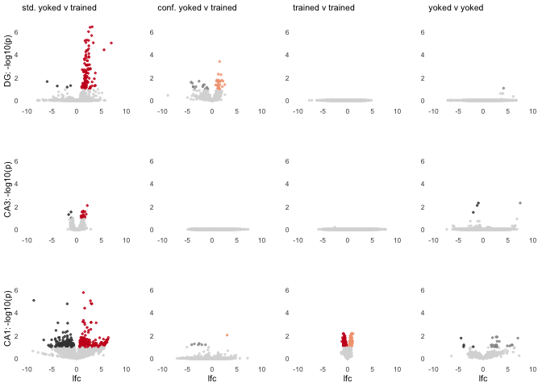
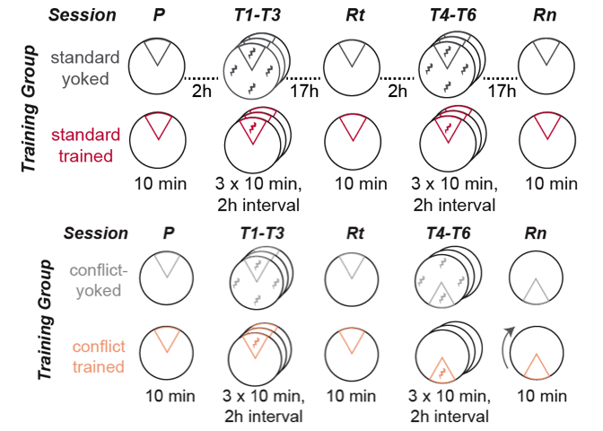

New approach. Behavior-centric analysis figures first.

    library(tidyverse) ## for respahing data

    ## ── Attaching packages ────────────────────────────── tidyverse 1.2.1 ──

    ## ✔ ggplot2 3.2.1     ✔ purrr   0.3.2
    ## ✔ tibble  2.1.3     ✔ dplyr   0.8.1
    ## ✔ tidyr   0.8.3     ✔ stringr 1.4.0
    ## ✔ readr   1.3.1     ✔ forcats 0.4.0

    ## ── Conflicts ───────────────────────────────── tidyverse_conflicts() ──
    ## ✖ dplyr::filter() masks stats::filter()
    ## ✖ dplyr::lag()    masks stats::lag()

    library(cowplot) ## for some easy to use themes

    ## 
    ## Attaching package: 'cowplot'

    ## The following object is masked from 'package:ggplot2':
    ## 
    ##     ggsave

    library(DESeq2)

    ## Loading required package: S4Vectors

    ## Loading required package: stats4

    ## Loading required package: BiocGenerics

    ## Loading required package: parallel

    ## 
    ## Attaching package: 'BiocGenerics'

    ## The following objects are masked from 'package:parallel':
    ## 
    ##     clusterApply, clusterApplyLB, clusterCall, clusterEvalQ,
    ##     clusterExport, clusterMap, parApply, parCapply, parLapply,
    ##     parLapplyLB, parRapply, parSapply, parSapplyLB

    ## The following objects are masked from 'package:dplyr':
    ## 
    ##     combine, intersect, setdiff, union

    ## The following objects are masked from 'package:stats':
    ## 
    ##     IQR, mad, sd, var, xtabs

    ## The following objects are masked from 'package:base':
    ## 
    ##     anyDuplicated, append, as.data.frame, basename, cbind,
    ##     colnames, dirname, do.call, duplicated, eval, evalq, Filter,
    ##     Find, get, grep, grepl, intersect, is.unsorted, lapply, Map,
    ##     mapply, match, mget, order, paste, pmax, pmax.int, pmin,
    ##     pmin.int, Position, rank, rbind, Reduce, rownames, sapply,
    ##     setdiff, sort, table, tapply, union, unique, unsplit, which,
    ##     which.max, which.min

    ## 
    ## Attaching package: 'S4Vectors'

    ## The following objects are masked from 'package:dplyr':
    ## 
    ##     first, rename

    ## The following object is masked from 'package:tidyr':
    ## 
    ##     expand

    ## The following object is masked from 'package:base':
    ## 
    ##     expand.grid

    ## Loading required package: IRanges

    ## 
    ## Attaching package: 'IRanges'

    ## The following objects are masked from 'package:dplyr':
    ## 
    ##     collapse, desc, slice

    ## The following object is masked from 'package:purrr':
    ## 
    ##     reduce

    ## Loading required package: GenomicRanges

    ## Loading required package: GenomeInfoDb

    ## Loading required package: SummarizedExperiment

    ## Loading required package: Biobase

    ## Welcome to Bioconductor
    ## 
    ##     Vignettes contain introductory material; view with
    ##     'browseVignettes()'. To cite Bioconductor, see
    ##     'citation("Biobase")', and for packages 'citation("pkgname")'.

    ## Loading required package: DelayedArray

    ## Loading required package: matrixStats

    ## 
    ## Attaching package: 'matrixStats'

    ## The following objects are masked from 'package:Biobase':
    ## 
    ##     anyMissing, rowMedians

    ## The following object is masked from 'package:dplyr':
    ## 
    ##     count

    ## Loading required package: BiocParallel

    ## 
    ## Attaching package: 'DelayedArray'

    ## The following objects are masked from 'package:matrixStats':
    ## 
    ##     colMaxs, colMins, colRanges, rowMaxs, rowMins, rowRanges

    ## The following object is masked from 'package:purrr':
    ## 
    ##     simplify

    ## The following objects are masked from 'package:base':
    ## 
    ##     aperm, apply, rowsum

    library("png")
    library("grid")

    library(BiocParallel)
    register(MulticoreParam(6))

    source("functions_RNAseq.R")
    source("figureoptions.R")

    knitr::opts_chunk$set(echo = TRUE, fig.path = '../figures/fig1/', message = F)

    # all behavior data
    behav <- read.csv("../data/01a_behavior.csv") 

    # make mouse name
    behav$mouse <- sapply(strsplit(as.character(behav$ID),"15"), "[", 2)

    behav <-  behav %>% 
      select(mouse,APA2, TrainSessionCombo, TrainSessionComboNum, Time1stEntr, Path1stEntr, pTimeTarget, NumEntrances)

    # subset to standard or conflict paradigm only
    standard <- behav %>% filter(APA2 %in% c("standard-yoked", "standard-trained")) 
    standard$APA2 <- factor(standard$APA2, levels = c("standard-yoked", "standard-trained"))

    conflict <- behav %>% filter(APA2 %in% c("conflict-yoked", "conflict-trained")) 
    conflict$APA2 <- factor(conflict$APA2, levels = c("conflict-yoked", "conflict-trained"))

    # gather and summarize

    calculatemeandev <- function(mydf){
      
      mydf <- mydf %>% gather(behavior, measure, Time1stEntr:NumEntrances)
      mydf$behavior <- factor(mydf$behavior, levels = c("Path1stEntr", "Time1stEntr", "pTimeTarget", "NumEntrances"))

      meandev <- mydf %>%
        dplyr::group_by(APA2, TrainSessionComboNum, behavior) %>%
        dplyr::summarise(m = mean(measure), 
                       se = sd(measure)/sqrt(length(measure)))
      return(meandev)
    }

    standard.meandev <- calculatemeandev(standard)
    conflict.meandev <- calculatemeandev(conflict)

      
    # Time1stEntr, Path1stEntr, pTimeTarget, NumEntrances
    a <- plotmeansd(standard.meandev, "Time1stEntr", "Time 1st entr. (s)" , trainedcolors)
    b <- plotmeansd(standard.meandev, "Path1stEntr", "Path 1st entr. (m)" , trainedcolors)
    c <- plotmeansd(standard.meandev, "pTimeTarget", "Prop. time in zone" , trainedcolors)
    d <- plotmeansd(standard.meandev, "NumEntrances", "Num. of entr." , trainedcolors)

    h <- plotmeansd(conflict.meandev, "Time1stEntr", "Time 1st entr. (s)" , conflictcolors)
    i <- plotmeansd(conflict.meandev, "Path1stEntr", "Path 1st entr. (m)" , conflictcolors)
    j <- plotmeansd(conflict.meandev, "pTimeTarget", "Prop. time in zone" , conflictcolors)
    k <- plotmeansd(conflict.meandev, "NumEntrances", "Num. of entr." , conflictcolors)

    A <- plot_grid(a + labs(subtitle = "std. yoked v trained"),
                   h + labs(y = NULL, subtitle = "conf. yoked v trained"),
                   b,i + labs(y = NULL),
                   c,j + labs(y = NULL),
                  d,k + labs(y = NULL), ncol = 2)
    A

    a.colData <- read.csv("../data/02a_colData.csv", header = T)
    a.countData <- read.csv("../data/02a_countData.csv", header = T, check.names = F, row.names = 1)

    standard <- c("standard.yoked", "standard.trained")
    conflict <- c("conflict.yoked", "conflict.trained")
    trained <- c("standard.trained", "conflict.trained")
    yoked <- c("standard.yoked", "conflict.yoked")

    # standard
    DGstandard <- returndds("DG", standard) 

    ## [1] "DG"

    CA3standard <- returndds("CA3", standard) 

    ## [1] "CA3"

    CA1standard <- returndds("CA1", standard) 

    ## [1] "CA1"

    a <- plot.volcano(DGstandard, "standard.trained", "standard.yoked", volcano1)

    ## 
    ## out of 16461 with nonzero total read count
    ## adjusted p-value < 0.1
    ## LFC > 0 (up)       : 106, 0.64%
    ## LFC < 0 (down)     : 4, 0.024%
    ## outliers [1]       : 25, 0.15%
    ## low counts [2]     : 2873, 17%
    ## (mean count < 2)
    ## [1] see 'cooksCutoff' argument of ?results
    ## [2] see 'independentFiltering' argument of ?results
    ## 
    ## NULL

    b <- plot.volcano(CA3standard, "standard.trained", "standard.yoked", volcano1)

    ## 
    ## out of 15699 with nonzero total read count
    ## adjusted p-value < 0.1
    ## LFC > 0 (up)       : 21, 0.13%
    ## LFC < 0 (down)     : 3, 0.019%
    ## outliers [1]       : 0, 0%
    ## low counts [2]     : 9740, 62%
    ## (mean count < 88)
    ## [1] see 'cooksCutoff' argument of ?results
    ## [2] see 'independentFiltering' argument of ?results
    ## 
    ## NULL

    c <- plot.volcano(CA1standard, "standard.trained", "standard.yoked", volcano1)

    ## 
    ## out of 15918 with nonzero total read count
    ## adjusted p-value < 0.1
    ## LFC > 0 (up)       : 305, 1.9%
    ## LFC < 0 (down)     : 196, 1.2%
    ## outliers [1]       : 13, 0.082%
    ## low counts [2]     : 4628, 29%
    ## (mean count < 6)
    ## [1] see 'cooksCutoff' argument of ?results
    ## [2] see 'independentFiltering' argument of ?results
    ## 
    ## NULL

    # conflict
    DGconflict <- returndds("DG", conflict) 

    ## [1] "DG"

    CA3conflict <- returndds("CA3", conflict) 

    ## [1] "CA3"

    CA1conflict <- returndds("CA1", conflict) 

    ## [1] "CA1"

    d <- plot.volcano(DGconflict, "conflict.trained", "conflict.yoked", volcano5)

    ## 
    ## out of 16252 with nonzero total read count
    ## adjusted p-value < 0.1
    ## LFC > 0 (up)       : 30, 0.18%
    ## LFC < 0 (down)     : 13, 0.08%
    ## outliers [1]       : 28, 0.17%
    ## low counts [2]     : 7538, 46%
    ## (mean count < 21)
    ## [1] see 'cooksCutoff' argument of ?results
    ## [2] see 'independentFiltering' argument of ?results
    ## 
    ## NULL

    e <- plot.volcano(CA3conflict, "conflict.trained", "conflict.yoked", volcano5)

    ## 
    ## out of 15884 with nonzero total read count
    ## adjusted p-value < 0.1
    ## LFC > 0 (up)       : 0, 0%
    ## LFC < 0 (down)     : 0, 0%
    ## outliers [1]       : 24, 0.15%
    ## low counts [2]     : 0, 0%
    ## (mean count < 0)
    ## [1] see 'cooksCutoff' argument of ?results
    ## [2] see 'independentFiltering' argument of ?results
    ## 
    ## NULL

    f <- plot.volcano(CA1conflict, "conflict.trained", "conflict.yoked", volcano5)

    ## 
    ## out of 16170 with nonzero total read count
    ## adjusted p-value < 0.1
    ## LFC > 0 (up)       : 1, 0.0062%
    ## LFC < 0 (down)     : 6, 0.037%
    ## outliers [1]       : 33, 0.2%
    ## low counts [2]     : 0, 0%
    ## (mean count < 0)
    ## [1] see 'cooksCutoff' argument of ?results
    ## [2] see 'independentFiltering' argument of ?results
    ## 
    ## NULL

    # trained
    DGtrained <- returndds("DG", trained) 

    ## [1] "DG"

    CA3trained <- returndds("CA3", trained) 

    ## [1] "CA3"

    CA1trained <- returndds("CA1", trained) 

    ## [1] "CA1"

    h <- plot.volcano(DGtrained, "conflict.trained", "standard.trained", volcano2)

    ## 
    ## out of 16556 with nonzero total read count
    ## adjusted p-value < 0.1
    ## LFC > 0 (up)       : 0, 0%
    ## LFC < 0 (down)     : 0, 0%
    ## outliers [1]       : 24, 0.14%
    ## low counts [2]     : 0, 0%
    ## (mean count < 0)
    ## [1] see 'cooksCutoff' argument of ?results
    ## [2] see 'independentFiltering' argument of ?results
    ## 
    ## NULL

    i <- plot.volcano(CA3trained, "conflict.trained", "standard.trained", volcano2)

    ## 
    ## out of 15721 with nonzero total read count
    ## adjusted p-value < 0.1
    ## LFC > 0 (up)       : 0, 0%
    ## LFC < 0 (down)     : 0, 0%
    ## outliers [1]       : 16, 0.1%
    ## low counts [2]     : 0, 0%
    ## (mean count < 0)
    ## [1] see 'cooksCutoff' argument of ?results
    ## [2] see 'independentFiltering' argument of ?results
    ## 
    ## NULL

    j <- plot.volcano(CA1trained, "conflict.trained", "standard.trained", volcano2)

    ## 
    ## out of 16595 with nonzero total read count
    ## adjusted p-value < 0.1
    ## LFC > 0 (up)       : 223, 1.3%
    ## LFC < 0 (down)     : 252, 1.5%
    ## outliers [1]       : 45, 0.27%
    ## low counts [2]     : 12184, 73%
    ## (mean count < 136)
    ## [1] see 'cooksCutoff' argument of ?results
    ## [2] see 'independentFiltering' argument of ?results
    ## 
    ## NULL

    # yoked
    DGyoked <- returndds("DG", yoked) 

    ## [1] "DG"

    CA3yoked <- returndds("CA3", yoked) 

    ## [1] "CA3"

    CA1yoked <- returndds("CA1", yoked) 

    ## [1] "CA1"

    k <- plot.volcano(DGyoked, "conflict.yoked", "standard.yoked", volcano6)

    ## 
    ## out of 16135 with nonzero total read count
    ## adjusted p-value < 0.1
    ## LFC > 0 (up)       : 1, 0.0062%
    ## LFC < 0 (down)     : 0, 0%
    ## outliers [1]       : 18, 0.11%
    ## low counts [2]     : 0, 0%
    ## (mean count < 0)
    ## [1] see 'cooksCutoff' argument of ?results
    ## [2] see 'independentFiltering' argument of ?results
    ## 
    ## NULL

    l <- plot.volcano(CA3yoked, "conflict.yoked", "standard.yoked", volcano6)

    ## 
    ## out of 15856 with nonzero total read count
    ## adjusted p-value < 0.1
    ## LFC > 0 (up)       : 1, 0.0063%
    ## LFC < 0 (down)     : 3, 0.019%
    ## outliers [1]       : 5, 0.032%
    ## low counts [2]     : 0, 0%
    ## (mean count < 0)
    ## [1] see 'cooksCutoff' argument of ?results
    ## [2] see 'independentFiltering' argument of ?results
    ## 
    ## NULL

    m <- plot.volcano(CA1yoked, "conflict.yoked", "standard.yoked", volcano6)

    ## 
    ## out of 15085 with nonzero total read count
    ## adjusted p-value < 0.1
    ## LFC > 0 (up)       : 20, 0.13%
    ## LFC < 0 (down)     : 4, 0.027%
    ## outliers [1]       : 12, 0.08%
    ## low counts [2]     : 6722, 45%
    ## (mean count < 14)
    ## [1] see 'cooksCutoff' argument of ?results
    ## [2] see 'independentFiltering' argument of ?results
    ## 
    ## NULL

    B <- plot_grid(a + labs(y = "DG: -log10(p)", subtitle = "std. yoked v trained"),
                   d + labs(subtitle = "conf. yoked v trained"),
                   h + labs(subtitle = "trained v trained"),
                   k + labs(subtitle = "yoked v yoked"),
              b + labs(y = "CA3: -log10(p)"),e,i,l,
              c + labs(y = "CA1: -log10(p)", x = "lfc"),
              f  + labs( x = "lfc"),
              j + labs( x = "lfc"),
              m + labs( x = "lfc"), nrow = 3, align = "hv")
    B

    C <- plot_grid(A,B,rel_widths = c(0.3,0.6))
    C

supplementary fig 1
===================

    schematicTrained <- ggdraw() +  draw_image("../figures/figure_fig1a.png")
    schematicConflict <- ggdraw() +  draw_image("../figures/figure_fig2a.png")

    plot_grid(schematicTrained, schematicConflict, nrow = 2)

