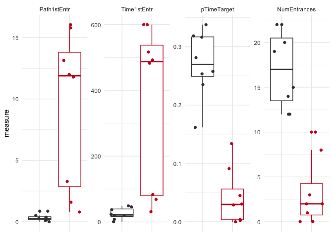
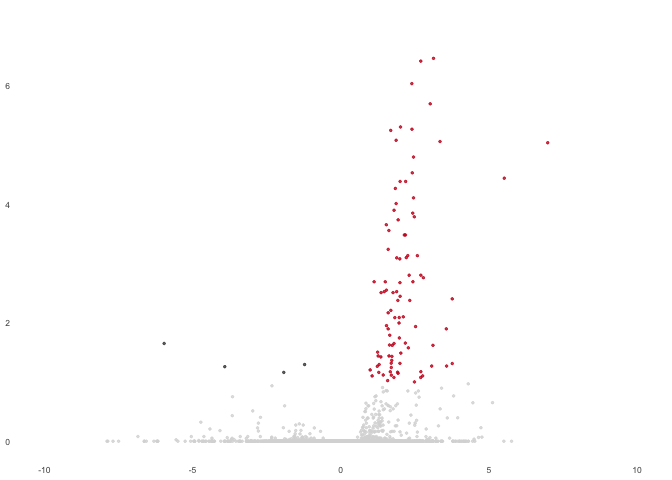
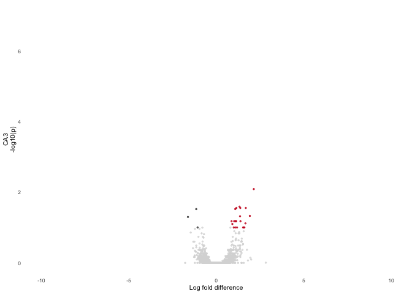
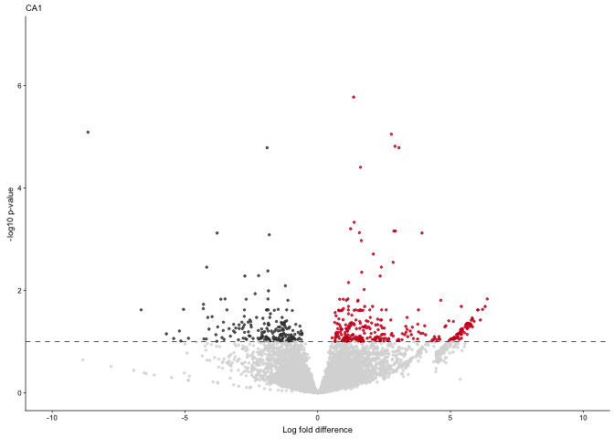
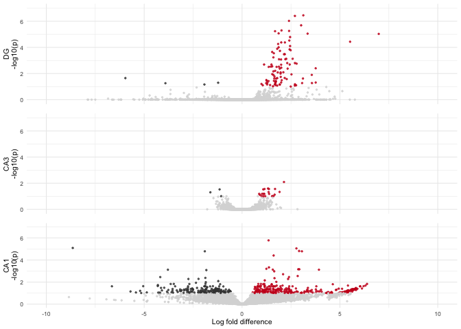
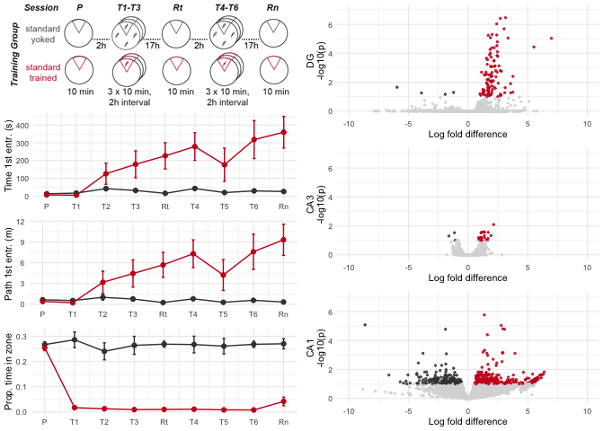

New approach. Behavior-centric analysis figures first.

    library(tidyverse) ## for respahing data

    ## ── Attaching packages ──────────────────────────────────────────────────────────────────────────────────────────────────────────────────── tidyverse 1.2.1 ──

    ## ✔ ggplot2 3.2.1     ✔ purrr   0.3.2
    ## ✔ tibble  2.1.3     ✔ dplyr   0.8.1
    ## ✔ tidyr   0.8.3     ✔ stringr 1.4.0
    ## ✔ readr   1.3.1     ✔ forcats 0.4.0

    ## ── Conflicts ─────────────────────────────────────────────────────────────────────────────────────────────────────────────────────── tidyverse_conflicts() ──
    ## ✖ dplyr::filter() masks stats::filter()
    ## ✖ dplyr::lag()    masks stats::lag()

    library(cowplot) ## for some easy to use themes

    ## 
    ## Attaching package: 'cowplot'

    ## The following object is masked from 'package:ggplot2':
    ## 
    ##     ggsave

    library(DESeq2)

    ## Loading required package: S4Vectors

    ## Loading required package: stats4

    ## Loading required package: BiocGenerics

    ## Loading required package: parallel

    ## 
    ## Attaching package: 'BiocGenerics'

    ## The following objects are masked from 'package:parallel':
    ## 
    ##     clusterApply, clusterApplyLB, clusterCall, clusterEvalQ,
    ##     clusterExport, clusterMap, parApply, parCapply, parLapply,
    ##     parLapplyLB, parRapply, parSapply, parSapplyLB

    ## The following objects are masked from 'package:dplyr':
    ## 
    ##     combine, intersect, setdiff, union

    ## The following objects are masked from 'package:stats':
    ## 
    ##     IQR, mad, sd, var, xtabs

    ## The following objects are masked from 'package:base':
    ## 
    ##     anyDuplicated, append, as.data.frame, basename, cbind,
    ##     colnames, dirname, do.call, duplicated, eval, evalq, Filter,
    ##     Find, get, grep, grepl, intersect, is.unsorted, lapply, Map,
    ##     mapply, match, mget, order, paste, pmax, pmax.int, pmin,
    ##     pmin.int, Position, rank, rbind, Reduce, rownames, sapply,
    ##     setdiff, sort, table, tapply, union, unique, unsplit, which,
    ##     which.max, which.min

    ## 
    ## Attaching package: 'S4Vectors'

    ## The following objects are masked from 'package:dplyr':
    ## 
    ##     first, rename

    ## The following object is masked from 'package:tidyr':
    ## 
    ##     expand

    ## The following object is masked from 'package:base':
    ## 
    ##     expand.grid

    ## Loading required package: IRanges

    ## 
    ## Attaching package: 'IRanges'

    ## The following objects are masked from 'package:dplyr':
    ## 
    ##     collapse, desc, slice

    ## The following object is masked from 'package:purrr':
    ## 
    ##     reduce

    ## Loading required package: GenomicRanges

    ## Loading required package: GenomeInfoDb

    ## Loading required package: SummarizedExperiment

    ## Loading required package: Biobase

    ## Welcome to Bioconductor
    ## 
    ##     Vignettes contain introductory material; view with
    ##     'browseVignettes()'. To cite Bioconductor, see
    ##     'citation("Biobase")', and for packages 'citation("pkgname")'.

    ## Loading required package: DelayedArray

    ## Loading required package: matrixStats

    ## 
    ## Attaching package: 'matrixStats'

    ## The following objects are masked from 'package:Biobase':
    ## 
    ##     anyMissing, rowMedians

    ## The following object is masked from 'package:dplyr':
    ## 
    ##     count

    ## Loading required package: BiocParallel

    ## 
    ## Attaching package: 'DelayedArray'

    ## The following objects are masked from 'package:matrixStats':
    ## 
    ##     colMaxs, colMins, colRanges, rowMaxs, rowMins, rowRanges

    ## The following object is masked from 'package:purrr':
    ## 
    ##     simplify

    ## The following objects are masked from 'package:base':
    ## 
    ##     aperm, apply, rowsum

    library(BiocParallel)
    register(MulticoreParam(6))

    source("functions_RNAseq.R")
    source("figureoptions.R")

    knitr::opts_chunk$set(echo = TRUE, fig.path = '../figures/fig1/')

    # all behavior data
    behav <- read.csv("../data/01a_behavior.csv") 

    # make mouse name
    behav$mouse <- sapply(strsplit(as.character(behav$ID),"15"), "[", 2)

    # subset to standard paradigm only
    standard <- behav %>% filter(APA2 %in% c("standard-yoked", "standard-trained"),
                                 TrainSession == "Retention") %>% 
                               select(mouse,APA2, Time1stEntr, Path1stEntr, pTimeTarget, NumEntrances)

    standard$APA2 <- factor(standard$APA2, levels = c("standard-yoked", "standard-trained"))

    # gather
    standard <- standard %>% gather(behavior, measure, Time1stEntr:NumEntrances)

    standard$behavior <- factor(standard$behavior, levels = c("Path1stEntr", "Time1stEntr", "pTimeTarget", "NumEntrances"))

    top <- ggplot(standard, aes(x = APA2, y = measure, color = APA2)) + 

      geom_boxplot() +
        geom_jitter()  + 
      facet_wrap(~behavior, scales = "free_y", nrow  = 1) + 
      theme_minimal() + 
      theme(legend.position = "none",
            axis.text.x = element_blank()) + 
      scale_color_manual(values = trainedcolors) +
      labs(x = NULL) 
    top

    a.colData <- read.csv("../data/02a_colData.csv", header = T)
    a.countData <- read.csv("../data/02a_countData.csv", header = T, check.names = F, row.names = 1)

    trained <- c("standard.yoked", "standard.trained")

    DGdds <- returndds("DG", trained) 

    ## [1] "DG"

    ## estimating size factors

    ## estimating dispersions

    ## gene-wise dispersion estimates: 6 workers

    ## mean-dispersion relationship

    ## final dispersion estimates, fitting model and testing: 6 workers

    CA1dds <- returndds("CA1", trained) 

    ## [1] "CA1"

    ## estimating size factors

    ## estimating dispersions

    ## gene-wise dispersion estimates: 6 workers

    ## mean-dispersion relationship

    ## final dispersion estimates, fitting model and testing: 6 workers

    CA3dds <- returndds("CA3", trained) 

    ## [1] "CA3"

    ## estimating size factors

    ## estimating dispersions

    ## gene-wise dispersion estimates: 6 workers

    ## mean-dispersion relationship

    ## final dispersion estimates, fitting model and testing: 6 workers

    DGvsd <- returnvsds(DGdds, "../data/fig1.DG.vsd.trained.csv")

    ##               143D-DG-3 144C-DG-2 144D-DG-2 146C-DG-4 146D-DG-3 147C-DG-3
    ## 0610007P14Rik  6.672996  6.179086  6.459435  6.784348  7.240654  6.056962
    ## 0610009B22Rik  4.847499  5.487824  5.306626  5.772294  4.481142  5.594871
    ## 0610009L18Rik  4.997876  5.105310  5.105369  4.481142  4.481142  4.797131
    ##               147D-DG-1
    ## 0610007P14Rik  6.267871
    ## 0610009B22Rik  5.571633
    ## 0610009L18Rik  5.359493

    returnvsds(CA1dds, "../data/fig1.CA1.vsd.trained.csv")

    ##               143C-CA1-1 143D-CA1-3 144C-CA1-2 146C-CA1-4 146D-CA1-3
    ## 0610007P14Rik   8.387760   8.493816   8.413245   8.526417   8.554423
    ## 0610009B22Rik   8.254295   7.929772   8.166522   8.187337   8.257832
    ## 0610009L18Rik   8.035259   7.929772   8.016305   8.221713   7.929772
    ##               147C-CA1-3
    ## 0610007P14Rik   8.452185
    ## 0610009B22Rik   8.190144
    ## 0610009L18Rik   8.019186

    ## class: DESeqTransform 
    ## dim: 15918 6 
    ## metadata(36): version version ... version version
    ## assays(1): ''
    ## rownames(15918): 0610007P14Rik 0610009B22Rik ... Zzef1 Zzz3
    ## rowData names(22): baseMean baseVar ... maxCooks dispFit
    ## colnames(6): 143C-CA1-1 143D-CA1-3 ... 146D-CA1-3 147C-CA1-3
    ## colData names(9): RNAseqID Mouse ... APA2 sizeFactor

    returnvsds(CA3dds, "../data/fig1.CA3.vsd.trained.csv")

    ##               144C-CA3-2 144D-CA3-2 146D-CA3-3 147C-CA3-3 147D-CA3-1
    ## 0610007P14Rik   7.974377   7.878990   8.085439   8.085445   7.846885
    ## 0610009B22Rik   7.900183   7.460824   7.538320   7.438119   7.597325
    ## 0610009L18Rik   7.335645   7.373395   7.269906   7.240971   7.247895

    ## class: DESeqTransform 
    ## dim: 15699 5 
    ## metadata(36): version version ... version version
    ## assays(1): ''
    ## rownames(15699): 0610007P14Rik 0610009B22Rik ... Zzef1 Zzz3
    ## rowData names(22): baseMean baseVar ... maxCooks dispFit
    ## colnames(5): 144C-CA3-2 144D-CA3-2 146D-CA3-3 147C-CA3-3
    ##   147D-CA3-1
    ## colData names(9): RNAseqID Mouse ... APA2 sizeFactor

    res_summary_subfield(DGdds, c("APA2", "standard.trained", "standard.yoked"))

    ## [1] "APA2"             "standard.trained" "standard.yoked"  
    ## [1] 110
    ## 
    ## out of 16461 with nonzero total read count
    ## adjusted p-value < 0.1
    ## LFC > 0 (up)       : 106, 0.64%
    ## LFC < 0 (down)     : 4, 0.024%
    ## outliers [1]       : 25, 0.15%
    ## low counts [2]     : 2873, 17%
    ## (mean count < 2)
    ## [1] see 'cooksCutoff' argument of ?results
    ## [2] see 'independentFiltering' argument of ?results
    ## 
    ## NULL
    ## log2 fold change (MLE): APA2 standard.trained vs standard.yoked 
    ## Wald test p-value: APA2 standard.trained vs standard.yoked 
    ## DataFrame with 5 rows and 6 columns
    ##               baseMean   log2FoldChange             lfcSE             stat
    ##              <numeric>        <numeric>         <numeric>        <numeric>
    ## Smad7 191.554680898903 3.52904476439663 0.376268098812353 9.37906980564033
    ## Fosl2 654.604095786292 2.60366788502287 0.321648458400874 8.09476251795956
    ## Frmd6   256.2828890978  3.3085634491998 0.421504617325348 7.84941211366615
    ## Rgs2  292.183288338612 2.67211107002041 0.358192019090054 7.45999611272357
    ## Egr4  853.400139423041 3.23607022817105 0.439454554371051 7.36383363417982
    ##                     pvalue                 padj
    ##                  <numeric>            <numeric>
    ## Smad7 6.65573031791577e-21 9.02716703018916e-17
    ## Fosl2 5.73761778768328e-16 3.89096550271741e-12
    ## Frmd6  4.1799197012357e-15 1.88974169692866e-11
    ## Rgs2  8.65250328167539e-14 2.93384755023408e-10
    ## Egr4  1.78702384781057e-13 4.84748088957096e-10

    res_summary_subfield(CA1dds, c("APA2", "standard.trained", "standard.yoked"))

    ## [1] "APA2"             "standard.trained" "standard.yoked"  
    ## [1] 501
    ## 
    ## out of 15918 with nonzero total read count
    ## adjusted p-value < 0.1
    ## LFC > 0 (up)       : 305, 1.9%
    ## LFC < 0 (down)     : 196, 1.2%
    ## outliers [1]       : 13, 0.082%
    ## low counts [2]     : 4628, 29%
    ## (mean count < 6)
    ## [1] see 'cooksCutoff' argument of ?results
    ## [2] see 'independentFiltering' argument of ?results
    ## 
    ## NULL
    ## log2 fold change (MLE): APA2 standard.trained vs standard.yoked 
    ## Wald test p-value: APA2 standard.trained vs standard.yoked 
    ## DataFrame with 5 rows and 6 columns
    ##                baseMean    log2FoldChange             lfcSE
    ##               <numeric>         <numeric>         <numeric>
    ## Hspa1a 379.777535705632  2.45897909317952 0.355064461848962
    ## Grin2b 2013.28278456294  1.35464981817231 0.215030188397372
    ## Gm6768  15.006257904779 -8.64951547262851  1.44532672219772
    ## Agap1  109.130722789594  2.77682310605492 0.468816104008652
    ## Mga     95.004389661655  2.91488855976576 0.502948444711577
    ##                     stat               pvalue                 padj
    ##                <numeric>            <numeric>            <numeric>
    ## Hspa1a  6.92544413027042 4.34609834740141e-12 4.90109510636457e-08
    ## Grin2b  6.29981226481998 2.98006362989405e-10 1.68030887771576e-06
    ## Gm6768 -5.98447073577682 2.17094615540572e-09 8.16058659817011e-06
    ## Agap1    5.9230540126746 3.16016990432763e-09 8.90930900277567e-06
    ## Mga     5.79560110069999 6.80769016051712e-09 1.53540643880303e-05

    res_summary_subfield(CA3dds, c("APA2", "standard.trained", "standard.yoked"))

    ## [1] "APA2"             "standard.trained" "standard.yoked"  
    ## [1] 24
    ## 
    ## out of 15699 with nonzero total read count
    ## adjusted p-value < 0.1
    ## LFC > 0 (up)       : 21, 0.13%
    ## LFC < 0 (down)     : 3, 0.019%
    ## outliers [1]       : 0, 0%
    ## low counts [2]     : 9740, 62%
    ## (mean count < 88)
    ## [1] see 'cooksCutoff' argument of ?results
    ## [2] see 'independentFiltering' argument of ?results
    ## 
    ## NULL
    ## log2 fold change (MLE): APA2 standard.trained vs standard.yoked 
    ## Wald test p-value: APA2 standard.trained vs standard.yoked 
    ## DataFrame with 5 rows and 6 columns
    ##                baseMean   log2FoldChange             lfcSE
    ##               <numeric>        <numeric>         <numeric>
    ## Reln    157.24702172872 2.14191252211946 0.443439391744685
    ## Gad1    1178.9090467898 1.32695796622586 0.298136360992819
    ## Btg2   204.548854380162 1.68568534191939 0.388063400984482
    ## Daam2  308.244973275245 1.37337828165421 0.321355515528076
    ## Slc6a1 1304.24280507927 1.14683235981017 0.271121206933494
    ##                    stat               pvalue                padj
    ##               <numeric>            <numeric>           <numeric>
    ## Reln   4.83022609627043   1.363781010499e-06 0.00812677104156355
    ## Gad1   4.45084243266061 8.55340851686508e-06  0.0254848806759995
    ## Btg2   4.34384004686596 1.40013477503368e-05  0.0278113437480856
    ## Daam2  4.27370378067843 1.92252412490963e-05  0.0278560552424099
    ## Slc6a1 4.22996184172153 2.33730955214045e-05  0.0278560552424099

    a <-  plot.cons.yokcons(DGdds, "DG", "DG") 

    ## [1] "DG"
    ## 
    ## out of 16461 with nonzero total read count
    ## adjusted p-value < 0.1
    ## LFC > 0 (up)       : 106, 0.64%
    ## LFC < 0 (down)     : 4, 0.024%
    ## outliers [1]       : 25, 0.15%
    ## low counts [2]     : 2873, 17%
    ## (mean count < 2)
    ## [1] see 'cooksCutoff' argument of ?results
    ## [2] see 'independentFiltering' argument of ?results
    ## 
    ## NULL

    b <-  plot.cons.yokcons(CA3dds, "CA3", "CA3") 

    ## [1] "CA3"
    ## 
    ## out of 15699 with nonzero total read count
    ## adjusted p-value < 0.1
    ## LFC > 0 (up)       : 21, 0.13%
    ## LFC < 0 (down)     : 3, 0.019%
    ## outliers [1]       : 0, 0%
    ## low counts [2]     : 9740, 62%
    ## (mean count < 88)
    ## [1] see 'cooksCutoff' argument of ?results
    ## [2] see 'independentFiltering' argument of ?results
    ## 
    ## NULL

    c <-  plot.cons.yokcons(CA1dds, "CA1", "CA1") 

    ## [1] "CA1"
    ## 
    ## out of 15918 with nonzero total read count
    ## adjusted p-value < 0.1
    ## LFC > 0 (up)       : 305, 1.9%
    ## LFC < 0 (down)     : 196, 1.2%
    ## outliers [1]       : 13, 0.082%
    ## low counts [2]     : 4628, 29%
    ## (mean count < 6)
    ## [1] see 'cooksCutoff' argument of ?results
    ## [2] see 'independentFiltering' argument of ?results
    ## 
    ## NULL

    abc <- plot_grid(a,b,c, nrow = 1)
    abc

    plot_grid(top,abc, nrow = 2)

