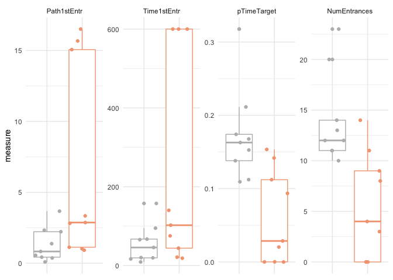

New approach. Behavior-centric analysis figures first.

    library(tidyverse) ## for respahing data

    ## ── Attaching packages ─────────────────────────────────────────────────────────────── tidyverse 1.2.1 ──

    ## ✔ ggplot2 3.2.1     ✔ purrr   0.3.2
    ## ✔ tibble  2.1.3     ✔ dplyr   0.8.1
    ## ✔ tidyr   0.8.3     ✔ stringr 1.4.0
    ## ✔ readr   1.3.1     ✔ forcats 0.4.0

    ## ── Conflicts ────────────────────────────────────────────────────────────────── tidyverse_conflicts() ──
    ## ✖ dplyr::filter() masks stats::filter()
    ## ✖ dplyr::lag()    masks stats::lag()

    library(cowplot) ## for some easy to use themes

    ## 
    ## Attaching package: 'cowplot'

    ## The following object is masked from 'package:ggplot2':
    ## 
    ##     ggsave

    library(DESeq2)

    ## Loading required package: S4Vectors

    ## Loading required package: stats4

    ## Loading required package: BiocGenerics

    ## Loading required package: parallel

    ## 
    ## Attaching package: 'BiocGenerics'

    ## The following objects are masked from 'package:parallel':
    ## 
    ##     clusterApply, clusterApplyLB, clusterCall, clusterEvalQ,
    ##     clusterExport, clusterMap, parApply, parCapply, parLapply,
    ##     parLapplyLB, parRapply, parSapply, parSapplyLB

    ## The following objects are masked from 'package:dplyr':
    ## 
    ##     combine, intersect, setdiff, union

    ## The following objects are masked from 'package:stats':
    ## 
    ##     IQR, mad, sd, var, xtabs

    ## The following objects are masked from 'package:base':
    ## 
    ##     anyDuplicated, append, as.data.frame, basename, cbind,
    ##     colnames, dirname, do.call, duplicated, eval, evalq, Filter,
    ##     Find, get, grep, grepl, intersect, is.unsorted, lapply, Map,
    ##     mapply, match, mget, order, paste, pmax, pmax.int, pmin,
    ##     pmin.int, Position, rank, rbind, Reduce, rownames, sapply,
    ##     setdiff, sort, table, tapply, union, unique, unsplit, which,
    ##     which.max, which.min

    ## 
    ## Attaching package: 'S4Vectors'

    ## The following objects are masked from 'package:dplyr':
    ## 
    ##     first, rename

    ## The following object is masked from 'package:tidyr':
    ## 
    ##     expand

    ## The following object is masked from 'package:base':
    ## 
    ##     expand.grid

    ## Loading required package: IRanges

    ## 
    ## Attaching package: 'IRanges'

    ## The following objects are masked from 'package:dplyr':
    ## 
    ##     collapse, desc, slice

    ## The following object is masked from 'package:purrr':
    ## 
    ##     reduce

    ## Loading required package: GenomicRanges

    ## Loading required package: GenomeInfoDb

    ## Loading required package: SummarizedExperiment

    ## Loading required package: Biobase

    ## Welcome to Bioconductor
    ## 
    ##     Vignettes contain introductory material; view with
    ##     'browseVignettes()'. To cite Bioconductor, see
    ##     'citation("Biobase")', and for packages 'citation("pkgname")'.

    ## Loading required package: DelayedArray

    ## Loading required package: matrixStats

    ## 
    ## Attaching package: 'matrixStats'

    ## The following objects are masked from 'package:Biobase':
    ## 
    ##     anyMissing, rowMedians

    ## The following object is masked from 'package:dplyr':
    ## 
    ##     count

    ## Loading required package: BiocParallel

    ## 
    ## Attaching package: 'DelayedArray'

    ## The following objects are masked from 'package:matrixStats':
    ## 
    ##     colMaxs, colMins, colRanges, rowMaxs, rowMins, rowRanges

    ## The following object is masked from 'package:purrr':
    ## 
    ##     simplify

    ## The following objects are masked from 'package:base':
    ## 
    ##     aperm, apply, rowsum

    library(BiocParallel)
    register(MulticoreParam(6))

    source("functions_RNAseq.R")
    source("figureoptions.R")

    knitr::opts_chunk$set(echo = TRUE, fig.path = '../figures/fig2/')

    # all behavior data
    behav <- read.csv("../data/01a_behavior.csv") 

    # make mouse name
    behav$mouse <- sapply(strsplit(as.character(behav$ID),"15"), "[", 2)

    # subset to conflict paradigm only
    conflict <- behav %>% filter(APA2 %in% c("conflict-yoked", "conflict-trained"),
                                 TrainSession == "Retention") %>% 
                               select(mouse,APA2, Time1stEntr, Path1stEntr, pTimeTarget, NumEntrances)

    conflict$APA2 <- factor(conflict$APA2, levels = c("conflict-yoked", "conflict-trained"))

    # gather
    conflict <- conflict %>% gather(behavior, measure, Time1stEntr:NumEntrances)

    conflict$behavior <- factor(conflict$behavior, levels = c("Path1stEntr", "Time1stEntr", "pTimeTarget", "NumEntrances"))

    top <- ggplot(conflict, aes(x = APA2, y = measure, color = APA2)) + 

      geom_boxplot() +
        geom_jitter()  + 
      facet_wrap(~behavior, scales = "free_y", nrow  = 1) + 
      theme_minimal() + 
      theme(legend.position = "none",
            axis.text.x = element_blank()) + 
      scale_color_manual(values = conflictcolors) +
      labs(x = NULL) 
    top

    a.colData <- read.csv("../data/02a_colData.csv", header = T)
    a.countData <- read.csv("../data/02a_countData.csv", header = T, check.names = F, row.names = 1)

    trained <- c("conflict.yoked", "conflict.trained")

    DGdds <- returndds("DG", trained) 

    ## [1] "DG"

    ## estimating size factors

    ## estimating dispersions

    ## gene-wise dispersion estimates: 6 workers

    ## mean-dispersion relationship

    ## final dispersion estimates, fitting model and testing: 6 workers

    CA1dds <- returndds("CA1", trained) 

    ## [1] "CA1"

    ## estimating size factors

    ## estimating dispersions

    ## gene-wise dispersion estimates: 6 workers

    ## mean-dispersion relationship

    ## final dispersion estimates, fitting model and testing: 6 workers

    CA3dds <- returndds("CA3", trained) 

    ## [1] "CA3"

    ## estimating size factors

    ## estimating dispersions

    ## gene-wise dispersion estimates: 6 workers

    ## mean-dispersion relationship

    ## final dispersion estimates, fitting model and testing: 6 workers

    DGvsd <- returnvsds(DGdds, "../data/fig1.DG.vsd.trained.csv")

    ##               143A-DG-1 143B-DG-1 144A-DG-2 145A-DG-2 145B-DG-1 146A-DG-2
    ## 0610007P14Rik  6.776798  6.794496  6.884496  6.930140  6.573376  6.713050
    ## 0610009B22Rik  6.299558  6.205067  6.102348  6.430007  6.305210  6.221678
    ## 0610009L18Rik  6.006481  6.151423  5.692422  5.891546  5.692422  6.221678
    ##               146B-DG-2 148A-DG-3 148B-DG-4
    ## 0610007P14Rik  6.450363  6.864733  6.755049
    ## 0610009B22Rik  6.450363  6.148093  6.075541
    ## 0610009L18Rik  5.692422  6.083065  5.963725

    returnvsds(CA1dds, "../data/fig1.CA1.vsd.trained.csv")

    ##               143B-CA1-1 144A-CA1-2 144B-CA1-1 145A-CA1-2 145B-CA1-1
    ## 0610007P14Rik   7.302833   7.107048   7.148069   7.164207   7.118404
    ## 0610009B22Rik   6.716577   6.619166   6.414801   6.531319   6.534744
    ## 0610009L18Rik   6.439711   6.255456   5.969777   6.362353   6.134629
    ##               146A-CA1-2 146B-CA1-2 148A-CA1-3 148B-CA1-4
    ## 0610007P14Rik   6.863221   6.719566   7.076837   6.883577
    ## 0610009B22Rik   6.574343   6.432119   6.660972   5.805926
    ## 0610009L18Rik   6.370153   5.805926   6.255916   5.805926

    ## class: DESeqTransform 
    ## dim: 16170 9 
    ## metadata(36): version version ... version version
    ## assays(1): ''
    ## rownames(16170): 0610007P14Rik 0610009B22Rik ... Zzef1 Zzz3
    ## rowData names(22): baseMean baseVar ... maxCooks dispFit
    ## colnames(9): 143B-CA1-1 144A-CA1-2 ... 148A-CA1-3 148B-CA1-4
    ## colData names(9): RNAseqID Mouse ... APA2 sizeFactor

    returnvsds(CA3dds, "../data/fig1.CA3.vsd.trained.csv")

    ##               143A-CA3-1 144A-CA3-2 144B-CA3-1 145A-CA3-2 146A-CA3-2
    ## 0610007P14Rik   6.687298   7.187321   6.863844   6.412194   6.861813
    ## 0610009B22Rik   6.084351   6.600358   6.160515   6.507533   5.864847
    ## 0610009L18Rik   5.660346   6.297502   5.898561   5.363522   5.864847
    ##               146B-CA3-2 148A-CA3-3 148B-CA3-4
    ## 0610007P14Rik   6.386205   6.551281   6.888830
    ## 0610009B22Rik   6.523976   6.160312   6.316237
    ## 0610009L18Rik   5.620255   5.797688   5.840981

    ## class: DESeqTransform 
    ## dim: 15884 8 
    ## metadata(36): version version ... version version
    ## assays(1): ''
    ## rownames(15884): 0610007P14Rik 0610009B22Rik ... Zzef1 Zzz3
    ## rowData names(22): baseMean baseVar ... maxCooks dispFit
    ## colnames(8): 143A-CA3-1 144A-CA3-2 ... 148A-CA3-3 148B-CA3-4
    ## colData names(9): RNAseqID Mouse ... APA2 sizeFactor

    res_summary_subfield(DGdds, c("APA2", "conflict.trained", "conflict.yoked"))

    ## [1] "APA2"             "conflict.trained" "conflict.yoked"  
    ## [1] 43
    ## 
    ## out of 16252 with nonzero total read count
    ## adjusted p-value < 0.1
    ## LFC > 0 (up)       : 30, 0.18%
    ## LFC < 0 (down)     : 13, 0.08%
    ## outliers [1]       : 28, 0.17%
    ## low counts [2]     : 7538, 46%
    ## (mean count < 21)
    ## [1] see 'cooksCutoff' argument of ?results
    ## [2] see 'independentFiltering' argument of ?results
    ## 
    ## NULL
    ## log2 fold change (MLE): APA2 conflict.trained vs conflict.yoked 
    ## Wald test p-value: APA2 conflict.trained vs conflict.yoked 
    ## DataFrame with 5 rows and 6 columns
    ##               baseMean    log2FoldChange             lfcSE
    ##              <numeric>         <numeric>         <numeric>
    ## Arc   833.301972666187  1.49725781322034 0.273744368403865
    ## Atf3  261.318114546385  1.24096691429823 0.255241235550866
    ## Smad7 158.733571392647  1.76600470652752 0.370993566279162
    ## Egr1  1334.15542044129 0.964053097853093 0.215237059879951
    ## Sgk1  314.246484602513  1.33559820670499 0.302739128558823
    ##                   stat               pvalue                 padj
    ##              <numeric>            <numeric>            <numeric>
    ## Arc   5.46954745389095 4.51186113457903e-08 0.000391900258149535
    ## Atf3  4.86193742018195 1.16242375467945e-06  0.00504840636657284
    ## Smad7 4.76020305214309 1.93398287674185e-06  0.00559952508912656
    ## Egr1  4.47902930095215 7.49832415290411e-06   0.0162826108980313
    ## Sgk1  4.41171319037302   1.025559061061e-05   0.0169961279736143

    res_summary_subfield(CA1dds, c("APA2", "conflict.trained", "conflict.yoked"))

    ## [1] "APA2"             "conflict.trained" "conflict.yoked"  
    ## [1] 7
    ## 
    ## out of 16170 with nonzero total read count
    ## adjusted p-value < 0.1
    ## LFC > 0 (up)       : 1, 0.0062%
    ## LFC < 0 (down)     : 6, 0.037%
    ## outliers [1]       : 33, 0.2%
    ## low counts [2]     : 0, 0%
    ## (mean count < 0)
    ## [1] see 'cooksCutoff' argument of ?results
    ## [2] see 'independentFiltering' argument of ?results
    ## 
    ## NULL
    ## log2 fold change (MLE): APA2 conflict.trained vs conflict.yoked 
    ## Wald test p-value: APA2 conflict.trained vs conflict.yoked 
    ## DataFrame with 5 rows and 6 columns
    ##                 baseMean    log2FoldChange             lfcSE
    ##                <numeric>         <numeric>         <numeric>
    ## Gm20390 39.8224569655197  3.01758768423975 0.603119975733951
    ## Ctcfl   83.8080641032213 -2.61146772015335 0.577745283874034
    ## Pde6a   14146.8659555149 -3.60167185482862 0.815422030738661
    ## Fhl3    19.7448649637789 -2.79954217060499 0.666488599321779
    ## Igf2bp2 8458.92588636728 -4.13809528833327 0.959799163418728
    ##                      stat               pvalue                padj
    ##                 <numeric>            <numeric>           <numeric>
    ## Gm20390    5.003295870888 5.63583397826858e-07 0.00909454529073201
    ## Ctcfl   -4.52010218524386 6.18097897201267e-06  0.0498712288356842
    ## Pde6a   -4.41694204848255 1.00107055356683e-05  0.0538475850763597
    ## Fhl3    -4.20043519642168 2.66402412675579e-05  0.0639816201717388
    ## Igf2bp2 -4.31141789454546 1.62211007145126e-05  0.0639816201717388

    res_summary_subfield(CA3dds, c("APA2", "conflict.trained", "conflict.yoked"))

    ## [1] "APA2"             "conflict.trained" "conflict.yoked"  
    ## [1] 0
    ## 
    ## out of 15884 with nonzero total read count
    ## adjusted p-value < 0.1
    ## LFC > 0 (up)       : 0, 0%
    ## LFC < 0 (down)     : 0, 0%
    ## outliers [1]       : 24, 0.15%
    ## low counts [2]     : 0, 0%
    ## (mean count < 0)
    ## [1] see 'cooksCutoff' argument of ?results
    ## [2] see 'independentFiltering' argument of ?results
    ## 
    ## NULL
    ## log2 fold change (MLE): APA2 conflict.trained vs conflict.yoked 
    ## Wald test p-value: APA2 conflict.trained vs conflict.yoked 
    ## DataFrame with 5 rows and 6 columns
    ##                       baseMean     log2FoldChange             lfcSE
    ##                      <numeric>          <numeric>         <numeric>
    ## 0610007P14Rik 41.7137842186884 0.0691874673518571 0.477895518147875
    ## 0610009B22Rik 18.4293012469205 -0.371649189828917 0.682951249040302
    ## 0610009L18Rik 4.99730172088268    0.4655694303516  1.16877714549489
    ## 0610009O20Rik 43.5446930143651  0.667815882967034 0.408441123275306
    ## 0610010F05Rik 56.0253782679927 -0.136221636954663 0.435932500032596
    ##                            stat            pvalue              padj
    ##                       <numeric>         <numeric>         <numeric>
    ## 0610007P14Rik 0.144775300718448 0.884888283914372 0.998308930352099
    ## 0610009B22Rik -0.54418114082252 0.586316828292844 0.998308930352099
    ## 0610009L18Rik 0.398338923845456 0.690380372252021 0.998308930352099
    ## 0610009O20Rik  1.63503585929789 0.102041530602941 0.998308930352099
    ## 0610010F05Rik  -0.3124833246993 0.754673234006906 0.998308930352099

    #plot_grid(top,abc, nrow = 2)
